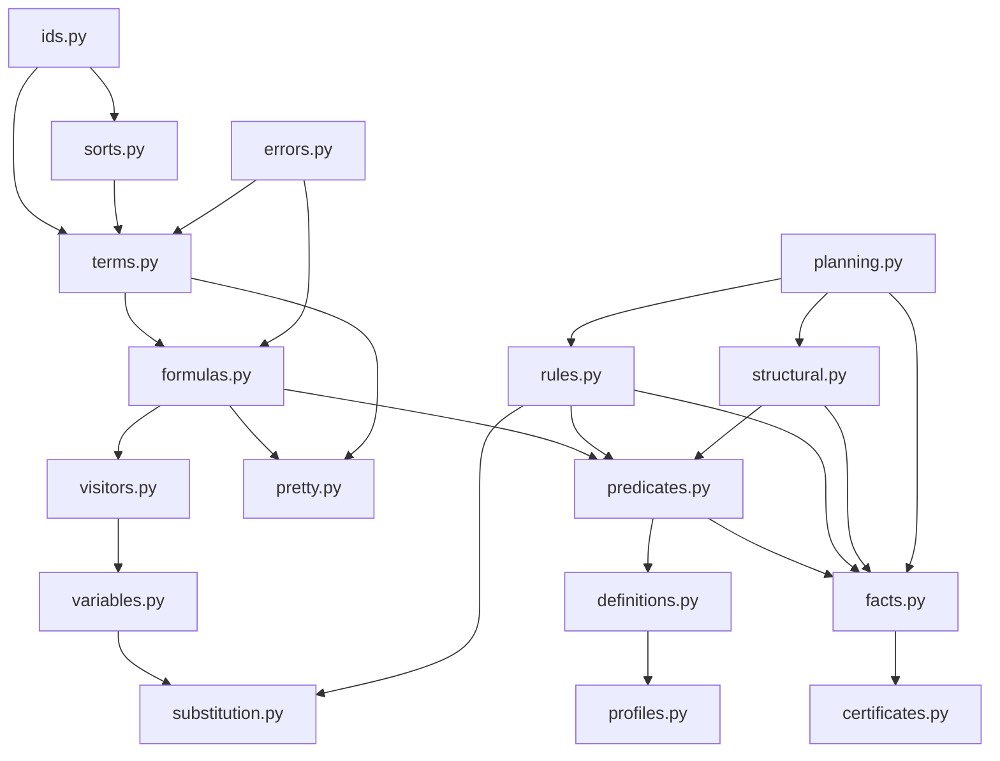
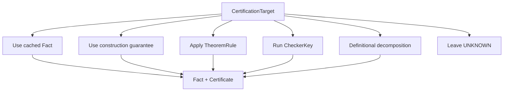

# Independent Logic Group Architecture Skeleton

**Status:** working reference for the independent `logic/` package.  
**Scope:** formula language, predicate vocabulary, facts, certificates, theorem-rule schemas, structural-node schemas, definition/computation profiles, abstract planning data, and pure utilities.  
**Non-goal:** this is not yet a proof assistant, theorem prover, or runtime evaluator for mathematical payloads.

---

## 0. Core Decision

The logical group is an **independent pure core**.

```text
logic/ must not import:
  workspace/
  objects/
  checkers/
  search/
  facets/
```

The logic group defines the **language of mathematical claims** and the **data structures for evidence and derivation metadata**. Other groups may depend on it. It must not depend on them.

The boundary slogan:

```text
logic/ defines what can be said.
workspace/ remembers what has been said about introduced objects.
checkers/ produce evidence from concrete payloads.
search/ produces evidence bundles.
facets/ expose APIs after certification.
```

The logic group should be usable in a blank Python session with no finite set implementation, no workspace, no relation class, no search engine, and no facet machinery.

---

## 1. Intended Role of `logic/`

The logic group is responsible for:

```text
terms
formulas
registered predicates
formal definitions
free/bound variable analysis
capture-avoiding substitution
alpha-renaming
macro expansion
pretty printing
definition dependency graphs
definition/computation profiles
fact keys
facts
fact statuses
certificates
theorem-rule schemas
rule matching data
structural-node schemas
abstract certification plans
```

The logic group is **not** responsible for:

```text
inspecting Python payloads
checking whether a concrete relation is transitive
storing workspace records
owning names like "A" or "R" in a user workspace
attaching facets
executing search
choosing concrete algorithms from object representations
rendering diagrams
mutating mathematical objects
```

The logic group can say:

```python
PredCall("TransitiveOn", (Var("R"), Var("A")))
```

It cannot decide by itself whether a particular workspace relation is transitive. That is a job for a checker, search engine, construction guarantee, trusted theorem rule, or later proof kernel.

---

## 2. Package Layout

Recommended layout:

```text
logic/
  __init__.py

  ids.py
    ObjectId
    Symbol
    PredicateKey
    RuleKey
    NodeKey
    CheckerKey

  sorts.py
    SortKey
    SortSpec
    SortRegistry

  terms.py
    Term
    Var
    Const
    ObjRef
    MetaVar

  formulas.py
    Formula
    In
    Eq
    PredCall
    Not
    And
    Or
    Implies
    Iff
    ForAll
    Exists
    ForAllIn        # optional sugar
    ExistsIn        # optional sugar

  visitors.py
    TermVisitor
    FormulaVisitor
    walk_terms
    walk_formulas
    replace_subformulas

  variables.py
    free_vars
    bound_vars
    fresh_var
    alpha_rename
    occurs_free

  substitution.py
    Substitution
    substitute_term
    substitute_formula
    instantiate_predicate
    instantiate_rule

  pretty.py
    PrettyStyle
    pretty_term
    pretty_formula
    pretty_fact_key

  predicates.py
    PredicateSpec
    PredicateRegistry
    PredicateSignature
    ParameterSpec

  definitions.py
    FormalDefinition
    expand_once
    expand_to_depth
    expand_to_primitives
    predicate_dependencies
    definition_graph

  profiles.py
    DefinitionProfile
    ComputationProfile
    ComplexityRank
    compute_definition_profile

  facts.py
    FactKey
    FactStatus
    Fact
    FactIndex

  certificates.py
    Certificate
    CertificateSource
    TrustLevel
    EvidencePayload

  rules.py
    TheoremRule
    RuleRegistry
    RuleApplication
    RuleMatch
    match_rule

  structural.py
    StructuralNodeSpec
    StructuralNodeRegistry
    StructuralCertificateKey
    BridgeRule

  planning.py
    CertificationTarget
    CertificationRoute
    CertificationPlan
    PlanStep
    RouteCost

  errors.py
    LogicError
    ArityError
    UnknownPredicateError
    FreeVariableError
    CaptureRiskError
    RuleMatchError
    IllFormedFormulaError
```

This is more detailed than the first implementation needs, but it gives the intended final shape.

---

## 3. Dependency Graph of the Logic Group



The exact imports can be simplified, but the conceptual flow is:

```text
IDs / sorts
  → terms
  → formulas
  → formula operations
  → predicate registry / definitions / profiles
  → facts / certificates
  → rules / structural nodes
  → abstract plans
```

---

## 4. File: `logic/ids.py`

### Purpose

Centralize lightweight identifiers used by the logic layer. The goal is to avoid hard-coding workspace-specific names like `record_id` into the pure logic layer.

### Design Point

Use `ObjectId`, not `record_id`, inside logic. The workspace may interpret `ObjectId(17)` as record 17, but the logic layer should not know what a workspace record is.

### Skeleton

```python
# logic/ids.py

from __future__ import annotations

from dataclasses import dataclass
from typing import NewType


PredicateKey = NewType("PredicateKey", str)
RuleKey = NewType("RuleKey", str)
NodeKey = NewType("NodeKey", str)
CheckerKey = NewType("CheckerKey", str)
SortKey = NewType("SortKey", str)
CapabilityKey = NewType("CapabilityKey", str)


@dataclass(frozen=True, order=True)
class ObjectId:
    """
    Pure logical reference to an external object.

    The logic layer does not know whether this object is a workspace record,
    a database row, a proof assistant constant, or something else.
    """

    value: int | str

    def __str__(self) -> str:
        return f"#{self.value}"


@dataclass(frozen=True, order=True)
class Symbol:
    """
    Human-readable symbolic name used inside formulas.

    Symbols are not workspace names. They are syntactic labels.
    """

    name: str

    def __post_init__(self) -> None:
        if not self.name:
            raise ValueError("Symbol name may not be empty.")

    def __str__(self) -> str:
        return self.name
```

### Notes

`ObjectId` is intentionally generic. The workspace adapter can map:

```text
ObjectId(17) ↔ ObjectRecord(record_id=17)
```

but `logic/` never imports `ObjectRecord`.

---

## 5. File: `logic/sorts.py`

### Purpose

Sorts are optional at first, but they become important for rule matching and schema validation.

Examples:

```text
Object
SetLike
RelationLike
FunctionLike
StructureLike
Element
Formula
```

A sort is not necessarily a mathematical theorem. It is a typing discipline for formulas and rule schemas.

### Skeleton

```python
# logic/sorts.py

from __future__ import annotations

from dataclasses import dataclass, field
from typing import Mapping

from .ids import SortKey


@dataclass(frozen=True)
class SortSpec:
    key: SortKey
    parent: SortKey | None = None
    description: str | None = None
    metadata: Mapping[str, object] = field(default_factory=dict)


class SortRegistry:
    def __init__(self) -> None:
        self._sorts: dict[SortKey, SortSpec] = {}

    def register(self, spec: SortSpec) -> None:
        if spec.key in self._sorts:
            raise ValueError(f"Sort already registered: {spec.key}")
        if spec.parent is not None and spec.parent not in self._sorts:
            raise ValueError(f"Parent sort is not registered: {spec.parent}")
        self._sorts[spec.key] = spec

    def get(self, key: SortKey) -> SortSpec:
        try:
            return self._sorts[key]
        except KeyError as exc:
            raise KeyError(f"Unknown sort: {key}") from exc

    def has(self, key: SortKey) -> bool:
        return key in self._sorts

    def is_subsort(self, child: SortKey, parent: SortKey) -> bool:
        current: SortKey | None = child
        while current is not None:
            if current == parent:
                return True
            current = self._sorts[current].parent if current in self._sorts else None
        return False
```

### Minimal Registered Sorts

```python
OBJECT = SortKey("Object")
SETLIKE = SortKey("SetLike")
RELATIONLIKE = SortKey("RelationLike")
FUNCTIONLIKE = SortKey("FunctionLike")
STRUCTURELIKE = SortKey("StructureLike")
ELEMENT = SortKey("Element")
```

Early implementation can use `sort=None` everywhere and add sorts later.

---

## 6. File: `logic/terms.py`

### Purpose

Terms are the objects that formulas talk about.

The first implementation only needs:

```text
Var
ObjRef
Const
```

Later, one might add function terms, tuple terms, set-builder terms, or operator terms. Do not add them until needed.

### Skeleton

```python
# logic/terms.py

from __future__ import annotations

from dataclasses import dataclass
from typing import Protocol

from .ids import ObjectId, SortKey, Symbol


class Term(Protocol):
    """Marker protocol for logical terms."""

    @property
    def sort(self) -> SortKey | None:
        ...


@dataclass(frozen=True)
class Var:
    """
    Bound or free variable in a formula schema.

    Example:
        Var("R") inside Relation(R)
        Var("x") inside ForAll(x, ...)
    """

    name: str
    sort: SortKey | None = None

    def __post_init__(self) -> None:
        if not self.name:
            raise ValueError("Variable name may not be empty.")


@dataclass(frozen=True)
class MetaVar:
    """
    Pattern variable used by theorem-rule schemas.

    In early versions, Var may be enough. MetaVar becomes useful if we want
    to distinguish object-language variables from rule-pattern variables.
    """

    name: str
    sort: SortKey | None = None


@dataclass(frozen=True)
class ObjRef:
    """
    Concrete external object reference.

    This may refer to a workspace record, but logic/ does not know that.
    """

    object_id: ObjectId
    sort: SortKey | None = None


@dataclass(frozen=True)
class Const:
    """
    Named logical constant.

    Example uses:
        Const("empty_set")
        Const("omega")

    Avoid using Const for workspace records. Use ObjRef for concrete objects.
    """

    symbol: Symbol
    sort: SortKey | None = None
```

### Design Notes

Use `ObjRef(ObjectId(17))`, not `ObjRef(record_id=17)`.

Bad:

```python
ObjRef(record_id=17)
```

Good:

```python
ObjRef(ObjectId(17))
```

The workspace adapter can translate between `ObjectId` and `ObjectRecord`.

---

## 7. File: `logic/formulas.py`

### Purpose

Formula AST. This is the machine-readable representation of definitions, theorem-rule patterns, structural-node requirements, search assumptions, and explanations.

### Skeleton

```python
# logic/formulas.py

from __future__ import annotations

from dataclasses import dataclass
from typing import Protocol

from .terms import Term, Var


class Formula(Protocol):
    """Marker protocol for logical formulas."""


@dataclass(frozen=True)
class In:
    left: Term
    right: Term


@dataclass(frozen=True)
class Eq:
    left: Term
    right: Term


@dataclass(frozen=True)
class PredCall:
    """
    Registered predicate call.

    Examples:
        PredCall("Relation", (Var("R"),))
        PredCall("TransitiveOn", (Var("R"), Var("A")))
    """

    name: str
    args: tuple[Term, ...]

    def __post_init__(self) -> None:
        object.__setattr__(self, "args", tuple(self.args))
        if not self.name:
            raise ValueError("Predicate name may not be empty.")


@dataclass(frozen=True)
class Not:
    body: Formula


@dataclass(frozen=True)
class And:
    left: Formula
    right: Formula


@dataclass(frozen=True)
class Or:
    left: Formula
    right: Formula


@dataclass(frozen=True)
class Implies:
    left: Formula
    right: Formula


@dataclass(frozen=True)
class Iff:
    left: Formula
    right: Formula


@dataclass(frozen=True)
class ForAll:
    var: Var
    body: Formula


@dataclass(frozen=True)
class Exists:
    var: Var
    body: Formula


@dataclass(frozen=True)
class ForAllIn:
    """
    Optional sugar for bounded universal quantification.

    Desugars to:
        ForAll(x, Implies(In(x, domain), body))
    """

    var: Var
    domain: Term
    body: Formula


@dataclass(frozen=True)
class ExistsIn:
    """
    Optional sugar for bounded existential quantification.

    Desugars to:
        Exists(x, And(In(x, domain), body))
    """

    var: Var
    domain: Term
    body: Formula
```

### Helper Constructors

Helpful but optional:

```python
def pred(name: str, *args: Term) -> PredCall:
    return PredCall(name, tuple(args))


def conj(*formulas: Formula) -> Formula:
    if not formulas:
        raise ValueError("Empty conjunction has no representation yet.")
    out = formulas[0]
    for f in formulas[1:]:
        out = And(out, f)
    return out


def disj(*formulas: Formula) -> Formula:
    if not formulas:
        raise ValueError("Empty disjunction has no representation yet.")
    out = formulas[0]
    for f in formulas[1:]:
        out = Or(out, f)
    return out
```

### Design Notes

Keep the formula language small. Do not add lambda terms, function terms, Hilbert choice terms, set comprehensions, or proof terms yet. They can be represented later if actual pressure appears.

---

## 8. File: `logic/visitors.py`

### Purpose

Visitors and walkers prevent every utility from manually repeating `isinstance` ladders. Start simple; avoid over-engineering.

### Skeleton

```python
# logic/visitors.py

from __future__ import annotations

from collections.abc import Iterator

from .terms import Term, Var, ObjRef, Const, MetaVar
from .formulas import (
    Formula,
    In,
    Eq,
    PredCall,
    Not,
    And,
    Or,
    Implies,
    Iff,
    ForAll,
    Exists,
    ForAllIn,
    ExistsIn,
)


def walk_terms_in_term(term: Term) -> Iterator[Term]:
    yield term


def immediate_subformulas(formula: Formula) -> tuple[Formula, ...]:
    if isinstance(formula, (In, Eq, PredCall)):
        return ()
    if isinstance(formula, Not):
        return (formula.body,)
    if isinstance(formula, (And, Or, Implies, Iff)):
        return (formula.left, formula.right)
    if isinstance(formula, (ForAll, Exists)):
        return (formula.body,)
    if isinstance(formula, (ForAllIn, ExistsIn)):
        return (formula.body,)
    raise TypeError(f"Unknown formula type: {type(formula)!r}")


def walk_formulas(formula: Formula) -> Iterator[Formula]:
    yield formula
    for child in immediate_subformulas(formula):
        yield from walk_formulas(child)


def walk_terms(formula: Formula) -> Iterator[Term]:
    if isinstance(formula, (In, Eq)):
        yield formula.left
        yield formula.right
    elif isinstance(formula, PredCall):
        yield from formula.args
    elif isinstance(formula, Not):
        yield from walk_terms(formula.body)
    elif isinstance(formula, (And, Or, Implies, Iff)):
        yield from walk_terms(formula.left)
        yield from walk_terms(formula.right)
    elif isinstance(formula, (ForAll, Exists)):
        yield formula.var
        yield from walk_terms(formula.body)
    elif isinstance(formula, (ForAllIn, ExistsIn)):
        yield formula.var
        yield formula.domain
        yield from walk_terms(formula.body)
    else:
        raise TypeError(f"Unknown formula type: {type(formula)!r}")
```

### Later Additions

```text
FormulaTransformer
TermTransformer
replace_subformula
collect_pred_calls
collect_obj_refs
```

---

## 9. File: `logic/variables.py`

### Purpose

Free-variable analysis, bound-variable analysis, fresh-variable generation, and alpha-renaming.

These operations are mandatory if definitions will be expanded safely.

### Skeleton

```python
# logic/variables.py

from __future__ import annotations

from .terms import Term, Var
from .formulas import (
    Formula,
    In,
    Eq,
    PredCall,
    Not,
    And,
    Or,
    Implies,
    Iff,
    ForAll,
    Exists,
    ForAllIn,
    ExistsIn,
)


def term_free_vars(term: Term) -> set[str]:
    if isinstance(term, Var):
        return {term.name}
    return set()


def free_vars(formula: Formula) -> set[str]:
    if isinstance(formula, (In, Eq)):
        return term_free_vars(formula.left) | term_free_vars(formula.right)

    if isinstance(formula, PredCall):
        out: set[str] = set()
        for arg in formula.args:
            out |= term_free_vars(arg)
        return out

    if isinstance(formula, Not):
        return free_vars(formula.body)

    if isinstance(formula, (And, Or, Implies, Iff)):
        return free_vars(formula.left) | free_vars(formula.right)

    if isinstance(formula, (ForAll, Exists)):
        return free_vars(formula.body) - {formula.var.name}

    if isinstance(formula, ForAllIn):
        return (term_free_vars(formula.domain) | free_vars(formula.body)) - {formula.var.name}

    if isinstance(formula, ExistsIn):
        return (term_free_vars(formula.domain) | free_vars(formula.body)) - {formula.var.name}

    raise TypeError(f"Unknown formula type: {type(formula)!r}")


def bound_vars(formula: Formula) -> set[str]:
    if isinstance(formula, (In, Eq, PredCall)):
        return set()
    if isinstance(formula, Not):
        return bound_vars(formula.body)
    if isinstance(formula, (And, Or, Implies, Iff)):
        return bound_vars(formula.left) | bound_vars(formula.right)
    if isinstance(formula, (ForAll, Exists)):
        return {formula.var.name} | bound_vars(formula.body)
    if isinstance(formula, (ForAllIn, ExistsIn)):
        return {formula.var.name} | bound_vars(formula.body)
    raise TypeError(f"Unknown formula type: {type(formula)!r}")


def fresh_var(base: str, taken: set[str], *, sort=None) -> Var:
    if base not in taken:
        return Var(base, sort=sort)
    i = 1
    while f"{base}_{i}" in taken:
        i += 1
    return Var(f"{base}_{i}", sort=sort)
```

### Alpha-Renaming Skeleton

```python
def alpha_rename(formula: Formula, taken: set[str]) -> Formula:
    """
    Rename bound variables to avoid names in `taken`.

    This is needed before substituting or expanding definitions inside a context.
    """
    # Implementation should recurse through quantifiers.
    # When a bound variable conflicts with `taken`, generate a fresh variable
    # and substitute it in the quantifier body.
    raise NotImplementedError
```

### Why This Matters

Without alpha-renaming, expanding:

```text
P(x) where P(t) := ∃x Q(t,x)
```

inside a formula already using `x` can cause variable capture. This will silently corrupt definitions.

---

## 10. File: `logic/substitution.py`

### Purpose

Capture-avoiding substitution for terms and formulas.

Used by:

```text
predicate definition instantiation
theorem-rule matching
rule application
formula expansion
search-query grounding
FactKey ↔ PredCall conversion
```

### Skeleton

```python
# logic/substitution.py

from __future__ import annotations

from dataclasses import dataclass
from collections.abc import Mapping

from .terms import Term, Var
from .formulas import (
    Formula,
    In,
    Eq,
    PredCall,
    Not,
    And,
    Or,
    Implies,
    Iff,
    ForAll,
    Exists,
    ForAllIn,
    ExistsIn,
)
from .variables import free_vars


@dataclass(frozen=True)
class Substitution:
    mapping: Mapping[str, Term]

    def without(self, var_name: str) -> "Substitution":
        return Substitution({k: v for k, v in self.mapping.items() if k != var_name})

    def apply_term(self, term: Term) -> Term:
        return substitute_term(term, self)

    def apply_formula(self, formula: Formula) -> Formula:
        return substitute_formula(formula, self)


def substitute_term(term: Term, subst: Substitution) -> Term:
    if isinstance(term, Var) and term.name in subst.mapping:
        return subst.mapping[term.name]
    return term


def substitute_formula(formula: Formula, subst: Substitution) -> Formula:
    if isinstance(formula, In):
        return In(substitute_term(formula.left, subst), substitute_term(formula.right, subst))

    if isinstance(formula, Eq):
        return Eq(substitute_term(formula.left, subst), substitute_term(formula.right, subst))

    if isinstance(formula, PredCall):
        return PredCall(
            formula.name,
            tuple(substitute_term(arg, subst) for arg in formula.args),
        )

    if isinstance(formula, Not):
        return Not(substitute_formula(formula.body, subst))

    if isinstance(formula, And):
        return And(substitute_formula(formula.left, subst), substitute_formula(formula.right, subst))

    if isinstance(formula, Or):
        return Or(substitute_formula(formula.left, subst), substitute_formula(formula.right, subst))

    if isinstance(formula, Implies):
        return Implies(substitute_formula(formula.left, subst), substitute_formula(formula.right, subst))

    if isinstance(formula, Iff):
        return Iff(substitute_formula(formula.left, subst), substitute_formula(formula.right, subst))

    if isinstance(formula, ForAll):
        # Bound variable shadows substitution variable.
        return ForAll(formula.var, substitute_formula(formula.body, subst.without(formula.var.name)))

    if isinstance(formula, Exists):
        return Exists(formula.var, substitute_formula(formula.body, subst.without(formula.var.name)))

    if isinstance(formula, ForAllIn):
        return ForAllIn(
            formula.var,
            substitute_term(formula.domain, subst),
            substitute_formula(formula.body, subst.without(formula.var.name)),
        )

    if isinstance(formula, ExistsIn):
        return ExistsIn(
            formula.var,
            substitute_term(formula.domain, subst),
            substitute_formula(formula.body, subst.without(formula.var.name)),
        )

    raise TypeError(f"Unknown formula type: {type(formula)!r}")
```

### Important Caveat

The above skeleton handles shadowing but not all capture risks. A stronger implementation should alpha-rename bound variables when substituted terms contain variables that could become captured.

Example risk:

```text
substitute y := x into ∀x P(y,x)
```

Naively produces:

```text
∀x P(x,x)
```

but that captures the free `x` from the substitution. Correct behavior requires renaming the bound `x` first.

---

## 11. File: `logic/pretty.py`

### Purpose

Pretty printing for explanations, debugging, markdown export, theorem-rule display, and workspace explanations.

### Skeleton

```python
# logic/pretty.py

from __future__ import annotations

from enum import Enum

from .terms import Term, Var, ObjRef, Const, MetaVar
from .formulas import Formula, In, Eq, PredCall, Not, And, Or, Implies, Iff, ForAll, Exists, ForAllIn, ExistsIn


class PrettyStyle(Enum):
    UNICODE = "unicode"
    ASCII = "ascii"
    SEXPR = "sexpr"
    LATEX = "latex"


def pretty_term(term: Term, *, style: PrettyStyle = PrettyStyle.UNICODE) -> str:
    if isinstance(term, Var):
        return term.name
    if isinstance(term, MetaVar):
        return f"?{term.name}"
    if isinstance(term, ObjRef):
        return str(term.object_id)
    if isinstance(term, Const):
        return str(term.symbol)
    raise TypeError(f"Unknown term type: {type(term)!r}")


def pretty_formula(formula: Formula, *, style: PrettyStyle = PrettyStyle.UNICODE) -> str:
    if isinstance(formula, In):
        op = "∈" if style is PrettyStyle.UNICODE else "in"
        return f"{pretty_term(formula.left, style=style)} {op} {pretty_term(formula.right, style=style)}"

    if isinstance(formula, Eq):
        return f"{pretty_term(formula.left, style=style)} = {pretty_term(formula.right, style=style)}"

    if isinstance(formula, PredCall):
        args = ", ".join(pretty_term(arg, style=style) for arg in formula.args)
        return f"{formula.name}({args})"

    if isinstance(formula, Not):
        sym = "¬" if style is PrettyStyle.UNICODE else "not"
        return f"{sym}{pretty_formula(formula.body, style=style)}"

    if isinstance(formula, And):
        sym = "∧" if style is PrettyStyle.UNICODE else "and"
        return f"({pretty_formula(formula.left, style=style)} {sym} {pretty_formula(formula.right, style=style)})"

    if isinstance(formula, Or):
        sym = "∨" if style is PrettyStyle.UNICODE else "or"
        return f"({pretty_formula(formula.left, style=style)} {sym} {pretty_formula(formula.right, style=style)})"

    if isinstance(formula, Implies):
        sym = "→" if style is PrettyStyle.UNICODE else "->"
        return f"({pretty_formula(formula.left, style=style)} {sym} {pretty_formula(formula.right, style=style)})"

    if isinstance(formula, Iff):
        sym = "↔" if style is PrettyStyle.UNICODE else "<->"
        return f"({pretty_formula(formula.left, style=style)} {sym} {pretty_formula(formula.right, style=style)})"

    if isinstance(formula, ForAll):
        sym = "∀" if style is PrettyStyle.UNICODE else "forall "
        return f"{sym}{formula.var.name}. {pretty_formula(formula.body, style=style)}"

    if isinstance(formula, Exists):
        sym = "∃" if style is PrettyStyle.UNICODE else "exists "
        return f"{sym}{formula.var.name}. {pretty_formula(formula.body, style=style)}"

    if isinstance(formula, ForAllIn):
        sym = "∀" if style is PrettyStyle.UNICODE else "forall "
        return f"{sym}{formula.var.name} ∈ {pretty_term(formula.domain, style=style)}. {pretty_formula(formula.body, style=style)}"

    if isinstance(formula, ExistsIn):
        sym = "∃" if style is PrettyStyle.UNICODE else "exists "
        return f"{sym}{formula.var.name} ∈ {pretty_term(formula.domain, style=style)}. {pretty_formula(formula.body, style=style)}"

    raise TypeError(f"Unknown formula type: {type(formula)!r}")
```

### Later Additions

```text
operator precedence-aware printer
multi-line pretty printer
LaTeX output
Obsidian markdown output
formula tree printer
```

---

## 12. File: `logic/predicates.py`

### Purpose

Register predicate vocabulary. Predicates are not arbitrary strings. A registered predicate has a signature, optional formal definition, profiles, and checker metadata.

### Core Principle

```text
Every PredicateSpec must either have a formal definition or be explicitly primitive.
```

### Skeleton

```python
# logic/predicates.py

from __future__ import annotations

from dataclasses import dataclass, field
from typing import Mapping

from .ids import PredicateKey, SortKey, CheckerKey
from .formulas import Formula
from .profiles import DefinitionProfile, ComputationProfile


@dataclass(frozen=True)
class ParameterSpec:
    name: str
    sort: SortKey | None = None
    description: str | None = None


@dataclass(frozen=True)
class PredicateSignature:
    parameters: tuple[ParameterSpec, ...]

    @property
    def arity(self) -> int:
        return len(self.parameters)


@dataclass
class PredicateSpec:
    key: PredicateKey
    signature: PredicateSignature
    formal_definition: Formula | None = None
    primitive: bool = False
    definition_profile: DefinitionProfile | None = None
    computation_profiles: tuple[ComputationProfile, ...] = ()
    checker_keys: tuple[CheckerKey, ...] = ()
    equality_invariant: bool = True
    explanation_template: str | None = None
    metadata: Mapping[str, object] = field(default_factory=dict)

    def __post_init__(self) -> None:
        if not self.primitive and self.formal_definition is None:
            raise ValueError(
                f"Predicate {self.key} must be primitive or have a formal definition."
            )


class PredicateRegistry:
    def __init__(self) -> None:
        self._predicates: dict[PredicateKey, PredicateSpec] = {}

    def register(self, spec: PredicateSpec) -> None:
        if spec.key in self._predicates:
            raise ValueError(f"Predicate already registered: {spec.key}")
        self._predicates[spec.key] = spec

    def get(self, key: PredicateKey | str) -> PredicateSpec:
        k = PredicateKey(str(key))
        try:
            return self._predicates[k]
        except KeyError as exc:
            raise KeyError(f"Unknown predicate: {key}") from exc

    def has(self, key: PredicateKey | str) -> bool:
        return PredicateKey(str(key)) in self._predicates

    def all(self) -> tuple[PredicateSpec, ...]:
        return tuple(self._predicates.values())

    def validate_call(self, name: str, arg_count: int) -> None:
        spec = self.get(PredicateKey(name))
        if spec.signature.arity != arg_count:
            raise ValueError(
                f"Predicate {name} expects {spec.signature.arity} args, got {arg_count}."
            )
```

### Example Registration

```python
from logic.ids import PredicateKey, SortKey
from logic.terms import Var
from logic.formulas import ForAll, Implies, In, PredCall
from logic.predicates import PredicateSpec, PredicateSignature, ParameterSpec

Relation = PredicateSpec(
    key=PredicateKey("Relation"),
    signature=PredicateSignature((ParameterSpec("R", SortKey("Object")),)),
    formal_definition=ForAll(
        Var("w"),
        Implies(
            In(Var("w"), Var("R")),
            PredCall("OrdPair", (Var("w"),)),
        ),
    ),
)
```

---

## 13. File: `logic/definitions.py`

### Purpose

Definitions provide expansion behavior and dependency analysis.

This file should not evaluate formulas. It only unfolds registered definitions.

### Skeleton

```python
# logic/definitions.py

from __future__ import annotations

from dataclasses import dataclass

from .formulas import Formula, PredCall, In, Eq, Not, And, Or, Implies, Iff, ForAll, Exists, ForAllIn, ExistsIn
from .predicates import PredicateRegistry
from .substitution import Substitution, substitute_formula
from .terms import Var


@dataclass(frozen=True)
class FormalDefinition:
    predicate_key: str
    parameters: tuple[str, ...]
    body: Formula
    description: str | None = None


def expand_predcall_once(call: PredCall, registry: PredicateRegistry) -> Formula:
    spec = registry.get(call.name)
    if spec.primitive or spec.formal_definition is None:
        return call

    param_names = tuple(p.name for p in spec.signature.parameters)
    if len(param_names) != len(call.args):
        raise ValueError(
            f"Cannot expand {call.name}: expected {len(param_names)} args, got {len(call.args)}."
        )

    subst = Substitution(dict(zip(param_names, call.args)))
    # A robust implementation should alpha-rename spec.formal_definition first.
    return substitute_formula(spec.formal_definition, subst)


def expand_once(formula: Formula, registry: PredicateRegistry) -> Formula:
    if isinstance(formula, PredCall):
        return expand_predcall_once(formula, registry)
    if isinstance(formula, (In, Eq)):
        return formula
    if isinstance(formula, Not):
        return Not(expand_once(formula.body, registry))
    if isinstance(formula, And):
        return And(expand_once(formula.left, registry), expand_once(formula.right, registry))
    if isinstance(formula, Or):
        return Or(expand_once(formula.left, registry), expand_once(formula.right, registry))
    if isinstance(formula, Implies):
        return Implies(expand_once(formula.left, registry), expand_once(formula.right, registry))
    if isinstance(formula, Iff):
        return Iff(expand_once(formula.left, registry), expand_once(formula.right, registry))
    if isinstance(formula, ForAll):
        return ForAll(formula.var, expand_once(formula.body, registry))
    if isinstance(formula, Exists):
        return Exists(formula.var, expand_once(formula.body, registry))
    if isinstance(formula, ForAllIn):
        return ForAllIn(formula.var, formula.domain, expand_once(formula.body, registry))
    if isinstance(formula, ExistsIn):
        return ExistsIn(formula.var, formula.domain, expand_once(formula.body, registry))
    raise TypeError(f"Unknown formula type: {type(formula)!r}")


def expand_to_depth(formula: Formula, registry: PredicateRegistry, depth: int) -> Formula:
    out = formula
    for _ in range(depth):
        out = expand_once(out, registry)
    return out


def predicate_dependencies(formula: Formula) -> set[str]:
    if isinstance(formula, PredCall):
        return {formula.name}
    if isinstance(formula, (In, Eq)):
        return set()
    if isinstance(formula, Not):
        return predicate_dependencies(formula.body)
    if isinstance(formula, (And, Or, Implies, Iff)):
        return predicate_dependencies(formula.left) | predicate_dependencies(formula.right)
    if isinstance(formula, (ForAll, Exists)):
        return predicate_dependencies(formula.body)
    if isinstance(formula, (ForAllIn, ExistsIn)):
        return predicate_dependencies(formula.body)
    raise TypeError(f"Unknown formula type: {type(formula)!r}")
```

### Dependency Depth

```python
def definition_depth(predicate_key: str, registry: PredicateRegistry, seen: set[str] | None = None) -> int:
    seen = set() if seen is None else seen
    if predicate_key in seen:
        raise ValueError(f"Cyclic definition dependency involving {predicate_key}")

    spec = registry.get(predicate_key)
    if spec.primitive or spec.formal_definition is None:
        return 0

    deps = predicate_dependencies(spec.formal_definition)
    if not deps:
        return 1

    return 1 + max(definition_depth(dep, registry, seen | {predicate_key}) for dep in deps)
```

### Design Notes

Definition expansion is a **view**, not the default runtime representation. Never expand everything automatically during certification unless a route explicitly asks for definitional decomposition.

---

## 14. File: `logic/profiles.py`

### Purpose

Profiles describe logical complexity and computational metadata. They are used by explanation, ranking, and planning. They do not decide truth.

### Skeleton

```python
# logic/profiles.py

from __future__ import annotations

from dataclasses import dataclass, field
from typing import Mapping

from .ids import CheckerKey


@dataclass(frozen=True)
class DefinitionProfile:
    predicate_key: str
    macro_depth: int
    quantifier_depth: int
    quantifier_alternation_depth: int
    membership_chase_depth: int
    primitive_expansion_size: int
    free_variable_count: int
    bound_variable_count: int
    predicate_dependencies: tuple[str, ...]


@dataclass(frozen=True)
class ComputationProfile:
    """
    Pure metadata about a possible computation route.

    The actual executable checker does not live in logic/.
    """

    checker_key: CheckerKey
    applies_when: tuple[str, ...] = ()
    estimated_cost_label: str | None = None
    finite_only: bool = False
    requires_extensional_data: bool = False
    produces_witness_on_fail: bool = False
    deterministic: bool = True
    cacheable: bool = True
    metadata: Mapping[str, object] = field(default_factory=dict)


@dataclass(frozen=True)
class ComplexityRank:
    """
    Rank vector used by planners. Not a truth value.
    """

    definition_depth: int = 0
    quantifier_depth: int = 0
    alternation_depth: int = 0
    estimated_cost: float | None = None
    payoff: float = 0.0
    dependency_distance: float | None = None
```

### Important Boundary

Bad:

```python
ComputationProfile(checker=callable_function)
```

Good:

```python
ComputationProfile(checker_key=CheckerKey("finite_transitive_on_checker"))
```

The actual callable belongs in `checkers/`, not `logic/`.

---

## 15. File: `logic/certificates.py`

### Purpose

Certificates explain why a fact or structural node has a status.

Certificates should be pure data. They may refer to checker keys, rule keys, search coverage, construction keys, premise facts, witnesses, and explanatory text. They should not hold workspace objects directly.

### Skeleton

```python
# logic/certificates.py

from __future__ import annotations

from dataclasses import dataclass, field
from enum import Enum
from typing import Mapping

from .ids import CheckerKey, RuleKey


class CertificateSource(Enum):
    DEFINITIONAL = "definitional"
    CONSTRUCTION_GUARANTEE = "construction_guarantee"
    COMPUTED = "computed"
    THEOREM = "theorem"
    SEARCH = "search"
    USER_ASSERTED = "user_asserted"
    CONJECTURAL = "conjectural"
    FAILED_WITH_WITNESS = "failed_with_witness"
    UNKNOWN = "unknown"


class TrustLevel(Enum):
    VERIFIED = "verified"
    TRUSTED = "trusted"
    COMPUTED = "computed"
    ASSUMED = "assumed"
    CONJECTURAL = "conjectural"
    REFUTED = "refuted"
    UNKNOWN = "unknown"


@dataclass(frozen=True)
class EvidencePayload:
    """
    Generic pure-data evidence payload.

    Examples:
        witness={"a": 1, "b": 2, "c": 4}
        coverage={"exhaustive": True, "searched_count": 65536}
    """

    data: Mapping[str, object] = field(default_factory=dict)


@dataclass(frozen=True)
class Certificate:
    source: CertificateSource
    trust: TrustLevel
    claim: object | None = None
    source_key: str | CheckerKey | RuleKey | None = None
    premises: tuple[object, ...] = ()
    premise_certificates: tuple["Certificate", ...] = ()
    evidence: EvidencePayload | None = None
    explanation: str | None = None
    metadata: Mapping[str, object] = field(default_factory=dict)
```

### Design Notes

`claim` is typed as `object | None` here to avoid a circular import with `facts.py`. If preferred, move `Certificate` below `FactKey` or type it with string annotations.

Certificates should explain:

```text
computed by checker X
inferred by theorem rule Y
guaranteed by construction Z
false by counterexample W
conjectural due to bounded search
unknown due to missing checker
```

---

## 16. File: `logic/facts.py`

### Purpose

Facts are instantiated predicate claims with statuses and certificates.

A `FactKey` is the canonical key for a concrete claim.

### Skeleton

```python
# logic/facts.py

from __future__ import annotations

from dataclasses import dataclass, field
from enum import Enum
from typing import Mapping

from .ids import ObjectId, PredicateKey
from .certificates import Certificate


@dataclass(frozen=True)
class FactKey:
    predicate: PredicateKey
    args: tuple[ObjectId, ...]

    def __post_init__(self) -> None:
        object.__setattr__(self, "args", tuple(self.args))


class FactStatus(Enum):
    TRUE = "true"
    FALSE = "false"
    UNKNOWN = "unknown"
    INAPPLICABLE = "inapplicable"
    BLOCKED = "blocked"
    ASSUMED = "assumed"
    CONJECTURAL = "conjectural"
    STALE = "stale"


@dataclass(frozen=True)
class Fact:
    key: FactKey
    status: FactStatus
    certificate: Certificate | None = None
    metadata: Mapping[str, object] = field(default_factory=dict)


class FactIndex:
    """
    Pure fact store.

    Workspace may own an instance of this, but FactIndex itself does not know
    what a workspace is.
    """

    def __init__(self) -> None:
        self._facts: dict[FactKey, Fact] = {}

    def add(self, fact: Fact, *, overwrite: bool = True) -> None:
        if not overwrite and fact.key in self._facts:
            raise ValueError(f"Fact already exists: {fact.key}")
        self._facts[fact.key] = fact

    def get(self, key: FactKey) -> Fact | None:
        return self._facts.get(key)

    def status(self, key: FactKey) -> FactStatus:
        fact = self.get(key)
        return FactStatus.UNKNOWN if fact is None else fact.status

    def knows_true(self, key: FactKey) -> bool:
        return self.status(key) is FactStatus.TRUE

    def knows_false(self, key: FactKey) -> bool:
        return self.status(key) is FactStatus.FALSE

    def all(self) -> tuple[Fact, ...]:
        return tuple(self._facts.values())
```

### FactKey vs PredCall

Use `PredCall` for schemas and formulas:

```python
PredCall("TransitiveOn", (Var("R"), Var("A")))
```

Use `FactKey` for concrete object claims:

```python
FactKey(PredicateKey("TransitiveOn"), (ObjectId(4), ObjectId(2)))
```

The workspace bridges between them.

---

## 17. File: `logic/rules.py`

### Purpose

Trusted inference schemas over registered predicates and structural claims.

The rule layer is **proof-lite**:

```text
premise patterns + certified matching facts ⇒ conclusion patterns
```

It is not arbitrary proof search.

### Skeleton

```python
# logic/rules.py

from __future__ import annotations

from dataclasses import dataclass, field
from typing import Mapping

from .ids import RuleKey
from .terms import Term, Var, ObjRef
from .formulas import PredCall
from .facts import FactKey, Fact, FactStatus, FactIndex
from .certificates import Certificate, CertificateSource, TrustLevel


@dataclass(frozen=True)
class RuleMatch:
    substitution: Mapping[str, Term]


@dataclass(frozen=True)
class TheoremRule:
    key: RuleKey
    premises: tuple[PredCall, ...]
    conclusions: tuple[PredCall, ...]
    trust: TrustLevel = TrustLevel.TRUSTED
    explanation_template: str | None = None
    metadata: Mapping[str, object] = field(default_factory=dict)


@dataclass(frozen=True)
class RuleApplication:
    rule_key: RuleKey
    match: RuleMatch
    premise_facts: tuple[FactKey, ...]
    conclusion_facts: tuple[FactKey, ...]
    certificate: Certificate


class RuleRegistry:
    def __init__(self) -> None:
        self._rules: dict[RuleKey, TheoremRule] = {}

    def register(self, rule: TheoremRule) -> None:
        if rule.key in self._rules:
            raise ValueError(f"Rule already registered: {rule.key}")
        self._rules[rule.key] = rule

    def get(self, key: RuleKey) -> TheoremRule:
        return self._rules[key]

    def all(self) -> tuple[TheoremRule, ...]:
        return tuple(self._rules.values())
```

### Pattern Matching Skeleton

Start with simple predicate-call pattern matching.

```python
def match_predcall(pattern: PredCall, target: PredCall) -> RuleMatch | None:
    if pattern.name != target.name:
        return None
    if len(pattern.args) != len(target.args):
        return None

    subst: dict[str, Term] = {}

    for p_arg, t_arg in zip(pattern.args, target.args):
        if isinstance(p_arg, Var):
            existing = subst.get(p_arg.name)
            if existing is not None and existing != t_arg:
                return None
            subst[p_arg.name] = t_arg
        elif p_arg != t_arg:
            return None

    return RuleMatch(subst)
```

### Example Rules

```python
TheoremRule(
    key=RuleKey("function_implies_relation"),
    premises=(PredCall("Function", (Var("F"),)),),
    conclusions=(PredCall("Relation", (Var("F"),)),),
)
```

```python
TheoremRule(
    key=RuleKey("bijective_implies_injective_surjective"),
    premises=(PredCall("BijectiveFunction", (Var("f"), Var("A"), Var("B"))),),
    conclusions=(
        PredCall("InjectiveFunction", (Var("f"), Var("A"), Var("B"))),
        PredCall("SurjectiveFunction", (Var("f"), Var("A"), Var("B"))),
    ),
)
```

```python
TheoremRule(
    key=RuleKey("partial_order_implies_order_axioms"),
    premises=(PredCall("PartialOrderRelation", (Var("R"), Var("A"))),),
    conclusions=(
        PredCall("ReflexiveOn", (Var("R"), Var("A"))),
        PredCall("AntisymmetricOn", (Var("R"), Var("A"))),
        PredCall("TransitiveOn", (Var("R"), Var("A"))),
    ),
)
```

### Important Boundary

The rule engine should not prove the theorem. It assumes registered `TheoremRule`s are trusted. Later, a proof kernel can replace or validate this trust.

---

## 18. File: `logic/structural.py`

### Purpose

Structural nodes are certified regimes/enrichment points. They are not ordinary predicates and not facets.

A structural node says:

```text
If these hard gates and requirements are certified, then this object/context has a useful mathematical regime, and these capabilities may be unlocked by the workspace.
```

### Skeleton

```python
# logic/structural.py

from __future__ import annotations

from dataclasses import dataclass, field
from typing import Mapping

from .ids import NodeKey, CapabilityKey, RuleKey
from .terms import Var
from .formulas import PredCall
from .certificates import TrustLevel


@dataclass(frozen=True)
class StructuralNodeSpec:
    key: NodeKey
    parameters: tuple[Var, ...]
    parent: NodeKey | None = None
    hard_gates: tuple[PredCall, ...] = ()
    requirements: tuple[PredCall, ...] = ()
    cheap_obstructions: tuple[PredCall, ...] = ()
    guarantees: tuple[PredCall, ...] = ()
    unlocks: tuple[CapabilityKey, ...] = ()
    explanation_template: str | None = None
    metadata: Mapping[str, object] = field(default_factory=dict)


class StructuralNodeRegistry:
    def __init__(self) -> None:
        self._nodes: dict[NodeKey, StructuralNodeSpec] = {}

    def register(self, spec: StructuralNodeSpec) -> None:
        if spec.key in self._nodes:
            raise ValueError(f"Structural node already registered: {spec.key}")
        if spec.parent is not None and spec.parent not in self._nodes:
            raise ValueError(f"Parent node not registered: {spec.parent}")
        self._nodes[spec.key] = spec

    def get(self, key: NodeKey) -> StructuralNodeSpec:
        return self._nodes[key]

    def ancestors(self, key: NodeKey) -> tuple[NodeKey, ...]:
        out: list[NodeKey] = []
        current = self._nodes[key].parent
        while current is not None:
            out.append(current)
            current = self._nodes[current].parent
        return tuple(out)


@dataclass(frozen=True)
class BridgeRule:
    """
    Rule connecting separate object-class spines.

    Example:
        PartialOrderRelation(R,A)
        StructureHasCarrier(S,A)
        StructureHasRelation(S,"leq",R)
        --------------------------------
        PosetStructure(S)
    """

    key: RuleKey
    premises: tuple[PredCall, ...]
    produced_node: PredCall
    trust: TrustLevel = TrustLevel.TRUSTED
    explanation_template: str | None = None
```

### Example: Partial Order Relation Node

```python
StructuralNodeSpec(
    key=NodeKey("PartialOrderRelation"),
    parameters=(Var("R"), Var("A")),
    parent=NodeKey("PreorderRelation"),
    hard_gates=(
        PredCall("Relation", (Var("R"),)),
        PredCall("SetLike", (Var("A"),)),
        PredCall("BinaryRelationOn", (Var("R"), Var("A"))),
    ),
    requirements=(
        PredCall("ReflexiveOn", (Var("R"), Var("A"))),
        PredCall("AntisymmetricOn", (Var("R"), Var("A"))),
        PredCall("TransitiveOn", (Var("R"), Var("A"))),
    ),
    guarantees=(
        PredCall("ReflexiveOn", (Var("R"), Var("A"))),
        PredCall("AntisymmetricOn", (Var("R"), Var("A"))),
        PredCall("TransitiveOn", (Var("R"), Var("A"))),
    ),
    unlocks=(CapabilityKey("partial_order_relation"),),
)
```

### Facet Boundary

`StructuralNodeSpec.unlocks` stores strings/keys, not facet classes.

Bad:

```python
unlocks=(PosetFacet,)
```

Good:

```python
unlocks=(CapabilityKey("poset"),)
```

The workspace/facet layer maps capability keys to actual APIs.

---

## 19. File: `logic/planning.py`

### Purpose

Abstract certification plans. The logic group can define plan data structures, but it should not execute workspace-aware checks.

A plan answers:

```text
What route might certify this target?
```

Execution belongs in `workspace/` or `certification/` bridge code.

### Skeleton

```python
# logic/planning.py

from __future__ import annotations

from dataclasses import dataclass, field
from enum import Enum
from typing import Mapping

from .ids import CheckerKey, RuleKey, NodeKey
from .facts import FactKey


class PlanStepKind(Enum):
    USE_CACHED_FACT = "use_cached_fact"
    APPLY_RULE = "apply_rule"
    RUN_CHECKER = "run_checker"
    USE_CONSTRUCTION_GUARANTEE = "use_construction_guarantee"
    CERTIFY_STRUCTURAL_NODE = "certify_structural_node"
    RECORD_FAILURE = "record_failure"
    LEAVE_UNKNOWN = "leave_unknown"


@dataclass(frozen=True)
class CertificationTarget:
    fact_key: FactKey | None = None
    node_key: NodeKey | None = None
    args: tuple[object, ...] = ()


@dataclass(frozen=True)
class RouteCost:
    logical_depth: int = 0
    estimated_runtime: float | None = None
    missing_requirements: int = 0
    trust_penalty: float = 0.0
    payoff: float = 0.0


@dataclass(frozen=True)
class PlanStep:
    kind: PlanStepKind
    target: CertificationTarget | FactKey | None = None
    checker_key: CheckerKey | None = None
    rule_key: RuleKey | None = None
    premises: tuple[FactKey, ...] = ()
    explanation: str | None = None
    metadata: Mapping[str, object] = field(default_factory=dict)


@dataclass(frozen=True)
class CertificationRoute:
    target: CertificationTarget
    steps: tuple[PlanStep, ...]
    cost: RouteCost
    explanation: str | None = None


@dataclass(frozen=True)
class CertificationPlan:
    target: CertificationTarget
    preferred_route: CertificationRoute | None
    alternatives: tuple[CertificationRoute, ...] = ()
    blocked_reasons: tuple[str, ...] = ()
```

### Design Notes

The pure planner may compare abstract routes, but the actual workspace certification engine will execute them.

Do not let `logic/planning.py` call:

```text
workspace.record(...)
relation.entries()
finite_set.elements()
checker_callable(...)
```

It can reference `CheckerKey`, not call the checker.

---

## 20. File: `logic/errors.py`

### Purpose

Clean exceptions for logic-level failures.

### Skeleton

```python
# logic/errors.py

class LogicError(Exception):
    pass


class IllFormedFormulaError(LogicError):
    pass


class ArityError(LogicError):
    pass


class UnknownPredicateError(LogicError):
    pass


class FreeVariableError(LogicError):
    pass


class CaptureRiskError(LogicError):
    pass


class RuleMatchError(LogicError):
    pass


class CyclicDefinitionError(LogicError):
    pass
```

---

## 21. Formula-to-Fact Bridge

This bridge may live in `logic/` if it only handles `PredCall` with `ObjRef` arguments. It must not know about workspace records.

### Purpose

Convert between:

```text
PredCall("Function", (ObjRef(ObjectId(17)),))
```

and:

```text
FactKey("Function", (ObjectId(17),))
```

### Skeleton

```python
# logic/fact_conversion.py

from __future__ import annotations

from .ids import PredicateKey
from .terms import ObjRef
from .formulas import PredCall
from .facts import FactKey


def predcall_to_fact_key(call: PredCall) -> FactKey:
    object_ids = []
    for arg in call.args:
        if not isinstance(arg, ObjRef):
            raise ValueError("Cannot convert PredCall to FactKey unless all args are ObjRef.")
        object_ids.append(arg.object_id)
    return FactKey(PredicateKey(call.name), tuple(object_ids))


def fact_key_to_predcall(key: FactKey) -> PredCall:
    return PredCall(
        str(key.predicate),
        tuple(ObjRef(object_id) for object_id in key.args),
    )
```

This is pure because `ObjRef` uses `ObjectId`, not `ObjectRecord`.

---

## 22. Minimal Registered Predicate Catalog

The first logic implementation should register a small foundational catalog.

### 22.1 Primitive Atoms

```text
In(x,y)
Eq(x,y)
```

These are formula nodes, not ordinary `PredicateSpec`s unless you want to expose them uniformly.

### 22.2 Set-Theoretic Coding Predicates

```text
Singleton(s,x)
UnorderedPair(p,x,y)
KuratowskiPair(w,x,y)
OrdPair(w)
Relation(R)
PairIn(R,x,y)
SingleValuedRelation(R)
Function(F)
CartesianProduct(P,A,B)
```

### 22.3 Relation/Order Predicates

```text
SetLike(A)
BinaryRelationOn(R,A)
ReflexiveOn(R,A)
IrreflexiveOn(R,A)
SymmetricOn(R,A)
AntisymmetricOn(R,A)
AsymmetricOn(R,A)
TransitiveOn(R,A)
TotalOn(R,A)
EquivalenceRelation(R,A)
PreorderRelation(R,A)
PartialOrderRelation(R,A)
```

### 22.4 Function Predicates

```text
FunctionBetween(f,A,B)
InjectiveFunction(f,A,B)
SurjectiveFunction(f,A,B)
BijectiveFunction(f,A,B)
InverseFunction(g,f,A,B)
OrderPreserving(f,P,Q)
```

### 22.5 Structure Predicates

```text
StructureHasCarrier(S,A)
StructureHasRelation(S,name,R)
StructureHasOperation(S,name,op)
PosetStructure(S)
LatticeStructure(S)
GroupStructure(S)
```

For early implementation, avoid symbolic string terms like `name`. Use a `Const(Symbol("leq"))` or introduce a separate naming representation.

---

## 23. Foundational Predicate Definitions

### 23.1 Singleton

```python
PredicateSpec(
    key=PredicateKey("Singleton"),
    signature=PredicateSignature((
        ParameterSpec("s"),
        ParameterSpec("x"),
    )),
    formal_definition=ForAll(
        Var("u"),
        Iff(In(Var("u"), Var("s")), Eq(Var("u"), Var("x"))),
    ),
)
```

### 23.2 Unordered Pair

```python
PredicateSpec(
    key=PredicateKey("UnorderedPair"),
    signature=PredicateSignature((
        ParameterSpec("p"),
        ParameterSpec("x"),
        ParameterSpec("y"),
    )),
    formal_definition=ForAll(
        Var("u"),
        Iff(
            In(Var("u"), Var("p")),
            Or(Eq(Var("u"), Var("x")), Eq(Var("u"), Var("y"))),
        ),
    ),
)
```

### 23.3 Kuratowski Pair

```python
PredicateSpec(
    key=PredicateKey("KuratowskiPair"),
    signature=PredicateSignature((
        ParameterSpec("w"),
        ParameterSpec("x"),
        ParameterSpec("y"),
    )),
    formal_definition=ForAll(
        Var("z"),
        Iff(
            In(Var("z"), Var("w")),
            Or(
                PredCall("Singleton", (Var("z"), Var("x"))),
                PredCall("UnorderedPair", (Var("z"), Var("x"), Var("y"))),
            ),
        ),
    ),
)
```

### 23.4 Ordered Pair

```python
PredicateSpec(
    key=PredicateKey("OrdPair"),
    signature=PredicateSignature((ParameterSpec("w"),)),
    formal_definition=Exists(
        Var("x"),
        Exists(
            Var("y"),
            PredCall("KuratowskiPair", (Var("w"), Var("x"), Var("y"))),
        ),
    ),
)
```

### 23.5 Relation

```python
PredicateSpec(
    key=PredicateKey("Relation"),
    signature=PredicateSignature((ParameterSpec("R"),)),
    formal_definition=ForAll(
        Var("w"),
        Implies(
            In(Var("w"), Var("R")),
            PredCall("OrdPair", (Var("w"),)),
        ),
    ),
)
```

### 23.6 PairIn

```python
PredicateSpec(
    key=PredicateKey("PairIn"),
    signature=PredicateSignature((
        ParameterSpec("R"),
        ParameterSpec("x"),
        ParameterSpec("y"),
    )),
    formal_definition=Exists(
        Var("w"),
        And(
            In(Var("w"), Var("R")),
            PredCall("KuratowskiPair", (Var("w"), Var("x"), Var("y"))),
        ),
    ),
)
```

### 23.7 Single-Valued Relation

```python
PredicateSpec(
    key=PredicateKey("SingleValuedRelation"),
    signature=PredicateSignature((ParameterSpec("R"),)),
    formal_definition=ForAll(
        Var("x"),
        ForAll(
            Var("y1"),
            ForAll(
                Var("y2"),
                Implies(
                    And(
                        PredCall("PairIn", (Var("R"), Var("x"), Var("y1"))),
                        PredCall("PairIn", (Var("R"), Var("x"), Var("y2"))),
                    ),
                    Eq(Var("y1"), Var("y2")),
                ),
            ),
        ),
    ),
)
```

### 23.8 Function

```python
PredicateSpec(
    key=PredicateKey("Function"),
    signature=PredicateSignature((ParameterSpec("F"),)),
    formal_definition=And(
        PredCall("Relation", (Var("F"),)),
        PredCall("SingleValuedRelation", (Var("F"),)),
    ),
)
```

---

## 24. Abstract Certification Flow Inside Logic

The logic group can describe certification routes abstractly.



But only the workspace/checker layer executes the route. Logic merely defines the data structures.

---

## 25. Full Playground Integration Graph

```mermaid
flowchart LR
    subgraph PURE[Pure independent logic/]
        TERM[Term/Formula AST]
        PRED[PredicateSpec]
        FACT[FactKey/Fact]
        CERT[Certificate]
        RULE[TheoremRule]
        NODE[StructuralNodeSpec]
        PLAN[CertificationPlan]
        TERM --> PRED
        PRED --> FACT
        FACT --> CERT
        RULE --> FACT
        NODE --> FACT
        PLAN --> FACT
        PLAN --> RULE
        PLAN --> NODE
    end

    subgraph PAYLOAD[objects/]
        MATH[MathObject]
        SET[FiniteSet]
        REL[Relation]
        STR[Structure]
    end

    subgraph LEDGER[workspace/]
        WS[Workspace]
        REC[ObjectRecord]
        REG[Registry]
        IDX[FactIndex]
        CONS[ConstructionGraph]
        CERTENG[CertificationEngine]
        EXPLAIN[Explain]
    end

    subgraph BRIDGE[checkers/]
        CHK[Checker callable]
        CHKREG[CheckerRegistry]
    end

    subgraph SEARCH[search/]
        SPACE[SearchSpace]
        QUERY[SearchQuery]
        BUNDLE[SearchResultBundle]
        DELTA[FactDelta]
    end

    subgraph API[facets/]
        FACET[Facet/View]
        POSET[PosetFacet]
        FUNC[FunctionFacet]
    end

    PURE --> LEDGER
    PURE --> BRIDGE
    PURE --> SEARCH
    PAYLOAD --> LEDGER
    PAYLOAD --> BRIDGE
    PAYLOAD --> API
    BRIDGE --> LEDGER
    SEARCH --> LEDGER
    LEDGER --> API

    PURE -. forbidden imports .-> PAYLOAD
    PURE -. forbidden imports .-> LEDGER
    PURE -. forbidden imports .-> BRIDGE
    PURE -. forbidden imports .-> SEARCH
    PURE -. forbidden imports .-> API
```



The direction of dependence is the main point.

---

## 26. Implementation Phases for `logic/`

### Phase G0 — Bare AST

Implement:

```text
ids.py
terms.py
formulas.py
pretty.py
```

Tests:

```text
construct Relation(R) formula
pretty print it
ensure dataclasses are hashable/frozen
```

### Phase G1 — Variable Operations

Implement:

```text
free_vars
bound_vars
fresh_var
substitute_term
substitute_formula
```

Tests:

```text
free_vars(∀w(w ∈ R -> OrdPair(w))) = {R}
bound_vars(∀w(...)) = {w}
substitute R := ObjRef(17)
```

### Phase G2 — Predicate Registry

Implement:

```text
PredicateSpec
PredicateSignature
PredicateRegistry
```

Register:

```text
Singleton
UnorderedPair
KuratowskiPair
OrdPair
Relation
PairIn
SingleValuedRelation
Function
```

Tests:

```text
unknown predicate raises
arity mismatch raises
primitive/no-definition rule enforced
```

### Phase G3 — Expansion and Profiles

Implement:

```text
expand_once
expand_to_depth
predicate_dependencies
definition_depth
quantifier_depth
DefinitionProfile
```

Tests:

```text
expand_once(Function(F)) = Relation(F) ∧ SingleValuedRelation(F)
Relation depends on OrdPair
Function dependency tree includes Relation and SingleValuedRelation
```

### Phase G4 — Fact and Certificate Layer

Implement:

```text
FactKey
FactStatus
Certificate
Fact
FactIndex
predcall_to_fact_key
fact_key_to_predcall
```

Tests:

```text
add/get facts
TRUE/FALSE/UNKNOWN statuses
conversion PredCall(ObjRef) ↔ FactKey
```

### Phase G5 — Rule Schemas

Implement:

```text
TheoremRule
RuleRegistry
match_predcall
RuleApplication
```

Tests:

```text
Function(F) matches Function(?F)
Function(F) derives Relation(F) via rule pattern
mismatch fails cleanly
```

### Phase G6 — Structural Node Schemas

Implement:

```text
StructuralNodeSpec
StructuralNodeRegistry
BridgeRule
ancestor lookup
```

Tests:

```text
PartialOrderRelation parent PreorderRelation
requirements instantiate correctly
unlock keys are just strings/capability keys
```

### Phase G7 — Abstract Planning Data

Implement:

```text
CertificationTarget
PlanStep
CertificationRoute
CertificationPlan
RouteCost
```

Tests:

```text
planner can describe route without executing it
no workspace imports
```

---

## 27. Import Discipline Tests

Add a test that fails if `logic/` imports forbidden packages.

### Example Test

```python
# tests/test_logic_import_boundaries.py

from pathlib import Path

FORBIDDEN = {
    "workspace",
    "objects",
    "checkers",
    "search",
    "facets",
}


def test_logic_has_no_forbidden_imports():
    logic_dir = Path("logic")
    for path in logic_dir.glob("*.py"):
        text = path.read_text()
        for name in FORBIDDEN:
            assert f"import {name}" not in text
            assert f"from {name}" not in text
```

This is crude but valuable. Later use `modulegraph` or `import-linter` if needed.

---

## 28. Unit Test Spine

### Formula Tests

```text
test_var_hashable
test_objref_hashable
test_predcall_arity_storage
test_pretty_relation_definition
test_pretty_function_definition
```

### Variable Tests

```text
test_free_vars_atomic
test_free_vars_quantified
test_bound_vars_nested
test_substitution_avoids_bound_var
test_alpha_rename_conflict
```

### Predicate Tests

```text
test_register_predicate
test_duplicate_predicate_error
test_defined_or_primitive_required
test_validate_call_arity
```

### Definition Tests

```text
test_expand_once_function
test_expand_relation_to_ordpair
test_predicate_dependencies
test_definition_depth
test_cyclic_definition_error
```

### Fact Tests

```text
test_fact_key_hashable
test_fact_index_add_get
test_fact_index_unknown_status
test_false_fact_with_certificate
```

### Rule Tests

```text
test_rule_match_simple
test_rule_match_repeated_var_consistency
test_rule_mismatch_predicate_name
test_rule_registry_duplicate_error
```

### Structural Tests

```text
test_structural_node_register
test_parent_must_exist
test_ancestor_chain
test_unlocks_are_capability_keys
```

---

## 29. Concrete Example: `Function(F)` in the Pure Logic Group

### Definition Setup

```python
F = Var("F")

Function_def = And(
    PredCall("Relation", (F,)),
    PredCall("SingleValuedRelation", (F,)),
)
```

### Registered Predicate

```python
registry.register(
    PredicateSpec(
        key=PredicateKey("Function"),
        signature=PredicateSignature((ParameterSpec("F"),)),
        formal_definition=Function_def,
    )
)
```

### Concrete Claim

```python
claim = PredCall("Function", (ObjRef(ObjectId(17)),))
fact_key = predcall_to_fact_key(claim)
```

Result:

```text
FactKey(Function, (#17,))
```

### Expansion

```python
expanded = expand_predcall_once(claim, registry)
```

Result:

```text
Relation(#17) ∧ SingleValuedRelation(#17)
```

### What Logic Does Not Do

It does not inspect record `#17`. It does not know whether `#17` contains pairs. It does not know whether it is a relation. It only knows the meaning and formal dependencies of `Function`.

---

## 30. Concrete Example: Rule Application Pattern

Rule:

```python
rule = TheoremRule(
    key=RuleKey("function_implies_relation"),
    premises=(PredCall("Function", (Var("F"),)),),
    conclusions=(PredCall("Relation", (Var("F"),)),),
)
```

Known fact:

```python
FactKey(PredicateKey("Function"), (ObjectId(17),)) = TRUE
```

The workspace/rule engine converts it to:

```python
PredCall("Function", (ObjRef(ObjectId(17)),))
```

Match:

```text
F := ObjRef(ObjectId(17))
```

Conclusion:

```python
PredCall("Relation", (ObjRef(ObjectId(17)),))
```

Converted conclusion fact:

```python
FactKey(PredicateKey("Relation"), (ObjectId(17),))
```

Certificate:

```python
Certificate(
    source=CertificateSource.THEOREM,
    trust=TrustLevel.TRUSTED,
    source_key=RuleKey("function_implies_relation"),
    premises=(FactKey(PredicateKey("Function"), (ObjectId(17),)),),
    explanation="A function is a relation by the registered theorem rule."
)
```

---

## 31. Concrete Example: Structural Node Schema

Partial order relation node:

```python
R = Var("R")
A = Var("A")

partial_order_node = StructuralNodeSpec(
    key=NodeKey("PartialOrderRelation"),
    parameters=(R, A),
    parent=NodeKey("PreorderRelation"),
    hard_gates=(
        PredCall("Relation", (R,)),
        PredCall("SetLike", (A,)),
        PredCall("BinaryRelationOn", (R, A)),
    ),
    requirements=(
        PredCall("ReflexiveOn", (R, A)),
        PredCall("AntisymmetricOn", (R, A)),
        PredCall("TransitiveOn", (R, A)),
    ),
    guarantees=(
        PredCall("ReflexiveOn", (R, A)),
        PredCall("AntisymmetricOn", (R, A)),
        PredCall("TransitiveOn", (R, A)),
    ),
    unlocks=(CapabilityKey("partial_order_relation"),),
)
```

The workspace later instantiates this node with concrete object IDs:

```text
R := #12
A := #4
```

The logic group can instantiate schemas. The workspace decides whether the facts are certified, blocked, unknown, or computable.

---

## 32. Class Responsibility Table

| Class | Lives in | Pure? | Main responsibility | Must not do |
|---|---:|---:|---|---|
| `Var` | `logic/terms.py` | yes | syntactic variable | inspect workspace |
| `ObjRef` | `logic/terms.py` | yes | external object reference | assume ObjectRecord |
| `PredCall` | `logic/formulas.py` | yes | predicate formula node | validate truth |
| `PredicateSpec` | `logic/predicates.py` | yes | registered predicate meaning | run checker |
| `DefinitionProfile` | `logic/profiles.py` | yes | definition complexity | decide truth |
| `ComputationProfile` | `logic/profiles.py` | yes | checker metadata | store callable |
| `FactKey` | `logic/facts.py` | yes | concrete claim key | store object payload |
| `Fact` | `logic/facts.py` | yes | claim status | mutate workspace |
| `Certificate` | `logic/certificates.py` | yes | why claim is known | contain payload object |
| `TheoremRule` | `logic/rules.py` | yes | trusted inference schema | prove itself |
| `StructuralNodeSpec` | `logic/structural.py` | yes | regime schema | attach facet class |
| `CertificationPlan` | `logic/planning.py` | yes | abstract route | execute route |

---

## 33. Non-Negotiable Design Rules for `logic/`

### Rule L1

`logic/` is not allowed to import playground payload or workspace code.

### Rule L2

No formula evaluates itself against concrete objects.

Bad:

```python
formula.evaluate(workspace)
```

Good:

```python
checker_key = "finite_extensional_transitive_on"
```

and let `checkers/` execute it.

### Rule L3

Checker metadata belongs in logic; checker callables do not.

### Rule L4

Theorem rules are trusted schemas, not verified proofs.

### Rule L5

Structural nodes unlock capability keys, not facet classes.

### Rule L6

Use `ObjectId`, not `record_id`, inside logic.

### Rule L7

Facts use explicit predicate signatures.

Prefer:

```text
ReflexiveOn(R,A)
```

not:

```text
Fact("reflexive", subject=R, context={"carrier": A})
```

The latter can exist as a compatibility layer in workspace, but the logic group should prefer explicit predicate arguments.

### Rule L8

Definition expansion is a view, not the runtime.

### Rule L9

Ranking profiles guide planning; they do not decide truth.

### Rule L10

Keep the first version tiny enough to test fully.

---

## 34. First Implementation Checklist

```text
[ ] Create logic/ package.
[ ] Add import-boundary test.
[ ] Implement ids.py.
[ ] Implement terms.py.
[ ] Implement formulas.py.
[ ] Implement pretty.py.
[ ] Implement variables.py.
[ ] Implement substitution.py.
[ ] Implement predicates.py.
[ ] Register Singleton / UnorderedPair / KuratowskiPair / OrdPair / Relation / PairIn / SingleValuedRelation / Function.
[ ] Implement expand_once.
[ ] Implement predicate_dependencies.
[ ] Implement definition_depth.
[ ] Implement quantifier_depth.
[ ] Implement facts.py.
[ ] Implement certificates.py.
[ ] Implement fact conversion between PredCall with ObjRef and FactKey.
[ ] Implement rules.py with simple predicate-call matching.
[ ] Implement structural.py skeletons.
[ ] Write tests for every file before integrating with workspace.
```

---

## 35. What to Postpone

Do not implement yet:

```text
full proof kernel
arbitrary formula theorem rules
proof search
evaluation of formulas against workspace objects
SMT/SAT integration
Lean/Coq export
dependent types
lambda terms
set comprehension terms
subobject classifiers
category-theoretic internal logic
```

These are natural future directions, but they will derail the immediate goal.

---

## 36. Final Mental Model

The independent logic group is the **syntax and claim layer** of the mathematical playground.

```text
Formula ASTs make definitions structured.
PredicateSpecs make vocabulary registered.
DefinitionProfiles make complexity visible.
FactKeys make claims addressable.
Facts make statuses durable.
Certificates make evidence explainable.
TheoremRules make trusted propagation possible.
StructuralNodeSpecs make certified regimes explicit.
CertificationPlans describe routes without executing them.
```

The logic group should feel like a tiny kernel-adjacent library, but without yet committing to proof checking.

The correct boundary is:

```text
logic/ says what mathematical claims look like.
workspace/ says which claims are known about introduced objects.
checkers/ and search/ say how evidence is produced.
facets/ say what APIs become available after certification.
```

That is the stable architecture.
