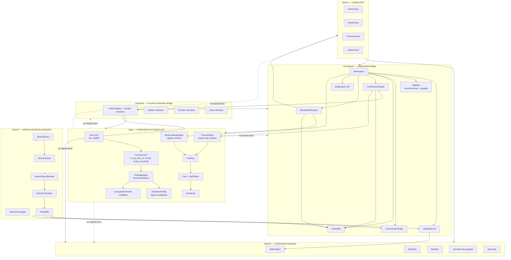
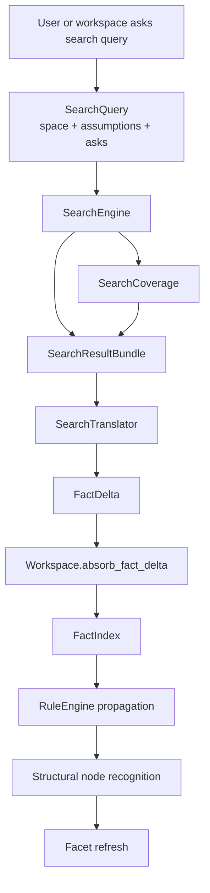
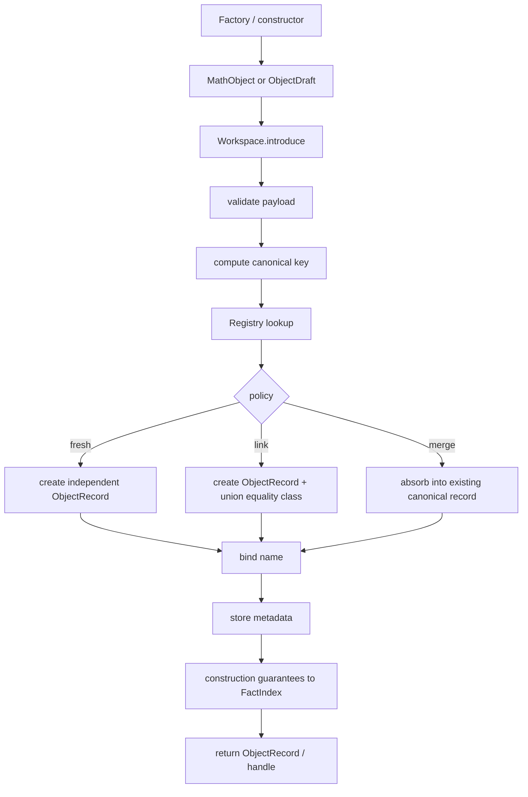

# Python Mathematical Workspace Architecture Reference

**Status:** working architecture spine.  
**Decision captured here:** the logical portion is independent and pure.  
**Origin:** this architecture began by reconsidering facets. The conclusion is that facets are not the recognition mechanism; facets are downstream APIs unlocked by certified structure.

---

## 0. Governing Picture

The project is a **mathematical workspace**, not merely a class library. A class library gives you `FiniteSet`, `Relation`, `Function`, and `Structure` objects. A mathematical workspace remembers how those objects were introduced, which names denote them, what facts have been certified, which constructions produced them, what is known equal, what failed, what can be inferred, and which specialized APIs are justified.

The current settled spine is:

```text
logic/       = pure language of mathematical claims
objects/     = payloads and concrete mathematical data
workspace/   = object ledger, names, equality, facts, certificates, provenance
checkers/    = bridge from payloads to certified facts
search/      = evidence-producing exploration layer
structural   = certified regimes / enrichment nodes
facets/      = APIs unlocked by certified regimes
```

The main slogan is:

```text
Formula = meaning.
MathObject = payload.
Checker/Search = evidence production.
Fact + Certificate = durable knowledge.
StructuralNode = certified enrichment.
Facet/View = usable API after certification.
```

The non-negotiable architectural boundary is:

```text
logic/ must not import workspace/, objects/, checkers/, search/, or facets/.
```

That keeps the logical layer clean enough to grow later toward a proof kernel, while preventing the current implementation from being contaminated by concrete Python payload assumptions.

---

## 1. Why Facets Were Reconsidered

The first recognition idea was roughly:

```text
facts → regimes → facets
```

A `PosetFacet`, for example, would expose methods such as:

```python
po.lower_set(x)
po.upper_set(x)
po.covers()
po.hasse_diagram()
```

This remains useful. The problem is that a facet only answers:

```text
What can I do once the workspace knows this object has a certain structure?
```

It does not answer:

```text
What does the claim mean?
Which predicates certify it?
Which facts are cached?
Which theorem rules propagate from it?
Which construction guaranteed it?
Which checker or search found a witness?
Why did recognition fail?
```

Therefore facets are now placed at the end of the pipeline:

```text
registered predicates
  → certified facts
  → structural nodes
  → facets/views/capabilities
```

A facet is an output of certification, not a source of mathematical meaning.

---

## 2. Whole-System Architecture Graph



The dashed arrows mean **forbidden imports**. The logical core defines the shared language. Everything else may use it, but it must not depend on the rest of the playground.

---

## 3. Package Dependency Rules

### Rule D1 — `logic/` is pure

`logic/` may import only standard-library utilities:

```text
dataclasses
typing
enum
collections
functools
itertools
```

It must not import:

```text
workspace/
objects/
checkers/
search/
facets/
```

### Rule D2 — `objects/` are payload-level

`objects/` should avoid importing `workspace/`. A finite set should be usable without a workspace. A relation should know its entries without knowing about certificates.

### Rule D3 — `workspace/` is the integration layer

`workspace/` may import `logic/` and `objects/`. It owns introduced-object history, names, equality, construction graph, fact index, certification, recognition, and explanation.

### Rule D4 — `checkers/` are impure bridges

`checkers/` may import `logic/`, `objects/`, and `workspace/`, because checkers inspect concrete payloads and return logical facts.

### Rule D5 — `search/` produces evidence bundles

Search may use formulas and workspace objects, but it must return structured evidence: `Fact`, `Certificate`, `FactDelta`, `SearchCoverage`, witnesses, and counterexamples. It must not return only informal strings.

### Rule D6 — `facets/` are downstream

Facets can depend on workspace and object payloads. They are APIs, not meaning anchors.

---

## 4. Recommended Module Layout

```text
mathplayground/
  logic/
    __init__.py
    formulas.py
      Term, Var, ObjRef
      Formula, In, Eq, PredCall
      Not, And, Or, Implies, Iff
      ForAll, Exists
      free_vars, bound_vars, substitute, alpha_rename, pretty

    predicates.py
      PredicateSpec
      PredicateRegistry
      expand_once
      expand_to_depth
      expand_to_primitives
      predicate_dependencies

    profiles.py
      DefinitionProfile
      ComputationProfile
      profile_formula
      definition_depth
      quantifier_depth
      quantifier_alternation_depth

    facts.py
      FactKey
      FactStatus
      Fact

    certificates.py
      Certificate
      CertificateSource

    rules.py
      TheoremRule
      RuleRegistry
      rule matching utilities

    structural.py
      StructuralNodeSpec
      StructuralNodeKey
      StructuralNodeCertificate

  objects/
    math_object.py
      MathObject
      ObjectDraft

    finite_set.py
      FiniteSet

    relation.py
      Relation
      RelationEntry / tuple presentation helpers

    function.py
      Function payload or function-view payload

    structure.py
      Structure

  workspace/
    records.py
      ObjectRecord

    registry.py
      Registry
      equality policies

    construction.py
      ConstructionEvent
      ConstructionGraph

    fact_index.py
      FactIndex

    certification.py
      CertificationEngine
      CertificationPlan
      CertificationStep

    recognition.py
      RecognitionEngine
      StructuralNodeRegistry

    facets.py
      FacetRegistry

    workspace.py
      Workspace

    explanation.py
      explain object, fact, certificate, node, construction

  checkers/
    base.py
      CheckerSpec
      CheckResult

    finite_sets.py
    relations.py
    functions.py
    orders.py

  search/
    spaces.py
      SearchVariable
      SearchSpace

    queries.py
      SearchQuery

    coverage.py
      SearchCoverage

    results.py
      SearchResultBundle
      FactDelta

    translators.py
      result_to_fact_delta
      witness_to_object_draft
      counterexample_to_certificate

    engines.py
      ExhaustiveSearchEngine
      BacktrackingSearchEngine
      SATSearchEngine later

  facets/
    base.py
      Facet

    function.py
      FunctionFacet

    poset.py
      PosetFacet

    lattice.py
      LatticeFacet
```

---

## 5. Logical Core: Purpose and Boundary

The logical core gives the program a machine-readable language of mathematical meaning.

It does **not** evaluate arbitrary formulas over the universe of sets. It does **not** inspect concrete object payloads. It does **not** prove arbitrary theorems.

It does provide:

```text
formula syntax trees
predicate definitions
fact keys
certificates
theorem-rule schemas
structural-node schemas
definition expansion
definition profiles
pretty printing
substitution / alpha-renaming
```

The current implementation should stop before a proof kernel. Later, a proof kernel can be added near:

```text
logic/kernel.py
logic/derivations.py
logic/proof_terms.py
```

but the first logical layer should only be a representation and certification-support layer.

---

## 6. Formula AST Skeleton

### 6.1 Terms

```python
from dataclasses import dataclass


class Term:
    pass


@dataclass(frozen=True)
class Var(Term):
    name: str
    sort: str | None = None


@dataclass(frozen=True)
class ObjRef(Term):
    object_id: int
```

`Var("R")` appears in general definitions. `ObjRef(17)` appears in concrete instantiated claims. The logic core should call this `object_id`, not `record_id`, to avoid knowing about workspace internals.

### 6.2 Formulas

```python
class Formula:
    pass


@dataclass(frozen=True)
class In(Formula):
    left: Term
    right: Term


@dataclass(frozen=True)
class Eq(Formula):
    left: Term
    right: Term


@dataclass(frozen=True)
class PredCall(Formula):
    name: str
    args: tuple[Term, ...]
```

### 6.3 Connectives

```python
@dataclass(frozen=True)
class Not(Formula):
    body: Formula


@dataclass(frozen=True)
class And(Formula):
    left: Formula
    right: Formula


@dataclass(frozen=True)
class Or(Formula):
    left: Formula
    right: Formula


@dataclass(frozen=True)
class Implies(Formula):
    left: Formula
    right: Formula


@dataclass(frozen=True)
class Iff(Formula):
    left: Formula
    right: Formula
```

### 6.4 Quantifiers

```python
@dataclass(frozen=True)
class ForAll(Formula):
    var: Var
    body: Formula


@dataclass(frozen=True)
class Exists(Formula):
    var: Var
    body: Formula
```

Bounded quantifiers may be added later as sugar:

```text
∀x∈A φ := ∀x(x ∈ A → φ)
∃x∈A φ := ∃x(x ∈ A ∧ φ)
```

### 6.5 Formula operations

```python
def free_vars(formula: Formula) -> set[str]: ...
def bound_vars(formula: Formula) -> set[str]: ...
def pred_calls(formula: Formula) -> list[PredCall]: ...
def predicate_dependencies(formula: Formula) -> set[str]: ...
def substitute(formula: Formula, subst: dict[str, Term]) -> Formula: ...
def alpha_rename(formula: Formula, taken_names: set[str]) -> Formula: ...
def pretty(formula: Formula, *, style: str = "unicode") -> str: ...
```

Do not implement this early:

```python
formula.evaluate(workspace)
```

Truth belongs to checkers, theorem rules, construction guarantees, search coverage, and certificates.

---

## 7. PredicateSpec and PredicateRegistry

A predicate spec is the registered meaning of a mathematical predicate.

```python
@dataclass
class PredicateSpec:
    key: str
    parameters: tuple[str, ...]
    formal_definition: Formula | None = None
    primitive: bool = False
    definition_profile: DefinitionProfile | None = None
    computation_profiles: list[ComputationProfile] = field(default_factory=list)
    checker_keys: tuple[str, ...] = ()
    equality_invariant: bool = True
    explanation_template: str | None = None
    metadata: dict = field(default_factory=dict)
```

Mandatory condition:

```text
Every PredicateSpec is either primitive or formally defined.
```

Examples of primitive atoms:

```text
In
Eq
```

Examples of defined predicates:

```text
Singleton(s,x)
UnorderedPair(p,x,y)
KuratowskiPair(w,x,y)
OrdPair(w)
Relation(R)
PairIn(R,x,y)
SingleValuedRelation(R)
Function(F)
CartesianProduct(P,A,B)
BinaryRelationOn(R,A)
ReflexiveOn(R,A)
TransitiveOn(R,A)
AntisymmetricOn(R,A)
```

A predicate has one mathematical meaning but may have many certification routes.

---

## 8. Formal Definitions: Foundational Examples

### 8.1 Singleton

```text
Singleton(s,x) :⇔ ∀u(u ∈ s ⇔ u = x)
```

```python
PredicateSpec(
    key="Singleton",
    parameters=("s", "x"),
    formal_definition=ForAll(
        Var("u"),
        Iff(In(Var("u"), Var("s")), Eq(Var("u"), Var("x"))),
    ),
)
```

### 8.2 Unordered pair

```text
UnorderedPair(p,x,y) :⇔ ∀u(u ∈ p ⇔ (u = x ∨ u = y))
```

### 8.3 Kuratowski pair

```text
KuratowskiPair(w,x,y) :⇔
∀z(z ∈ w ⇔ (Singleton(z,x) ∨ UnorderedPair(z,x,y)))
```

### 8.4 Ordered pair predicate

```text
OrdPair(w) :⇔ ∃x∃y KuratowskiPair(w,x,y)
```

### 8.5 Relation

```text
Relation(R) :⇔ ∀w(w ∈ R → OrdPair(w))
```

### 8.6 PairIn bridge

```text
PairIn(R,x,y) :⇔ ∃w(w ∈ R ∧ KuratowskiPair(w,x,y))
```

### 8.7 Single-valued relation

```text
SingleValuedRelation(R) :⇔
∀x∀y1∀y2((PairIn(R,x,y1) ∧ PairIn(R,x,y2)) → y1 = y2)
```

Important correction:

```text
SingleValuedRelation(R) does not by itself imply Relation(R).
```

A set with no ordered pairs may satisfy single-valuedness vacuously. Therefore:

```text
Function(F) requires Relation(F) and SingleValuedRelation(F).
```

### 8.8 Function

```text
Function(F) :⇔ Relation(F) ∧ SingleValuedRelation(F)
```

---

## 9. Definition Profiles and Computation Profiles

### 9.1 DefinitionProfile

```python
@dataclass(frozen=True)
class DefinitionProfile:
    predicate_key: str
    macro_depth: int
    quantifier_depth: int
    quantifier_alternation_depth: int
    membership_chase_depth: int
    primitive_expansion_size: int
    free_variable_count: int
    bound_variable_count: int
    predicate_dependencies: tuple[str, ...]
```

This supports the membership-chase idea:

```text
∈, =
  ↓
Singleton / UnorderedPair
  ↓
KuratowskiPair
  ↓
OrdPair
  ↓
Relation
  ↓
Function
```

### 9.2 ComputationProfile

```python
@dataclass(frozen=True)
class ComputationProfile:
    applies_when: tuple[str, ...]
    estimated_cost: str | None = None
    finite_only: bool = False
    requires_extensional_data: bool = False
    produces_witness_on_fail: bool = False
    deterministic: bool = True
    cacheable: bool = True
```

### 9.3 Key distinction

Definition depth is not runtime cost.

```text
DefinitionProfile = how the predicate unfolds semantically.
ComputationProfile = how the predicate can be checked in a concrete representation.
```

A predicate may have a massive set-theoretic expansion but a cheap checker because the payload representation already carries the relevant structure.

---

## 10. Facts and Certificates

### 10.1 FactKey

```python
@dataclass(frozen=True)
class FactKey:
    predicate: str
    args: tuple[ObjRef, ...]
```

Examples:

```python
FactKey("Function", (ObjRef(F_id),))
FactKey("TransitiveOn", (ObjRef(R_id), ObjRef(A_id)))
FactKey("CartesianProduct", (ObjRef(P_id), ObjRef(A_id), ObjRef(B_id)))
```

Prefer explicit arguments:

```text
TransitiveOn(R,A)
```

over vague local context records:

```text
subject=R, claim=transitive, context={carrier:A}
```

### 10.2 FactStatus

```python
class FactStatus(Enum):
    TRUE = "true"
    FALSE = "false"
    UNKNOWN = "unknown"
    INAPPLICABLE = "inapplicable"
    BLOCKED = "blocked"
    ASSUMED = "assumed"
    CONJECTURAL = "conjectural"
    STALE = "stale"
```

### 10.3 Certificate

```python
@dataclass(frozen=True)
class Certificate:
    source_type: str
    claim: FactKey
    source_key: str | None = None
    premises: tuple[FactKey, ...] = ()
    witness: object | None = None
    explanation: str | None = None
    data: dict = field(default_factory=dict)
```

Source types:

```text
DEFINITIONAL
CONSTRUCTION_GUARANTEE
COMPUTED
THEOREM
SEARCH_EXHAUSTIVE
SEARCH_BOUNDED
FAILED_WITH_WITNESS
USER_ASSERTED
CONJECTURAL
UNKNOWN
```

### 10.4 Fact

```python
@dataclass(frozen=True)
class Fact:
    key: FactKey
    status: FactStatus
    certificate: Certificate | None = None
```

Negative facts are valuable. A failed transitivity check with witness `(a,b,c)` should be cached, because it blocks many downstream structures.

---

## 11. TheoremRule Layer

Theorem rules are trusted implication schemas.

```python
@dataclass(frozen=True)
class TheoremRule:
    key: str
    premises: tuple[PredCall, ...]
    conclusions: tuple[PredCall, ...]
    trust_level: str = "THEOREM"
    explanation_template: str | None = None
```

Examples:

```text
Function(F) → Relation(F)
Function(F) → SingleValuedRelation(F)
BijectiveFunction(f,A,B) → InjectiveFunction(f,A,B)
PartialOrderRelation(R,A) → TransitiveOn(R,A)
```

The theorem layer is a directed hypergraph, not a tree:

```text
A + B + C → D
```

Start with forward propagation only. Do not build proof search yet.

---

## 12. Structural Nodes and Spines

### 12.1 The problem

We want tree-like organization without lying about mathematical dependency.

The fix:

```text
structural parent edges form a tree/spine
predicate requirements form a dependency graph
```

### 12.2 StructuralNodeSpec

```python
@dataclass(frozen=True)
class StructuralNodeSpec:
    key: str
    parameters: tuple[str, ...]
    parent: str | None = None
    hard_gates: tuple[PredCall, ...] = ()
    requirements: tuple[PredCall, ...] = ()
    guarantees: tuple[PredCall, ...] = ()
    unlocks: tuple[str, ...] = ()
    explanation_template: str | None = None
```

### 12.3 Example relation spine

```text
Relation
└── BinaryRelation
    ├── EquivalenceRelation
    └── PreorderRelation
        └── PartialOrderRelation
            └── LatticeOrderRelation
                └── CompleteLatticeOrderRelation
```

### 12.4 Example function spine

```text
Function
├── InjectiveFunction
├── SurjectiveFunction
├── BijectiveFunction
├── Endofunction
│   ├── IdempotentEndofunction
│   └── FixedPointSystem
└── OrderPreservingFunction
```

### 12.5 Example structure spine

```text
Structure
├── RelationalStructure
│   └── OrderedStructure
│       └── PosetStructure
│           └── LatticeStructure
├── AlgebraicStructure
│   └── Magma
│       └── Semigroup
│           └── Monoid
│               └── Group
└── MixedStructure
```

### 12.6 PartialOrderRelation node

```python
StructuralNodeSpec(
    key="PartialOrderRelation",
    parameters=("R", "A"),
    parent="PreorderRelation",
    hard_gates=(
        PredCall("Relation", (Var("R"),)),
        PredCall("SetLike", (Var("A"),)),
        PredCall("BinaryRelationOn", (Var("R"), Var("A"))),
    ),
    requirements=(
        PredCall("ReflexiveOn", (Var("R"), Var("A"))),
        PredCall("AntisymmetricOn", (Var("R"), Var("A"))),
        PredCall("TransitiveOn", (Var("R"), Var("A"))),
    ),
    guarantees=(
        PredCall("ReflexiveOn", (Var("R"), Var("A"))),
        PredCall("AntisymmetricOn", (Var("R"), Var("A"))),
        PredCall("TransitiveOn", (Var("R"), Var("A"))),
    ),
    unlocks=("partial_order_relation",),
)
```

### 12.7 Structural node certificates

```python
@dataclass(frozen=True)
class StructuralNodeKey:
    node: str
    args: tuple[ObjRef, ...]


@dataclass(frozen=True)
class StructuralNodeCertificate:
    key: StructuralNodeKey
    status: FactStatus
    certificate: Certificate
```

Early implementation can encode structural nodes as special facts, but a separate type is cleaner.

---

## 13. Certification Engine

The certification engine answers:

```text
How can I certify this target claim or structural node?
```

### 13.1 Certification routes

Route order for the first implementation:

```text
1. cached fact / cached node certificate
2. construction guarantee
3. theorem-rule derivation
4. direct checker
5. search evidence
6. definitional decomposition
7. unknown or blocked
```

### 13.2 Plan objects

```python
@dataclass(frozen=True)
class CertificationStep:
    kind: str
    target: FactKey | StructuralNodeKey
    source_key: str | None = None
    estimated_cost: object | None = None
    reason: str | None = None


@dataclass(frozen=True)
class CertificationPlan:
    target: FactKey | StructuralNodeKey
    steps: tuple[CertificationStep, ...]
    total_estimated_cost: object | None = None
```

### 13.3 Ranking

Ranking should eventually use:

```text
known cached facts
construction guarantees
cost of missing requirements
definition depth
computation profile
structural payoff
cheap obstruction availability
coverage strength
```

But ranking decides only order, not truth.

```text
Plans choose what to try.
Certificates decide what is known.
```

---

## 14. Obstruction-First Checking

For structural nodes, split checks into:

```text
hard gates
cheap obstructions
full certifying checks
```

Example for partial order:

```text
hard gates:
  R relation-like
  A set-like
  R binary on A

cheap obstructions:
  missing diagonal pair, refuting reflexivity
  aRb and bRa with a≠b, refuting antisymmetry
  aRb and bRc but not aRc, refuting transitivity

full checks:
  full reflexivity
  full antisymmetry
  full transitivity
```

If a cheap obstruction is found, store the negative fact with a witness. Then block dependent nodes.

---

## 15. Checkers

A checker is not a predicate definition. It is a feasible route to a fact.

```python
@dataclass(frozen=True)
class CheckerSpec:
    key: str
    predicate_key: str
    profile: ComputationProfile
    trust_level: str = "COMPUTED"
```

Actual checker functions live in `checkers/` and may inspect workspace records and payloads.

Example:

```python
def check_transitive_on(workspace, fact_key: FactKey) -> Fact:
    R_id, A_id = [arg.object_id for arg in fact_key.args]
    R = workspace.record(R_id).obj
    A = workspace.record(A_id).obj
    # inspect finite/extensional data
    ...
```

A checker returns a `Fact` with a `Certificate`.

---

## 16. Search Layer

Search is a generalized evidence producer. It should not return only raw candidates. It should return evidence bundles.

### 16.1 Search data flow



### 16.2 Search objects

```python
@dataclass(frozen=True)
class SearchVariable:
    name: str
    domain: object


@dataclass(frozen=True)
class SearchSpace:
    key: str
    variables: tuple[SearchVariable, ...]
    ambient_formula: Formula
    estimated_size: object | None = None
    data: dict = field(default_factory=dict)


@dataclass(frozen=True)
class SearchQuery:
    space: SearchSpace
    assumptions: tuple[Formula, ...] = ()
    asks: tuple[Formula, ...] = ()
    mode: str = "exhaustive"
    limits: dict = field(default_factory=dict)


@dataclass(frozen=True)
class SearchCoverage:
    exhaustive: bool
    searched_count: int | None = None
    total_count: int | None = None
    bounds: dict = field(default_factory=dict)
    method: str | None = None
    engine: str | None = None
```

### 16.3 SearchResultBundle and FactDelta

```python
@dataclass
class SearchResultBundle:
    query: SearchQuery
    coverage: SearchCoverage
    candidate_count: object | None = None
    surviving_candidates: object | None = None
    true_facts: list[Fact] = field(default_factory=list)
    false_facts: list[Fact] = field(default_factory=list)
    unknown_facts: list[Fact] = field(default_factory=list)
    conjectural_facts: list[Fact] = field(default_factory=list)
    witnesses: list[object] = field(default_factory=list)
    counterexamples: list[object] = field(default_factory=list)
    generated_objects: list[object] = field(default_factory=list)
    residual_constraints: list[Formula] = field(default_factory=list)
    exports: dict[str, object] = field(default_factory=dict)


@dataclass
class FactDelta:
    source: str
    facts: list[Fact] = field(default_factory=list)
    generated_objects: list[object] = field(default_factory=list)
    construction_events: list[object] = field(default_factory=list)
    residual_constraints: list[Formula] = field(default_factory=list)
    explanation: str | None = None
```

### 16.4 Coverage rule

```text
No coverage, no strong certificate.
```

Exhaustive search may produce `TRUE` or `FALSE` facts. Bounded non-exhaustive search should produce `CONJECTURAL` or bounded evidence, not theorem-level facts.

---

## 17. Payload Objects

### 17.1 MathObject

`MathObject` should stay thin.

```python
class MathObject:
    object_kind = "MathObject"

    def validate(self) -> None:
        raise NotImplementedError

    def canonical_key(self) -> tuple:
        raise NotImplementedError

    def display_payload(self) -> str:
        raise NotImplementedError

    def default_metadata(self) -> "InitialMetadata":
        return InitialMetadata()
```

### 17.2 ObjectDraft

```python
@dataclass(frozen=True)
class ObjectDraft:
    obj: MathObject
    metadata: InitialMetadata
```

Factories may return `ObjectDraft`s to attach construction metadata and guarantees.

### 17.3 FiniteSet

Owns:

```text
elements
membership
cardinality
union/intersection/difference/powerset
canonical extensional equality
```

### 17.4 Relation

Owns:

```text
entries
arity profile
field/domain/range if extensional
inverse/restriction/image
canonical relation equality
```

Carrier-relative properties are not global relation payload facts:

```text
ReflexiveOn(R,A)
TransitiveOn(R,A)
PartialOrderRelation(R,A)
```

### 17.5 Function

Set-theoretically, a function is a single-valued relation. Computationally, a function may deserve its own payload representation and spine.

Recommended stance:

```text
Function has a function spine computationally.
Function can expose a graph-as-relation bridge mathematically.
```

### 17.6 Structure

Owns slots:

```text
carrier
relations
operations
functions
constants
```

Recognition certifies:

```text
PosetStructure
GroupStructure
LatticeStructure
```

only after requirements are known.

---

## 18. Workspace Layer

### 18.1 ObjectRecord

```python
@dataclass
class ObjectRecord:
    record_id: int
    obj: MathObject
    kind: str
    canonical_key: tuple
    names: set[str] = field(default_factory=set)
    aliases: set[str] = field(default_factory=set)
    presentations: list = field(default_factory=list)
    definitions: list = field(default_factory=list)
    provenance: list = field(default_factory=list)
    local_facts: list[Fact] = field(default_factory=list)
    structural_nodes: dict = field(default_factory=dict)
    facets: dict[str, object] = field(default_factory=dict)
    construction_events: list = field(default_factory=list)
    equal_to: set[int] = field(default_factory=set)
    equivalent_to: set[int] = field(default_factory=set)
    status: str = "active"
```

### 18.2 Registry

```python
class Registry:
    def __init__(self):
        self.key_to_record_ids: dict[tuple, list[int]] = {}
        self.key_to_primary_id: dict[tuple, int] = {}
        self.parent: dict[int, int] = {}
```

Mature default equality policy:

```text
link
```

Meaning: preserve separate construction histories but record known equality through canonical keys or certified equality.

### 18.3 ConstructionGraph

```python
@dataclass(frozen=True)
class ConstructionEvent:
    name: str
    input_records: tuple[int, ...]
    output_record: int
    protocol: str | None = None
    guarantees: tuple[FactKey, ...] = ()
    data: dict = field(default_factory=dict)
```

Construction guarantees should enter the fact index with `CONSTRUCTION_GUARANTEE` certificates.

### 18.4 Workspace fields

```python
class Workspace:
    def __init__(self, *, equality_policy="link"):
        self.equality_policy = equality_policy
        self._records = {}
        self._name_to_id = {}
        self._registry = Registry()
        self._construction_graph = ConstructionGraph()
        self._next_id = 0

        self._predicate_registry = PredicateRegistry()
        self._fact_index = FactIndex()
        self._rule_registry = RuleRegistry()
        self._rule_engine = RuleEngine(self)
        self._structural_registry = StructuralNodeRegistry()
        self._certification_engine = CertificationEngine(self)
        self._facet_registry = FacetRegistry()
```

---

## 19. Workspace Public API

```python
class Workspace:
    # object ledger
    def introduce(self, obj_or_draft, *, name=None, policy=None): ...
    def record(self, record_id: int) -> ObjectRecord: ...
    def get(self, name: str) -> ObjectRecord: ...
    def name(self, record, name: str) -> None: ...
    def alias(self, record, alias: str) -> None: ...

    # equality
    def canonical(self, record) -> ObjectRecord: ...
    def knows_equal(self, left, right) -> bool: ...
    def assert_equal(self, left, right, *, certificate=None) -> None: ...

    # predicates and formulas
    def register_predicate(self, spec: PredicateSpec) -> None: ...
    def predicate(self, key: str) -> PredicateSpec: ...
    def expand_predicate(self, key: str, *args, depth=None) -> Formula: ...
    def definition_profile(self, key: str) -> DefinitionProfile: ...

    # facts and certification
    def fact_key(self, predicate: str, *records) -> FactKey: ...
    def fact(self, predicate: str, *records) -> Fact | None: ...
    def knows(self, predicate: str, *records) -> bool: ...
    def certify(self, predicate: str, *records) -> Fact: ...
    def why(self, predicate: str, *records) -> str: ...

    # rules and structural nodes
    def register_theorem_rule(self, rule: TheoremRule) -> None: ...
    def propagate(self) -> list[Fact]: ...
    def register_structural_node(self, spec: StructuralNodeSpec) -> None: ...
    def certify_node(self, node_key: str, *records): ...

    # facets and explanation
    def facet(self, record, name: str): ...
    def explain(self, record) -> str: ...

    # search bridge
    def absorb_fact_delta(self, delta: FactDelta) -> None: ...
    def absorb_search_result(self, result: SearchResultBundle) -> None: ...
```

---

## 20. Facets / Views / Capabilities

Facets are APIs unlocked by certified structural nodes.

```python
class Facet:
    facet_name = "abstract"

    def __init__(self, workspace, record, certificate):
        self.workspace = workspace
        self.record = record
        self.certificate = certificate
```

Example:

```python
class PosetFacet(Facet):
    facet_name = "poset"

    def lower_set(self, x): ...
    def upper_set(self, x): ...
    def covers(self): ...
    def hasse_diagram(self): ...
```

A structural node spec unlocks symbolic capability names:

```python
unlocks=("poset",)
```

The workspace resolves that to an actual facet class.

---

## 21. End-to-End Flow Graphs

### 21.1 Object introduction



### 21.2 Predicate certification

```mermaid
flowchart TD
    A[W.certify(predicate, records)] --> B[Build FactKey]
    B --> C{FactIndex has TRUE/FALSE?}
    C -->|yes| Z[return cached Fact]
    C -->|no| D[PredicateRegistry lookup]
    D --> E{construction guarantee?}
    E -->|yes| F[store guaranteed Fact]
    E -->|no| G{theorem derivable?}
    G -->|yes| H[apply TheoremRule]
    G -->|no| I{checker available?}
    I -->|yes| J[run checker]
    I -->|no| K{search route available?}
    K -->|yes| L[run search / absorb FactDelta]
    K -->|no| M{definitional decomposition?}
    M -->|yes| N[certify subclaims]
    M -->|no| O[return UNKNOWN]
    F --> P[FactIndex.add]
    H --> P
    J --> P
    L --> P
    N --> P
    P --> Q[RuleEngine propagation]
    Q --> R[attempt structural recognition]
    R --> S[refresh facets if unlocked]
```

### 21.3 Structural node certification

```mermaid
flowchart TD
    A[W.certify_node(node, args)] --> B[Instantiate StructuralNodeSpec]
    B --> C[Check hard gates]
    C -->|gate fails| D[BLOCKED node certificate]
    C -->|gates pass| E[Run cheap obstruction checks]
    E -->|counterexample found| F[store FALSE fact with witness]
    F --> G[BLOCK dependent nodes]
    E -->|no obstruction| H[Certify requirements]
    H -->|requirement false| G
    H -->|all true| I[store StructuralNodeCertificate]
    I --> J[cache guarantees]
    J --> K[cache ancestor nodes]
    K --> L[unlock facets]
```

---

## 22. Examples

## 22.1 Function certification

User:

```python
F = W.introduce(Relation.from_entries({("a", 1), ("b", 2)}), name="F")
W.certify("Function", F)
```

Meaning:

```text
Function(F) ⇔ Relation(F) ∧ SingleValuedRelation(F)
```

Possible certification route:

```text
1. Relation(F) known from payload construction.
2. SingleValuedRelation(F) checked by finite extensional checker.
3. Function(F) certified by definitional decomposition.
4. Function(F) implies Relation(F) and SingleValuedRelation(F) by theorem/definition rules.
5. FunctionFacet unlocked if configured.
```

Stored facts:

```text
Relation(F) = TRUE
SingleValuedRelation(F) = TRUE
Function(F) = TRUE
```

Explanation:

```text
F is a function because it is a relation and the finite checker found no input with two distinct outputs.
```

## 22.2 Partial order certification

Target:

```python
W.certify_node("PartialOrderRelation", R, A)
```

Requirements:

```text
Relation(R)
SetLike(A)
BinaryRelationOn(R,A)
ReflexiveOn(R,A)
AntisymmetricOn(R,A)
TransitiveOn(R,A)
```

If transitivity fails, store:

```text
TransitiveOn(R,A) = FALSE
witness = (a,b,c)
explanation = aRb and bRc but not aRc
```

Then block:

```text
PreorderRelation(R,A)
PartialOrderRelation(R,A)
PosetStructure(S)
LatticeStructure(S)
```

## 22.3 Poset structure bridge

Bridge rule:

```text
Structure S has carrier A and order slot R
PartialOrderRelation(R,A)
----------------------------------------
PosetStructure(S)
```

This bridges the relation spine and the structure spine.

---

## 23. Equality and Fact Transport

The registry knows equality classes. The logical layer should be conservative about fact transport.

Add to `PredicateSpec`:

```python
equality_invariant: bool = True
```

Most mathematical facts are equality-invariant:

```text
Cardinality(A,3)
SubsetOf(A,B)
TransitiveOn(R,A)
```

But workspace-history facts are not:

```text
IntroducedByRoster(A)
NamedAs(A,"A")
ConstructedBySearch(A)
```

Design rule:

```text
Mathematical facts may transport across equality.
Workspace-history facts should not automatically transport.
```

---

## 24. Implementation Plan

### Phase A — isolate pure logic

Implement:

```text
logic/formulas.py
logic/predicates.py
logic/profiles.py
logic/facts.py
logic/certificates.py
logic/rules.py
logic/structural.py
```

No imports from workspace or objects.

### Phase B — wire workspace fact index

Implement:

```text
FactIndex
Workspace.fact_key
Workspace.fact
Workspace.knows
Workspace.certify placeholder
```

### Phase C — register foundational predicates

Register:

```text
Singleton
UnorderedPair
KuratowskiPair
OrdPair
Relation
PairIn
SingleValuedRelation
Function
CartesianProduct
```

Implement:

```text
expand_once
expand_to_depth
free_vars
predicate_dependencies
definition_depth
quantifier_depth
pretty
```

### Phase D — bridge checkers

Implement finite/extensional checkers for:

```text
Relation
SingleValuedRelation
Function
BinaryRelationOn
ReflexiveOn
SymmetricOn
AntisymmetricOn
TransitiveOn
```

### Phase E — construction guarantees

Make object/construction factories emit facts like:

```text
CartesianProduct(P,A,B)
Union(C,A,B)
Relation(R)
Function(F)
```

with `CONSTRUCTION_GUARANTEE` certificates where justified.

### Phase F — theorem rules

Start with simple forward rules:

```text
Function(F) → Relation(F)
Function(F) → SingleValuedRelation(F)
EquivalenceRelation(R,A) → ReflexiveOn(R,A)
EquivalenceRelation(R,A) → SymmetricOn(R,A)
EquivalenceRelation(R,A) → TransitiveOn(R,A)
PartialOrderRelation(R,A) → ReflexiveOn(R,A)
PartialOrderRelation(R,A) → AntisymmetricOn(R,A)
PartialOrderRelation(R,A) → TransitiveOn(R,A)
```

### Phase G — structural nodes

Implement:

```text
FunctionObject
EquivalenceRelation
PreorderRelation
PartialOrderRelation
PosetStructure
```

### Phase H — facets

Attach:

```text
FunctionFacet
EquivalenceRelationFacet
PosetFacet
```

only after structural certification.

### Phase I — search evidence

Start with finite brute force:

```text
subsets of finite sets
relations on finite sets
functions between finite sets
```

Return `SearchResultBundle`, translate to `FactDelta`, absorb into workspace.

---

## 25. Non-Negotiable Rules

1. `logic/` must stay independent.
2. Formulas represent meaning, not runtime payloads.
3. Predicates are registered; no random string claims.
4. Facts are instantiated predicate claims with statuses.
5. Every nontrivial fact should have a certificate.
6. Negative facts with witnesses are first-class knowledge.
7. Construction guarantees become facts.
8. Theorem rules are trusted schemas, not arbitrary proof search.
9. Structural nodes are certified regimes, not mere predicates.
10. Facets are downstream APIs, not recognition logic.
11. Search results must become `FactDelta`s, not temporary lists.
12. Equality, isomorphism, aliasing, and construction history are distinct.
13. Ranking guides the planner but never decides truth.
14. Start small; do not build a proof assistant before the workspace works.

---

## 26. One-Sentence Final Summary

The mathematical playground is intended to function as a workspace where concrete payload objects are introduced into a ledger, logical predicates give their claims machine-readable meaning, checkers/search/constructions/theorem rules produce certified facts, structural nodes organize those facts into recognized mathematical regimes, and facets expose APIs only after the corresponding regime has been certified.
