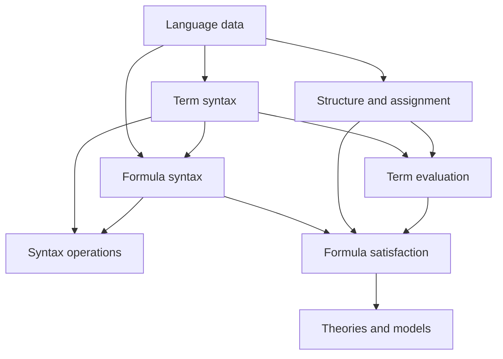

# Logic Package Architecture Plan

**Status:** Working architecture and implementation guide.

## 1. Purpose

`logic/` is an independent Python package for constructing and working with
many-sorted first-order languages.

The package supplies the metatheoretic machinery. A user supplies a particular
language: its sorts, variables, function symbols, relation symbols, equality
policy, and selected logical vocabulary.

The initial target is not a framework for inventing arbitrary new logics. The
backend supports a fixed repertoire of first-order mechanisms and ensures that
they behave correctly:

- well-formed term and formula construction;
- sort-correct function and relation application;
- logical connectives and quantifiers;
- variable binding and alpha-renaming;
- capture-avoiding substitution;
- structures, assignments, evaluation, and satisfaction.

Proof systems, automated reasoning, and user-defined logical constructors may
be added later, but they do not shape the first implementation.

## 2. Governing Distinctions

### 2.1 Metatheory and instantiated language

Python classes such as `ForAll`, `Equals`, and `RelationApplication` belong to
the metatheoretic implementation. Their existence does not make them available
in every instantiated language.

A language determines which constructions are admitted. For example:

- `ForAll(x, phi)` is well formed only if universal quantification is admitted;
- `Equals(t, u)` is well formed only if equality is admitted at their common
  sort;
- `RelationApplication(R, args)` is well formed only if `R` belongs to the
  language and the argument sorts match its profile.

### 2.2 Language and structure

A language declares symbols and their profiles. It does not assign them
semantic values.

An `L`-structure interprets a fixed language `L` by supplying:

- one carrier for each object sort;
- one element for each constant symbol;
- one operation for each function symbol;
- one relation for each relation symbol.

The backend supplies the semantics of logical vocabulary. Under ordinary
first-order semantics, a structure does not choose a new meaning for `and`,
`forall`, or logical equality.

### 2.3 Syntax and semantics

A term is not its semantic value, and a formula is not its truth value.

```text
term + structure + assignment       -> semantic value
formula + structure + assignment    -> truth value
```

### 2.4 Object sorts and syntactic sorts

Object sorts belong to an instantiated language. Examples include `Point`,
`Line`, or `GroupElement`.

From those object sorts, the syntax layer has corresponding syntactic sorts:

```text
Term[Point]
Term[Line]
Formula
```

`Formula` is not an object sort. Classifications such as `SetLike` and
`RelationLike` are also not globally built-in sorts; a particular language may
declare them if needed.

Subsorting is not part of the initial core. If later required, it should be an
explicit relation or policy rather than a mandatory `parent` field on every
sort.

## 3. Architectural Spine



### 3.1 Language data

A many-sorted first-order language contains:

```text
Language
  object sorts
  sorted variable supplies
  constant and function symbols with profiles
  relation symbols with profiles
  equality policy
  logical vocabulary
  binding conventions
```

Constants should initially be treated as nullary function symbols. This keeps
term formation and interpretation uniform.

### 3.2 Term syntax

Terms are generated from variables and function symbols:

```text
Variable(sort)
FunctionApplication(symbol, arguments)
```

The term layer is the algebraic reduct of the language. It does not depend on
relations, connectives, quantifiers, or truth.

### 3.3 Formula syntax

Atomic formulas are formed from:

```text
RelationApplication(symbol, arguments)
Equals(left, right)
```

Compound formulas are formed using the logical vocabulary admitted by the
language:

```text
Not
And
Or
Implies
Iff
ForAll
Exists
```

Membership is not globally primitive. A set-theoretic language may declare a
binary relation symbol named `in`.

### 3.4 Syntax operations

Operations over syntax should normally be ordinary functions rather than
methods embedded throughout the syntax classes.

The first supported operations are:

- structural traversal;
- pretty printing;
- free-variable calculation;
- alpha-renaming;
- sort-preserving term substitution;
- capture-avoiding formula substitution.

Simple operations such as size and pretty printing are structural folds.
Binding-aware substitution additionally requires scope and freshness handling.

### 3.5 Structures and assignments

An `L`-structure must be complete and profile-correct for its language. Its
function and relation interpretations should be validated when the structure
is built, as far as Python can validate them without evaluating every possible
input.

An assignment maps each variable of sort `s` to an element of the carrier
`M_s`.

### 3.6 Evaluation and satisfaction

Term evaluation is recursive and homomorphic:

```text
evaluate(variable)       = assignment value
evaluate(f(t1, ..., tn)) = interpretation(f)(evaluate(t1), ..., evaluate(tn))
```

Formula satisfaction first evaluates atomic terms, then applies fixed logical
clauses for connectives and quantifiers.

Quantifiers range over the carrier corresponding to the bound variable's sort.

## 4. Proposed Package Components

These are responsibility boundaries, not a requirement to create every file
immediately.

```text
logic/
  language.py       sorts, symbols, profiles, Language
  terms.py          variables and function applications
  formulas.py       atomic and compound formulas
  traversal.py      folds, walks, and generic syntax traversal
  variables.py      free variables, freshness, alpha-renaming
  substitution.py   term and capture-avoiding formula substitution
  pretty.py         configurable rendering
  structures.py     Structure and Assignment
  semantics.py      term evaluation and formula satisfaction
  theories.py       Theory and model-of relation; later
  errors.py         well-formedness and interpretation errors
```

The present `induction_and_recursion.py` and `formal_syntax.py` are experiments
and learning surfaces. They do not yet define the package API.

## 5. Core Invariants

1. Every term has exactly one object sort.
2. Every function application matches the function symbol's input profile and
   receives its declared output sort.
3. Every relation application matches the relation symbol's input profile.
4. Equality is only formed between terms of the same sort and only where the
   equality policy admits it.
5. Every syntax object belongs to one fixed language.
6. Substitution preserves language membership and sorts.
7. Formula substitution avoids variable capture.
8. Every structure interprets exactly the vocabulary required by its language.
9. Every assignment maps variables into carriers of the matching sort.
10. Logical semantics is supplied by the backend, not redefined independently
    by each structure.

## 6. First Vertical Slice

The first implementation should answer one concrete question:

> Can we declare a small typed arithmetic language, construct a term, interpret
> the language in Python integers, and evaluate the term?

Target usage:

```python
number = Sort("Number")

language = Language(
    sorts={number},
    functions={
        FunctionSymbol("zero", inputs=(), output=number),
        FunctionSymbol("succ", inputs=(number,), output=number),
        FunctionSymbol("add", inputs=(number, number), output=number),
    },
)

x = language.variable("x", sort=number)
term = language.apply("add", language.apply("succ", x), language.apply("zero"))

integers = Structure(
    language,
    carriers={number: int},
    functions={
        "zero": 0,
        "succ": lambda value: value + 1,
        "add": lambda left, right: left + right,
    },
)

assert evaluate(term, integers, {x: 4}) == 5
```

The exact API is provisional. This example exists to force the first useful
interfaces and invariants.

### Initial implementation checklist

- [ ] Define immutable `Sort` and profiled `FunctionSymbol` values.
- [ ] Define `Language` with symbol registration and profile validation.
- [ ] Define sorted `Variable` and `FunctionApplication` terms.
- [ ] Reject unknown symbols, wrong arities, and sort mismatches.
- [ ] Define `Structure` and validate required interpretations.
- [ ] Implement `evaluate`.
- [ ] Implement a minimal term pretty-printer.
- [ ] Add one runnable arithmetic smoke test.

Do not add formulas until this slice works.

## 7. Following Slices

### Slice 2: Atomic and propositional formulas

Add relation symbols, equality, Boolean connectives, and satisfaction without
quantifiers.

### Slice 3: Binding

Add quantifiers, free-variable analysis, freshness, alpha-renaming, and
capture-avoiding substitution.

### Slice 4: Quantifier semantics

Add assignment updates and satisfaction clauses that range over sorted
carriers.

### Slice 5: Theories

Represent sets of sentences and define when a structure is a model of a
theory.

## 8. Deferred Work

The following should not influence the first implementation:

- arbitrary user-defined logical constructors;
- subsorting and coercions;
- proof calculi and derivation objects;
- proof search or theorem proving;
- rewriting and normalization systems;
- certificates, trust levels, and fact statuses;
- structural-node or certification planning;
- SAT, SMT, Lean, or Coq integration;
- alternate concrete presentations of syntax;
- classes generated automatically from specifications.

They remain possible future consumers, not current requirements.

## 9. Immediate Decision

Begin with Slice 1. It is small enough to understand completely but exercises
the central dependency chain:

```text
language -> sorted terms -> structure -> evaluation
```

Every abstraction introduced during that slice must serve one of those four
pieces.
