# Algebraic Syntax for First-Order Logic — Theory Skeleton Atlas

**Standing notation.** $\Omega=(\Omega,\operatorname{ar})$ is a one-sorted finitary signature, $\Omega_n:=\{f:\operatorname{ar}(f)=n\}$, and $X\cap\Omega=\varnothing$ is the generator/variable set. $\mathbf A=(A,(f^{\mathbf A})_{f\in\Omega})$ is an $\Omega$-algebra; bold = algebra, italic = carrier. $T:=T_\Omega(X)$ and $\mathbf T:=\mathbf T_\Omega(X)$; $\eta_X:X\to T$ is variable insertion. For $g:X\to B$, $\operatorname{ev}_g:\mathbf T\to\mathbf B$ is evaluation and $\kappa_g:=\ker(\operatorname{ev}_g)$. For a congruence $\theta$, $\operatorname{nat}_\theta:T\to T/\theta$ is the quotient projection. $X_n:=\{x_1,\dots,x_n\}$, $T(n):=T_\Omega(X_n)$, $E_n:=\{\Box_1,\dots,\Box_n\}$.

> [!note] How to read this atlas
> Treat this file as a dependency map, not as a substitute for the full treatise. The main line is:
>
> $$
> \text{signature} \to \text{free syntax} \to \text{syntax operations} \to \text{evaluation} \to \text{kernels/quotients}.
> $$
>
> The highest-yield panels are 6--10, 16--19, and 23--29. Panels 6--10 explain why raw terms are governed by a universal property rather than by any chosen encoding. Panels 16--19 explain why substitution and contexts are not extra machinery: they are just evaluation into syntax and substitution at holes. Panels 23--29 explain the semantic payoff: evaluation is a homomorphism, semantic collapse is a kernel, and quotient syntax is legitimate exactly when the relevant maps descend.
>
> The recurring test is always the same: **is the proposed map compatible with the structure it is supposed to respect?** For homomorphisms this means operation preservation; for quotients it means congruence-compatibility; for substitutions on quotients it means preservation of equivalence classes; for evaluation through a quotient it means the equations are valid under the assignment.

---

## Panel 1 — Signature, algebra, and homomorphism data

A finitary signature fixes constructor arities:

$$
\Omega=\coprod_{n\in\mathbb N}\Omega_n,\qquad f\in\Omega_n\Rightarrow f^{\mathbf A}:A^n\to A.
$$

Nullaries are distinguished carrier elements:

$$
c\in\Omega_0 \quad\Rightarrow\quad c^{\mathbf A}\in A.
$$

A homomorphism is exactly operation preservation:

$$
h:\mathbf A\to\mathbf B,\\qquad
h\big(f^{\mathbf A}(a_1,\dots,a_n)\big)=f^{\mathbf B}\big(h(a_1),\dots,h(a_n)\big).
$$

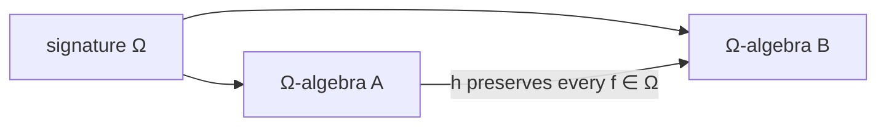

$$
\boxed{\text{signature = operation types; algebra = interpretations; homomorphism = preservation.}}
$$

**Focus.** This is the type discipline for the whole document: every later construction must say what the carrier is, what the operations are, and which maps preserve them.

*Provenance:* Definitions 1.1, 1.3, 1.5, 1.11; Proposition 1.12.

---

## Panel 2 — Constants are forced; generators are free

Constants and generators are both atomic in syntax but opposite under maps:

$$
\begin{array}{c|c|c}
\text{atom} & \text{source} & \text{map behavior} \\
\hline
c\in\Omega_0 & \text{signature} & h(c^{\mathbf A})=c^{\mathbf B} \\
x\in X & \text{external generator set} & g(x)\text{ arbitrary}
\end{array}
$$

Generator insertion is extra structure:

$$
\eta:X\to F,\qquad (\mathbf F,\eta)\text{ is assessed as a pair.}
$$

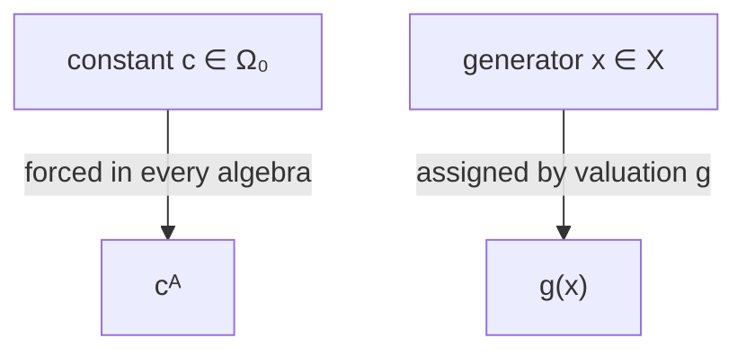

$$
\boxed{\Omega_0\neq X.\; \text{Treating variables as nullaries destroys the UMP.}}
$$

**Focus.** Constants are interpreted uniformly in every algebra; variables are reassigned by valuations. This distinction is the first-order logic distinction between function-symbol constants and individual variables.

*Provenance:* Warning 1.4; Definitions 3.1–3.3; Construction 4.4.

---

## Panel 3 — Subalgebra generation

A subset $C\subseteq A$ is a subuniverse iff closed under all basic operations:

$$
\vec c\in C^n\Rightarrow f^{\mathbf A}(\vec c)\in C,\qquad c^{\mathbf A}\in C\ (c\in\Omega_0).
$$

Generated subalgebra:

$$
\langle S\rangle_{\mathbf A}:=\bigcap\{C\subseteq A:S\subseteq C,\ C\text{ closed}\}.
$$

Finitary stage construction:

$$
S^{(0)}=S\cup\{c^{\mathbf A}:c\in\Omega_0\},
$$

$$
S^{(k+1)}=S^{(k)}\cup\{f^{\mathbf A}(a_1,\dots,a_n):n\ge1,\ f\in\Omega_n,\ a_i\in S^{(k)}\},
$$

$$
\boxed{\langle S\rangle_{\mathbf A}=\bigcup_{k<\omega}S^{(k)}}.
$$

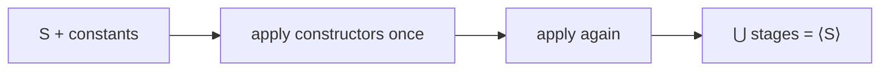

Homomorphic image of generated data:

$$
h[\langle S\rangle_{\mathbf A}]=\langle h[S]\rangle_{\mathbf B}.
$$

*Provenance:* Definitions 2.1, 2.4; Construction 2.5; Proposition 2.7.

---

## Panel 4 — Kernels, congruences, quotients

Kernel:

$$
\ker h:=\{(a,a'):h(a)=h(a')\};\qquad h\text{ injective}\iff\ker h=\Delta_A.
$$

Congruence:

$$
\theta\in\operatorname{Con}(\mathbf A)
\iff
\theta\text{ is an equivalence and }(a_i,b_i)\in\theta\Rightarrow
(f^{\mathbf A}(\vec a),f^{\mathbf A}(\vec b))\in\theta.
$$

Quotient algebra:

$$
f^{\mathbf A/\theta}([a_1]_\theta,
\dots,[a_n]_\theta):=[f^{\mathbf A}(a_1,
\dots,a_n)]_\theta.
$$

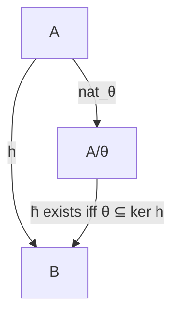

$$
\boxed{\text{compatibility is exactly quotient well-definedness.}}
$$

**Focus.** Whenever a construction is pushed to equivalence classes, ask whether changing representatives changes the output. Congruence is precisely the condition that the answer is no.

*Provenance:* Definitions 2.8, 2.9, 2.12, 2.14; Proposition 2.11; Theorem 2.15.

---

## Panel 5 — First isomorphism template

Every homomorphism factors canonically:

$$
\mathbf A\twoheadrightarrow \mathbf A/\ker h\xrightarrow{\ \cong\ }\operatorname{im}(h)\hookrightarrow\mathbf B,
\qquad [a]\mapsto h(a).
$$

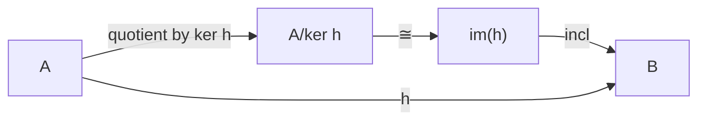

$$
\boxed{\text{image} = \text{domain modulo exactly the identifications forced by }h.}
$$

This is later used with $h=\operatorname{ev}_g$.

*Provenance:* Theorem 2.16; later instantiated in Theorem 17.9.

---

## Panel 6 — Free algebra = UMP

$(\mathbf F,\eta)$ is free on $X$ iff, for every $\mathbf A$ and every assignment $g:X\to A$, there is a unique homomorphism

$$
\widehat g:\mathbf F\to\mathbf A,
\qquad \widehat g\circ\eta=g.
$$

Equivalently:

$$
\operatorname{Hom}_\Omega(\mathbf F,\mathbf A)\cong A^X,
\qquad h\mapsto h\circ\eta.
$$

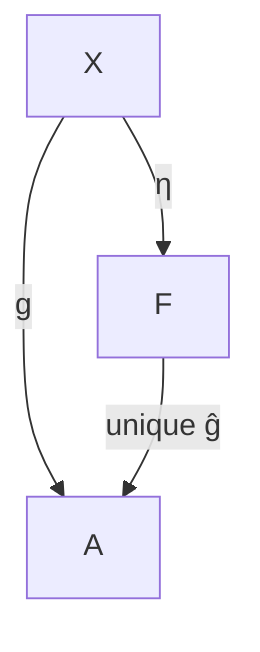

Consequences:

$$
h\circ\eta=k\circ\eta\Rightarrow h=k,\qquad
\langle\eta[X]\rangle_{\mathbf F}=F.
$$

$$
\boxed{\text{homomorphisms out of free syntax are fixed by generator values.}}
$$

**Focus.** The UMP is the engine behind evaluation, substitution, recursion, and transfer. Once generator values are fixed, there is no remaining choice.

*Provenance:* Definition 3.4; Lemma 3.5; Propositions 3.6–3.7.

---

## Panel 7 — Uniqueness of free syntax

If $(\mathbf F,\eta)$ and $(\mathbf F',\eta')$ are free on the same $X$, then there is a unique isomorphism over $X$:

$$
\varphi:\mathbf F\xrightarrow{\cong}\mathbf F',
\qquad \varphi\circ\eta=\eta'.
$$

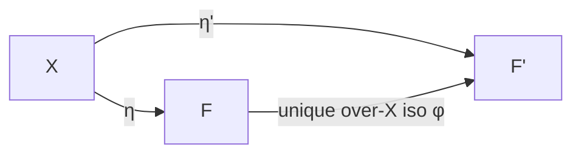

$$
\boxed{\text{free syntax is unique canonically, not merely up to arbitrary isomorphism.}}
$$

**Focus.** This justifies working with trees, strings, tuples, or expressions interchangeably when the statement is invariant. Encoding-specific facts still stay with their encoding.

*Provenance:* Theorem 3.8; Remark 3.9.

---

## Panel 8 — Canonical term algebra

Terms are the least set closed under:

$$
\textbf{(V)}\ X\subseteq T_\Omega(X),\qquad
\textbf{(C)}\ \Omega_0\subseteq T_\Omega(X),
$$

$$
\textbf{(O)}\quad f\in\Omega_n,\ n\ge1,\\ t_i\in T_\Omega(X)\Rightarrow f(t_1,\dots,t_n)\in T_\Omega(X).
$$

Term algebra operations are formal constructors:

$$
f^{\mathbf T}(t_1,\dots,t_n):=f(t_1,\dots,t_n),
\qquad c^{\mathbf T}:=c.
$$

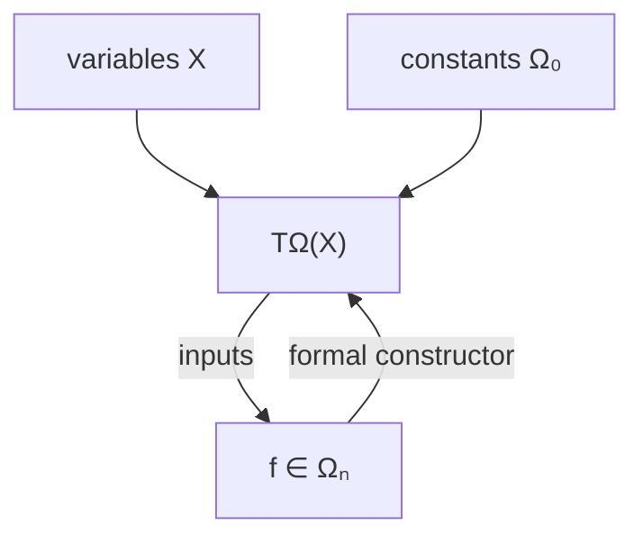

$$
\boxed{\mathbf T_\Omega(X)\text{ builds syntax; it computes nothing.}}
$$

**Focus.** The term algebra records construction history. Computation only begins after choosing a target algebra and a valuation.

*Provenance:* Definition 4.1; Constructions 4.3–4.4.

---

## Panel 9 — Term algebra freeness and evaluation recursion

For every $g:X\to A$, the unique extension $\widehat g:\mathbf T\to\mathbf A$ is given by:

$$
\widehat g(x)=g(x),\qquad \widehat g(c)=c^{\mathbf A},
$$

$$
\widehat g(f(t_1,\dots,t_n))=f^{\mathbf A}(\widehat g(t_1),\dots,\widehat g(t_n)).
$$

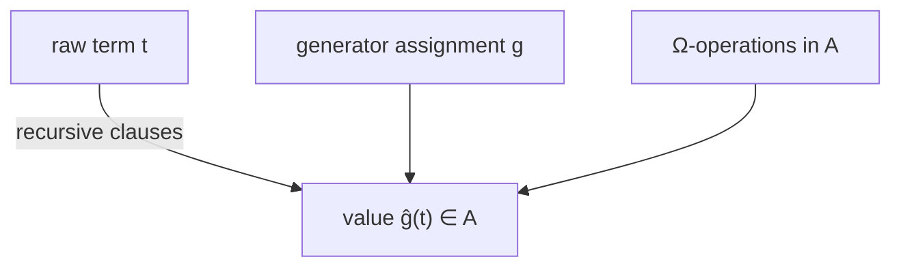

$$
\boxed{(\mathbf T_\Omega(X),\eta_X)\text{ is free on }X.}
$$

*Provenance:* Theorem 4.6; Theorem 4.10; Construction 17.3.

---

## Panel 10 — Unique readability, induction, recursion

Unique readability:

$$
\begin{array}{c}
\text{variable terms, constant terms, compound terms are pairwise disjoint;}\\
f(t_1,
\dots,t_n)=g(s_1,
\dots,s_m)\Rightarrow f=g,
\ n=m,
\ t_i=s_i.
\end{array}
$$

Structural induction:

$$
X\subseteq P,
\quad \Omega_0\subseteq P,
\quad t_i\in P\Rightarrow f(t_1,
\dots,t_n)\in P
\quad\Longrightarrow\quad P=T.
$$

Structural recursion:

$$
\alpha:X\to V,
\quad \beta_c\in V,
\quad \Phi_f:V^n\to V
\quad\Rightarrow\quad !R:T\to V.
$$

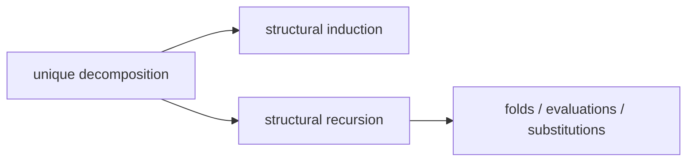

$$
\boxed{\text{UR is the parsing theorem behind induction and recursion.}}
$$

**Focus.** Unique readability is the hidden reason structural proofs are legitimate: every non-atomic term has exactly one outer constructor and one ordered list of immediate subterms.

*Provenance:* Theorems 4.7, 4.9, 4.10.

---

## Panel 11 — Constructor-system certification

A constructor system has atoms $X,\Omega_0$, constructor maps

$$
\Phi_f:C^n\to C\qquad (f\in\Omega_n,n\ge1),
$$

and a generated carrier $C=\bigcup_{k<\omega}C^{(k)}$.

Free-constructor conditions:

$$
\textbf{D1--D3:}\quad \text{atom/constructor ranges disjoint},
$$

$$
\textbf{I:}\quad \Phi_f\text{ injective, and ranges of distinct }f\text{ separated}.
$$

Comparison map:

$$
r:\mathbf T_\Omega(X)\to\mathbf C,
\qquad r(x)=\iota(x),\quad r(c)=c^\mathbf C,
\quad r(f(\vec t))=\Phi_f(r(\vec t)).
$$

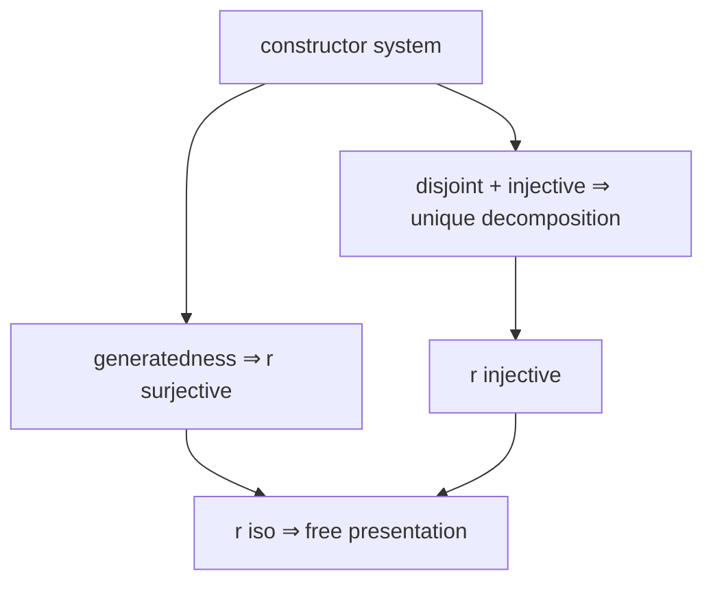

Equivalent faces of freeness:

$$
\boxed{\text{UMP}\iff\text{REC}\iff\text{INJ}\iff\text{UR}\iff r\text{ injective}\iff\ker r=\Delta.}
$$

*Provenance:* Definitions 5.1, 5.3, 5.8; Theorems 5.11–5.15.

---

## Panel 12 — Four concrete presentations

Each concrete syntax carrier is certified by the same constructor-system pattern:

$$
\begin{array}{c|c|c}
\text{presentation} & \text{carrier shape} & \text{free theorem}\\
\hline
\text{expressions} & \text{recursive term expressions} & \text{Thm 6.7}\\
\text{trees} & \text{finite addressed ranked trees} & \text{Thm 7.8}\\
\text{tuples} & \text{tagged set-theoretic codes} & \text{Thm 8.6}\\
\text{strings} & \text{well-formed hygienic strings} & \text{Thm 9.8}
\end{array}
$$

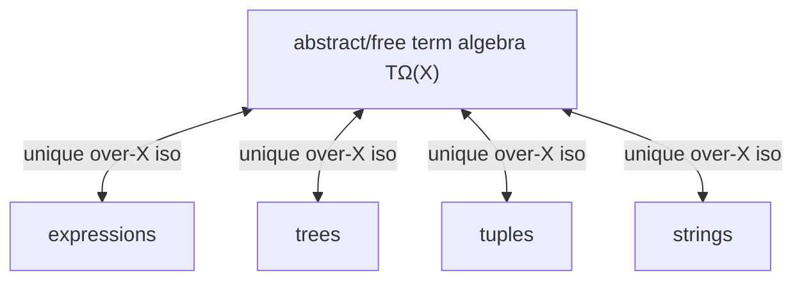

$$
\boxed{\text{different carriers; same free syntax object.}}
$$

Encoding-dependent destructors do not automatically transfer; invariant algebraic operations do.

**Focus.** Prefer proving algebraic facts once on the free object, then transporting them. Do not reprove substitution or evaluation separately for every concrete representation.

*Provenance:* Chapters 6–9; Theorems 6.7, 7.8, 8.6, 9.8; Chapter 10 for implementation variants.

---

## Panel 13 — Transfer across presentations

For presentations $\mathbf P,\mathbf Q$ free on $X$, the unique over-$X$ isomorphism is

$$
\theta_{P,Q}:P\xrightarrow{\cong}Q.
$$

Transfer by conjugation:

$$
O_Q:=\theta_{P,Q}\circ O_P\circ\theta_{Q,P}^{\,k}
$$

for any $k$-ary operation/relation/function whose definition is presentation-invariant.

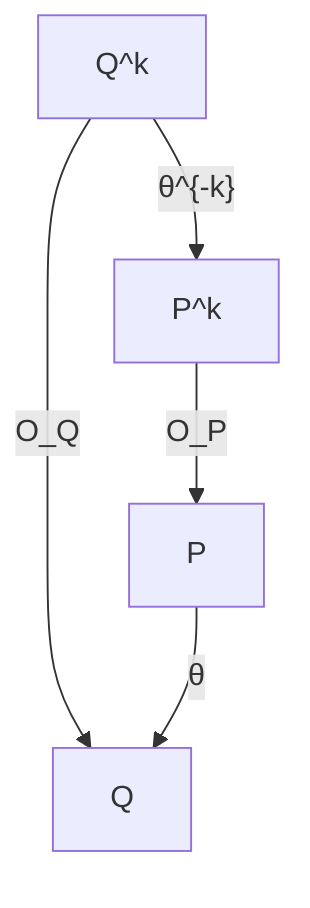

Master transfer:

$$
\boxed{\text{constructors, equality, induction, recursion, subst, contexts, clones, eval, kernels, quotients transfer.}}
$$

*Provenance:* Definitions 11.1; Propositions 11.2, 11.5, 11.9; Construction 11.4; Theorems 11.6, 11.8, 11.10.

---

## Panel 14 — Structural operations on syntax

Raw terms decompose by outer case:

$$
\operatorname{case}(t)\in X\ \sqcup\ \Omega_0\ \sqcup\ \coprod_{n\ge1}\Omega_n,
$$

with immediate subterm destructors for compounds:

$$
f(t_1,
\dots,t_n)\mapsto (t_1,
\dots,t_n).
$$

Subterms and positions:

$$
s\preceq t\iff s\text{ occurs in }t,
\qquad \operatorname{Pos}(t)=\text{occurrence addresses}.
$$

Replacement:

$$
t[p:=s]\quad\text{= term obtained by replacing the occurrence at }p.
$$

Measures:

$$
\operatorname{ht}(t),\quad |t|,
\quad \operatorname{Var}(t),
\quad \operatorname{occ}_x(t).
$$

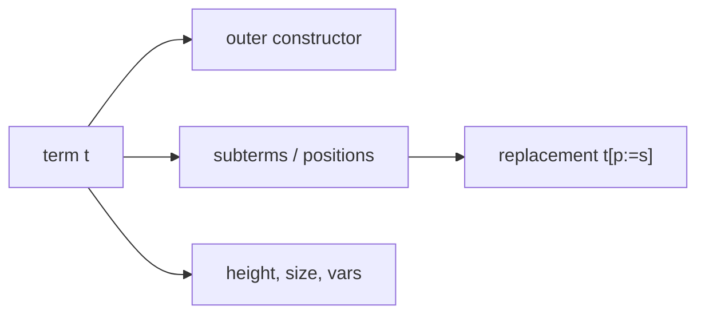

$$
\boxed{\text{positions are presentation-visible; subterm/recursion facts are invariant.}}
$$

*Provenance:* Definitions 12.1–12.10; Propositions 12.4, 12.12.

---

## Panel 15 — Recursion as fold

Recursion data:

$$
\mathcal D=(\alpha:X\to V,
\ (\beta_c)_{c\in\Omega_0},
\ (\Phi_f:V^n\to V)_{f\in\Omega_n,n\ge1}).
$$

Unique fold:

$$
\operatorname{fold}_{\mathcal D}:T\to V,
$$

$$
\operatorname{fold}(x)=\alpha(x),\qquad
\operatorname{fold}(c)=\beta_c,
$$

$$
\operatorname{fold}(f(t_1,
\dots,t_n))=
\Phi_f(\operatorname{fold}(t_1),
\dots,\operatorname{fold}(t_n)).
$$

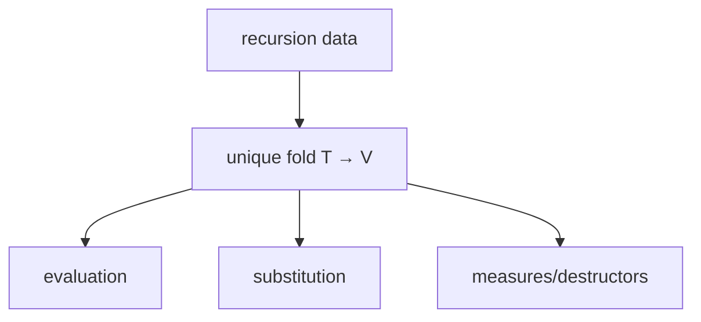

Variants: strong induction, recursion with subterm access, simultaneous recursion.

*Provenance:* Theorems 13.1–13.4, 13.9, 13.10; Definition 13.3; Proposition 13.5.

---

## Panel 16 — Substitution = evaluation into syntax

A substitution is a function into a term algebra:

$$
\sigma:X\to T_\Omega(Y).
$$

Its unique homomorphic extension:

$$
\widehat\sigma:\mathbf T_\Omega(X)\to\mathbf T_\Omega(Y),
$$

with clauses

$$
\widehat\sigma(x)=\sigma(x),\qquad \widehat\sigma(c)=c,
$$

$$
\widehat\sigma(f(t_1,
\dots,t_n))=f(\widehat\sigma(t_1),
\dots,\widehat\sigma(t_n)).
$$

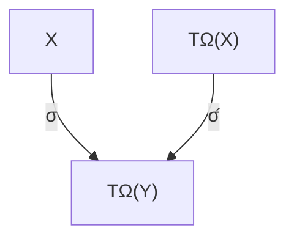

Identity and composition:

$$
\widehat{\eta_X}=\mathrm{id},
\qquad
\widehat\tau\circ\widehat\sigma=\widehat{\tau\star\sigma},
\quad (\tau\star\sigma)(x):=\widehat\tau(\sigma(x)).
$$

$$
\boxed{\text{substitution is the Kleisli composition of the term monad.}}
$$

**Focus.** A substitution is not a semantic valuation unless its codomain is semantic. It is evaluation whose target happens to be another syntax algebra.

*Provenance:* Definitions 14.1, 14.3, 14.8; Theorems 14.4, 14.9; Propositions 14.5, 14.7.

---

## Panel 17 — Substitution/evaluation compatibility

For $\sigma:X\to T_\Omega(Y)$ and $w:Y\to B$, define

$$
(w\star\sigma)(x):=\operatorname{ev}_w(\sigma(x)).
$$

Substitution lemma:

$$
\operatorname{ev}_w\circ\widehat\sigma=\operatorname{ev}_{w\star\sigma},
$$

or pointwise:

$$
\operatorname{ev}_w(t[\sigma])=
\operatorname{ev}_{w\star\sigma}(t).
$$

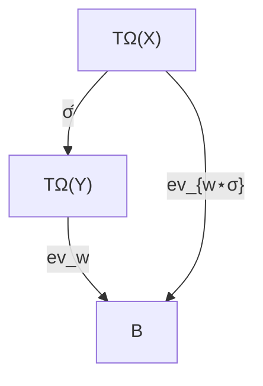

Kernel pullback:

$$
\ker(\operatorname{ev}_{w\star\sigma})=(\widehat\sigma\times\widehat\sigma)^{-1}[\ker(\operatorname{ev}_w)].
$$

$$
\boxed{\text{evaluate after substituting = evaluate under pulled-back assignment.}}
$$

*Provenance:* Theorem 14.10; Corollary 14.11.

---

## Panel 18 — Contexts and plugging

Hole-extended syntax:

$$
T_\Omega(X\sqcup E_n),
\qquad E_n=\{\Box_1,
\dots,\Box_n\}.
$$

A context $C\in T_\Omega(X\sqcup E_n)$ induces plugging by substitution fixing $X$ and sending holes to inputs:

$$
C[s_1,
\dots,s_n]:=\widehat{\sigma_{\vec s}}(C),
\qquad \sigma_{\vec s}(x)=x,
\quad \sigma_{\vec s}(\Box_i)=s_i.
$$

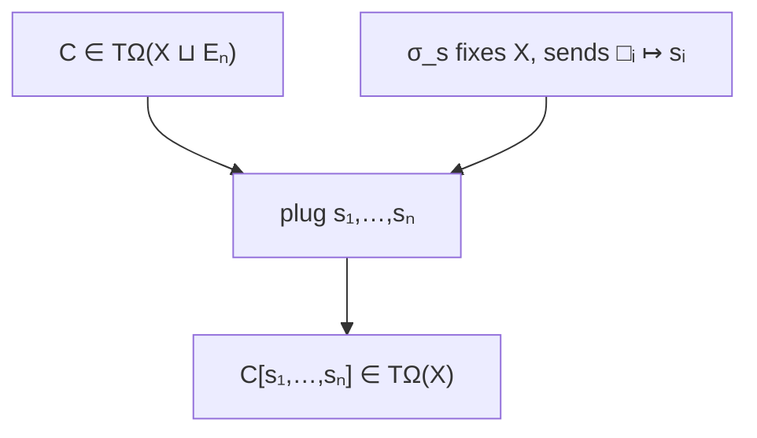

One-hole composition:

$$
(C\circ D)[s]=C[D[s]],
\qquad \Box\text{ is the unit.}
$$

$$
\boxed{\text{contexts are terms with distinguished generator-slots.}}
$$

**Focus.** Contexts are not informal “terms with blanks”; algebraically, blanks are fresh generators. Plugging is just substitution that fixes the ordinary parameters.

*Provenance:* Definitions 15.1–15.3; Construction 15.4; Proposition 15.5.

---

## Panel 19 — Context decomposition, replacement, congruence closure

For every occurrence position $p\in\operatorname{Pos}(t)$ there is a unique extracted context $C_p^t$ and subtree $t|_p$ such that

$$
t=C_p^t[t|_p],
\qquad t[p:=s]=C_p^t[s].
$$

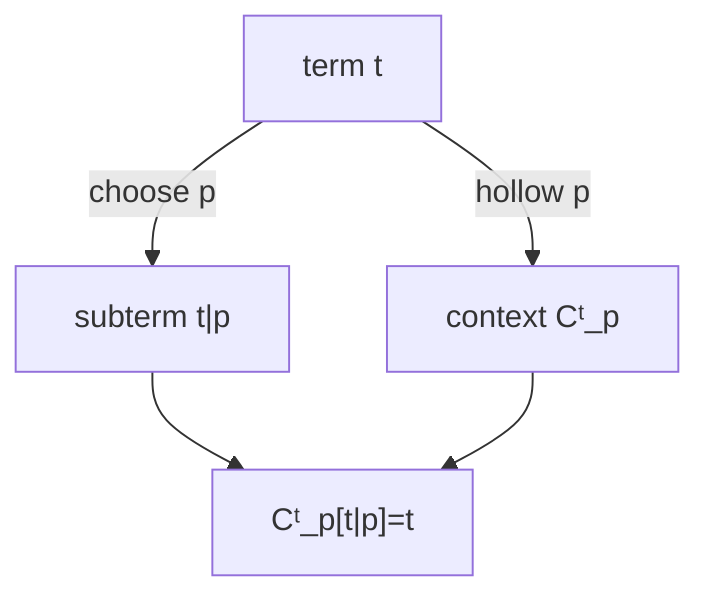

Congruences are context-closed equivalences:

$$
\theta\in\operatorname{Con}(\mathbf T)
\iff
\theta\text{ equivalence and }(s,t)\in\theta\Rightarrow(C[s],C[t])\in\theta.
$$

Generated congruence $\theta_E$:

$$
(s,t)\in\theta_E
\iff
s=w_0\sim w_1\sim\cdots\sim w_k=t,
\quad
\{w_{j-1},w_j\}=\{C_j[\ell_j],C_j[r_j]\},
\quad (\ell_j,r_j)\in E^{\pm}.
$$

$$
\boxed{\operatorname{Cg}_{\mathbf T}(E)=\text{symmetry + chains + replacement in arbitrary contexts}.}
$$

**Focus.** This is the operational meaning of imposing equations: you may replace each side of a generating equation inside any surrounding syntax, then chain such replacements.

*Provenance:* Propositions 15.7, 15.9, 15.12; Theorem 18.3.

---

## Panel 20 — Syntactic clone

Fixed arity terms:

$$
T(n):=T_\Omega(X_n),
\qquad x_i\in T(n)\text{ are projections.}
$$

Superposition = simultaneous substitution:

$$
t[s_1,
\dots,s_m]:=\widehat\sigma(t)\in T(n),
\qquad t\in T(m),\ s_i\in T(n),\ \sigma(x_i)=s_i.
$$

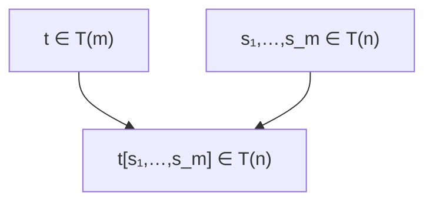

Clone laws:

$$
\text{assoc},\qquad x_i[t_1,
\dots,t_n]=t_i,
\qquad t[x_1,
\dots,x_n]=t.
$$

$$
\boxed{\mathcal T_\Omega=(T(n))_{n\ge1}\text{ is the syntax clone.}}
$$

*Provenance:* Notation 16.1; Definitions 16.2, 16.6; Construction 16.4; Theorem 16.5.

---

## Panel 21 — Interpretation into concrete term clones

For $t\in T(n)$ and $\vec a\in A^n$:

$$
t^{\mathbf A}(a_1,
\dots,a_n):=\operatorname{ev}_{a}(t),
\qquad a(x_i)=a_i.
$$

Interpretation map:

$$
\Theta_{\mathbf A,n}:T(n)\to\operatorname{Clo}_n(\mathbf A),
\qquad t\mapsto t^{\mathbf A}.
$$

It is a clone homomorphism:

$$
\Theta_{\mathbf A,n}(t[s_1,
\dots,s_m])=
\Theta_{\mathbf A,m}(t)[\Theta_{\mathbf A,n}(s_1),
\dots,
\Theta_{\mathbf A,n}(s_m)].
$$

```mermaid
flowchart TD
    A["syntax clone 𝒯Ω"] -->|"Θ_A"| B["term clone Clo(A)"]
    A -->|"superposition"| A
    B -->|"operation composition"| B
```

$$
\boxed{\text{interpreting after superposing = composing interpreted operations.}}
$$

*Provenance:* Definition 16.9; Construction 16.10; Theorem 16.11; Definition 16.12; Proposition 16.19.

---

## Panel 22 — Operation kernel versus valuation kernel

Clone/equational kernel:

$$
\equiv_{\mathbf A}^{(n)}:=\ker(\Theta_{\mathbf A,n})
=\{(s,t):s^{\mathbf A}=t^{\mathbf A}\}.
$$

Valuation kernel at one assignment $a:X_n\to A$:

$$
\ker(\operatorname{ev}_a)=\{(s,t):\operatorname{ev}_a(s)=\operatorname{ev}_a(t)\}.
$$

Relation:

$$
\equiv_{\mathbf A}^{(n)}=\bigcap_{a:X_n\to A}\ker(\operatorname{ev}_a)
\subseteq \ker(\operatorname{ev}_a).
$$

```mermaid
flowchart LR
    A["one assignment"] --> K["valuation kernel"]
    B["all assignments"] --> I["identity / clone kernel"]
    I -->|"⊆"| K
```

$$
\boxed{\text{one-assignment collapse is local; operation equality is all-assignments collapse.}}
$$

**Focus.** Keep this distinction sharp. $\kappa_g$ says two terms agree under one valuation; the operation/equational kernel says they agree as functions under every valuation.

Polynomial operations briefly:

$$
\operatorname{Pol}_n(\mathbf A)=\{\text{term operations with parameters frozen from }A\}.
$$

*Provenance:* Definitions 16.13, 16.15; Proposition 16.14.

---

## Panel 23 — Evaluation into target algebras

A valuation $g:X\to B$ induces the evaluation homomorphism

$$
\operatorname{ev}_g:\mathbf T_\Omega(X)\to\mathbf B,
$$

$$
\operatorname{ev}_g(x)=g(x),\qquad
\operatorname{ev}_g(c)=c^{\mathbf B},
$$

$$
\operatorname{ev}_g(f(t_1,
\dots,t_n))=f^{\mathbf B}(\operatorname{ev}_g(t_1),
\dots,\operatorname{ev}_g(t_n)).
$$

Coincidence:

$$
g|_{\operatorname{Var}(t)}=g'|_{\operatorname{Var}(t)}\n\Rightarrow
\operatorname{ev}_g(t)=\operatorname{ev}_{g'}(t).
$$

```mermaid
flowchart TD
    X["X"] -->|"g"| B["B"]
    T["TΩ(X)"] -->|"ev_g"| B
```

$$
\boxed{\text{evaluation is the UMP extension of a valuation.}}
$$

*Provenance:* Definitions 17.1–17.2; Construction 17.3; Lemma 17.4.

---

## Panel 24 — Evaluation image and generated subalgebra

Evaluation image:

$$
\operatorname{im}(\operatorname{ev}_g)\le\mathbf B.
$$

Generated-subalgebra theorem:

$$
\operatorname{im}(\operatorname{ev}_g)=\langle g[X]\rangle_{\mathbf B}.
$$

```mermaid
flowchart LR
    G["g:X→B"] --> E["ev_g:TΩ(X)→B"]
    E --> I["im(ev_g)"]
    G --> C["⟨g[X]⟩_B"]
    I -->|"="| C
```

Freeness criterion for generated subalgebras:

$$
(\langle g[X]\rangle_{\mathbf B},g)\text{ is free on }X
\iff
\ker(\operatorname{ev}_g)=\Delta_T.
$$

$$
\boxed{\text{generated = reachable by terms; freely generated = reachable with no collapse.}}
$$

**Focus.** Surjectivity of evaluation gives generatedness. Injectivity, equivalently trivial kernel, is the extra condition that representations are unique.

*Provenance:* Proposition 17.5; Theorems 17.6, 17.10.

---

## Panel 25 — Evaluation kernel and quotient theorem

Evaluation kernel:

$$
\kappa_g:=\ker(\operatorname{ev}_g)=
\{(s,t):\operatorname{ev}_g(s)=\operatorname{ev}_g(t)\}
\in\operatorname{Con}(\mathbf T).
$$

First-isomorphism instance:

$$
\mathbf T_\Omega(X)/\kappa_g\xrightarrow{\cong}\langle g[X]\rangle_{\mathbf B},
\qquad [t]\mapsto\operatorname{ev}_g(t).
$$

```mermaid
flowchart TD
    T["TΩ(X)"] -->|"ev_g"| C["⟨g[X]⟩_B"]
    T -->|"nat"| Q["TΩ(X)/κ_g"]
    Q -->|"≅"| C
```

$$
\boxed{\text{every generated algebra is raw syntax modulo its evaluation kernel.}}
$$

**Focus.** This is the central semantic theorem: concrete generated structure is not mysterious; it is the free term algebra with exactly the valuation-forced identifications imposed.

*Provenance:* Definition 17.7; Theorems 17.8–17.9; Corollaries 17.14–17.15.

---

## Panel 26 — Naturality of evaluation

For a homomorphism $h:\mathbf B\to\mathbf C$ and valuation $g:X\to B$:

$$
h\circ\operatorname{ev}_g=\operatorname{ev}_{h\circ g}.
$$

```mermaid
flowchart TD
    T["TΩ(X)"] -->|"ev_g"| B["B"]
    B -->|"h"| C["C"]
    T -->|"ev_{h∘g}"| C
```

Together with the substitution lemma:

$$
\operatorname{ev}_w\circ\widehat\sigma=\operatorname{ev}_{w\star\sigma},
\qquad
h\circ\operatorname{ev}_g=\operatorname{ev}_{h\circ g}.
$$

$$
\boxed{\text{substitution, evaluation, and homomorphisms normalize to evaluation maps.}}
$$

*Provenance:* Proposition 17.13; Theorem 14.10.

---

## Panel 27 — Quotient syntax and descent

Equations $E\subseteq T\times T$ generate

$$
\theta_E:=\operatorname{Cg}_{\mathbf T}(E).
$$

Quotient syntax:

$$
\mathbf T/E:=\mathbf T/\theta_E,
\qquad t\mapsto [t]_{\theta_E}.
$$

General descent test:

$$
\Psi:T\to V\text{ descends to }T/\theta
\iff
\theta\subseteq\ker\Psi.
$$

```mermaid
flowchart TD
    T["T"] -->|"Ψ"| V["V"]
    T -->|"nat_θ"| Q["T/θ"]
    Q -->|"Ψ̃ exists iff θ ⊆ ker Ψ"| V
```

Recursion modulo equations:

$$
\operatorname{fold}_{\mathcal D}:T\to V\text{ induces }T/\theta\to V
\iff
\theta\subseteq\ker(\operatorname{fold}_{\mathcal D}).
$$

$$
\boxed{\text{quotient syntax supports only operations constant on classes.}}
$$

**Focus.** Quotienting is safe only for operations that cannot see the difference between identified representatives. This is the universal descent criterion in its simplest form.

*Provenance:* Definitions 18.1–18.2; Theorems 18.3, 18.5; Proposition 18.6.

---

## Panel 28 — Evaluation through quotient syntax

Evaluation factors through $\mathbf T/\theta$ iff the quotient equations are valid under $g$:

$$
\operatorname{ev}_g=\widetilde{\operatorname{ev}_g}\circ\operatorname{nat}_\theta
\iff
\theta\subseteq\ker(\operatorname{ev}_g).
$$

For $\theta=\theta_E$:

$$
\theta_E\subseteq\ker(\operatorname{ev}_g)
\iff
\forall(s,t)\in E,
\quad \operatorname{ev}_g(s)=\operatorname{ev}_g(t).
$$

```mermaid
flowchart TD
    T["TΩ(X)"] -->|"ev_g"| B["B"]
    T -->|"nat_θ"| Q["TΩ(X)/θ"]
    Q -->|"eṽ_g"| B
```

Presented quotient universal property:

$$
\theta_E\subseteq\ker h
\quad\Longleftrightarrow\quad
h\text{ factors uniquely through }\mathbf T/\theta_E.
$$

$$
\boxed{\text{models of the imposed equations are exactly targets admitting quotient evaluation.}}
$$

**Focus.** An equation set $E$ is semantically respected precisely when evaluation kills the congruence generated by $E$, not merely the displayed pairs in isolation.

*Provenance:* Theorem 18.8; Corollary 18.9.

---

## Panel 29 — Substitution on quotient syntax

Given

$$
\theta\in\operatorname{Con}(\mathbf T_\Omega(X)),
\quad
\psi\in\operatorname{Con}(\mathbf T_\Omega(Y)),
\quad
\sigma:X\to T_\Omega(Y),
$$

the induced quotient substitution

$$
\overline\sigma:\mathbf T_\Omega(X)/\theta\to\mathbf T_\Omega(Y)/\psi,
\qquad
\overline\sigma([t]_\theta)=[\widehat\sigma(t)]_\psi
$$

exists iff

$$
(s,t)\in\theta\Rightarrow(\widehat\sigma(s),\widehat\sigma(t))\in\psi,
\qquad
\theta\subseteq(\widehat\sigma\times\widehat\sigma)^{-1}[\psi].
$$

```mermaid
flowchart TD
    TX["TΩ(X)"] -->|"σ̂"| TY["TΩ(Y)"]
    TX -->|"quot θ"| QX["TΩ(X)/θ"]
    TY -->|"quot ψ"| QY["TΩ(Y)/ψ"]
    QX -->|"σ̄ iff compatibility"| QY
```

Fully invariant congruence:

$$
\theta\text{ fully invariant}\iff
(t,t')\in\theta\Rightarrow(\widehat\sigma(t),\widehat\sigma(t'))\in\theta
\text{ for all endosubstitutions }\sigma.
$$

Thus endosubstitutions descend on $\mathbf T/\theta$ iff $\theta$ is fully invariant.

**Focus.** Fully invariant congruences are the right quotient relations for equational theories because they survive arbitrary syntactic substitution, not just constructor application.

*Provenance:* Theorem 18.10; Definition 18.11; Corollary 18.12.

---

## Panel 30 — Three-level architecture and map taxonomy

Three layers:

$$
\text{abstract free syntax}\quad\longleftrightarrow\quad
\text{concrete presentations}\quad\longrightarrow\quad
\text{semantic targets / quotients}.
$$

```mermaid
flowchart TD
    A["abstract TΩ(X)"]
    P["presentations: trees/tuples/strings/exprs"]
    S["syntax maps: substitution, contexts, clones"]
    E["semantic maps: evaluation, term operations"]
    Q["quotient maps: nat_θ, descent"]
    A <-->|"unique transfer isos"| P
    A --> S
    A --> E
    A --> Q
```

Map families:

$$
\begin{array}{c|c|c}
\text{family} & \text{typical map} & \text{codomain}\\
\hline
\text{representation} & r_P,\theta_{P,Q},\operatorname{parse} & \text{syntax/presentation}\\
\text{syntax} & \widehat\sigma, C[-],\Theta_\mathbf T & \text{syntax}\\
\text{semantic} & \operatorname{ev}_g,\Theta_\mathbf A & \text{target algebra / operations}\\
\text{quotient} & \operatorname{nat}_\theta,\widetilde\Psi & \text{classes / descended data}
\end{array}
$$

$$
\boxed{\text{parser}\neq\text{substitution}\neq\text{evaluation}\neq\text{quotient projection}.}
$$

**Focus.** Most mistakes in this material are type mistakes. Track domains and codomains before interpreting what a map “means.”

*Provenance:* Chapter 19.1–19.4; Orientation §0.3.

---

## Panel 31 — Omnibus diagram

```mermaid
flowchart TD
    O["signature Ω + variables X"] --> T["free term algebra TΩ(X)"]
    T --> P["concrete presentations"]
    T --> R["recursion / induction"]
    T --> S["substitution σ̂"]
    T --> C["contexts / plugging"]
    T --> CL["syntax clone 𝒯Ω"]
    T --> E["evaluation ev_g"]
    E --> I["image = ⟨g[X]⟩_B"]
    E --> K["kernel κ_g"]
    K --> Q["quotient T/κ_g"]
    Q --> I
    T --> Q2["quotient syntax T/θ"]
    Q2 --> D["descent iff θ ⊆ kernel"]
    CL --> OP["term clone Clo(A)"]
```

Final compression:

$$
\boxed{\text{syntax} = \text{free }\Omega\text{-algebra on }X.}
$$

$$
\boxed{\text{all syntax operations are UMP extensions, transfers, or descents.}}
$$

$$
\boxed{\text{semantics} = \text{homomorphic evaluation; semantic equality} = \text{evaluation kernel}.}
$$

*Provenance:* Theorem 19.1 and the chapter spine.

---

## Panel 32 — Bridge to first-order logic

For a first-order language $\mathcal L$, take

$$
\Omega:=\text{function-symbol signature of }\mathcal L,
\qquad X:=\text{individual variables}.
$$

Then

$$
T_\Omega(X)=\text{the term layer of first-order syntax}.
$$

```mermaid
flowchart LR
    L["FOL language L"] --> F["function symbols = Ω"]
    L --> X["individual variables X"]
    F --> T["term algebra TΩ(X)"]
    X --> T
    T --> A["atomic formulas / satisfaction / theories"]
```

Everything above is the algebraic substrate beneath the later logical layer:

$$
\text{terms first;}\qquad \text{relations, satisfaction, deduction, theories next.}
$$

$$
\boxed{\text{FOL term syntax is absolutely free algebraic syntax.}}
$$

**Focus.** The logical layer starts only after this algebraic term layer is fixed. Atomic formulas, satisfaction, theories, and deduction all presuppose this free-syntax substrate.

*Provenance:* Orientation §§0.1–0.4; Theorem 19.1.

---

## Placement against the original treatise

| Panels | Original location |
| --- | --- |
| 1–5 | Part I, Chapters 1–2 |
| 6–11 | Part II, Chapters 3–5 |
| 12 | Part III, Chapters 6–10 |
| 13 | Part IV, Chapter 11 |
| 14–22 | Part V, Chapters 12–16 |
| 23–29 | Part VI, Chapters 17–18 |
| 30–32 | Part VII, Chapter 19 + Orientation |

