# Theory Atlas — Algebraic Syntax into First-Order Logic

This atlas moves in three movements. **Part I** develops universal algebra and algebraic syntax as a self-contained engine room: signatures, algebras, free objects, presentations, substitution, contexts, evaluation, kernels, quotients, descent. **Part II** develops first-order logic faithfully *as logic* — language, terms, atoms, formulas, binding, semantics, deduction, theories, models — calling on the Part I machinery only at the exact points where logic genuinely runs on an algebraic engine. **Part III** is a synthesis layer: a ledger of engines, of map types, of equality notions, of the precise universal-algebra transfer points, and a final dependency map.

The atlas is read as a sequence of **rooms**. Each room names the objects now in play, places the engine exactly where it begins to do work, draws one compact hands-up graph, and hands forward what the next room consumes. Object entries display the object as a datum; the datum and the surrounding prose carry the species (set, family, algebra, map, relation, quotient, closure operator, semantic structure). There is no global type tag.

One slogan governs the whole stack:

$$
\boxed{\text{free algebra builds }\textbf{terms}\;;\quad\text{inductive closure builds }\textbf{formulas}\;;\quad\text{the term UMP interprets terms, structural recursion interprets formulas}\;;\quad\text{kernels measure collapse}\;;\quad\text{descent licenses quotients.}}
$$

And one standing correction, load-bearing throughout: **formulas are not a sort of $Σ_L$.** The functional signature carries only function symbols; relations, equality, connectives, and quantifiers do not contribute sorts or operations to $Σ_L$. Raw formulas form a *separate* inductive closure over the term algebra — and, if one wishes, the free algebra for their own formula-constructor signature. They are emphatically not elements of $T_{Σ_L}(\operatorname{Var})$. Consequently, terms are interpreted by the UMP of $T_{Σ_L}(\operatorname{Var})$; formula satisfaction is defined by structural recursion on the formula-constructor algebra. The Lindenbaum–Tarski quotient $LT(T)$ is an algebra of formulas modulo provable equivalence — typically a Boolean (or cylindric/polyadic) algebra, but in general *not* a free one.

---

## Object reference compendium

An alphabetical quick-find index of the mathematical objects defined in the atlas. Each entry links to the room containing its full datum, assumptions, outputs, and governing facts. Definition numbers remain the precise local locator within that room.

**A**

- [[#I.8 · Concrete syntax carriers|Addressed syntax trees]] — `I.8.3` · $\mathrm{AddrTree}$
- [[#II.8 · Structures and assignments|Algebraic reduct]] — `II.8.2` · $\mathcal M_{\mathrm{alg}}$
- [[#II.6 · Alpha-equivalence|alpha-compatible operation]] — `II.6.4`
- [[#II.6 · Alpha-equivalence|Alpha-equivalence]] — `II.6.2` · $\equiv_\alpha$
- [[#I.1 · Signatures and operation data|Arity]] — `I.1.2` · $\operatorname{ar}(f)$
- [[#II.8 · Structures and assignments|Assignment]] — `II.8.4` · $a$
- [[#II.9 · Term denotation|Assignment dependence]] — `II.9.3` · locality
- [[#II.8 · Structures and assignments|Assignment update]] — `II.8.5` · $a[x\mapsto m]$
- [[#II.7 · Term substitution inside formulas|Atomic action]] — `II.7.2` · substitution at leaves
- [[#II.3 · Atomic formulas|Atomic formula set]] — `II.3.3` · $\operatorname{Atom}_L$

**B**

- [[#II.6 · Alpha-equivalence|Binding-aware formulas]] — `II.6.3` · $\operatorname{Form}_L$

**C**

- [[#II.12 · Deductive calculi|Calculus datum]] — `II.12.1` · $\mathsf C$
- [[#II.13 · Soundness and completeness|Canonical syntactic model]] — `II.13.5` · term model
- [[#II.7 · Term substitution inside formulas|Capture obstruction]] — `II.7.3` · $\operatorname{Cap}_{x,\sigma}(\varphi)$
- [[#II.15 · Term models and definable quotients|Closed terms]] — `II.15.1` · $\operatorname{ClTerm}_L$
- [[#I.7 · Constructor presentations and free-syntax certification|Comparison map]] — `I.7.2` · $\rho$
- [[#II.14 · Theories|complete $T$ / consistent $T$ / satisfiable $T$]] — `II.14.3`
- [[#I.4 · Kernels, congruences, and quotients|Congruence]] — `I.4.2` · $\theta$
- [[#I.4 · Kernels, congruences, and quotients|Congruence generated by a relation]] — `I.4.3` · $\operatorname{Cg}(R)$
- [[#I.7 · Constructor presentations and free-syntax certification|Constructor system]] — `I.7.1` · $(\mathbf P,\iota,(c_f))$
- [[#II.4 · Raw formulas|Constructor view]] — `II.4.3` · formula tree
- [[#I.15 · Templates and context operations|Context closure of a relation]] — `I.15.4` · $\theta^{\mathrm{ctx}}$
- [[#I.12 · Trees, positions, extraction, and replacement|Context extraction at a position]] — `I.12.3` · $C_{t,p}$
- [[#I.13 · Typed contexts and sort-correct filling|Context profile]] — `I.13.2` · $C:(s_1,\ldots,s_n)\Rightarrow s$
- [[#I.15 · Templates and context operations|Context with holes]] — `I.15.3` · $C[\square_1,\ldots,\square_n]$

**D**

- [[#I.8 · Concrete syntax carriers|DAG / implementation carrier]] — `I.8.6` · $\mathrm{DAG}$
- [[#II.9 · Term denotation|denotation clauses]] — `II.9.2`
- [[#II.12 · Deductive calculi|Derivability]] — `II.12.4` · $\Gamma\vdash_{\mathsf C}\varphi$
- [[#I.18 · Quotient syntax and descent|Descended operation]] — `I.18.3` · $\widetilde F$
- [[#II.17 · Model-theoretic layer|Diagram]] — `II.17.5` · $\operatorname{Diag}(\mathbf M)$

**E**

- [[#II.17 · Model-theoretic layer|Elementary embedding]] — `II.17.4` · $h:\mathbf M\preceq\mathbf N$
- [[#II.17 · Model-theoretic layer|Embedding]] — `II.17.3` · $h:\mathbf M\hookrightarrow\mathbf N$
- [[#II.3 · Atomic formulas|Equality atom]] — `II.3.1` · $t=_s u$
- [[#I.17 · Semantic collapse and quotient comparison|Evaluation kernel]] — `I.17.1` · $\kappa_g$
- [[#II.14 · Theories|extension / $T'\supseteq T$]] — `II.14.4`

**F**

- [[#I.9 · Presentation-neutral syntax and transfer|Faithful presentation]] — `I.9.2` · $\mathcal P=(\mathbf P,\iota,\rho)$
- [[#I.3 · Subalgebras and generated structure|Finitary stage closure]] — `I.3.3` · $X^{(n)}$
- [[#II.1 · First-order language data|First-order language]] — `II.1.1` · $L$
- [[#I.14 · Syntax clone and superposition|Fixed-profile term set]] — `I.14.1` · $\operatorname{SynClo}(\Sigma)_{w,s}$
- [[#II.8 · Structures and assignments|$f^{\mathcal M}$, $c^{\mathcal M}$, $R^{\mathcal M}$]] — `II.8.3`
- [[#I.6 · Raw term algebras|Formal constructor operation]] — `I.6.2` · $f^{\mathbf T}$
- [[#I.6 · Raw term algebras|Formal term formation]] — `I.6.1` · $\operatorname{Term}$
- [[#I.5 · Free algebras and the universal mapping property|Free algebra on X]] — `I.5.2` · $\mathbf T_\Sigma(X)$
- [[#II.5 · Variables, occurrence, and binding|Free-variable set]] — `II.5.3` · $\operatorname{FV}(\varphi)$
- [[#II.5 · Variables, occurrence, and binding|Free vs bound occurrence]] — `II.5.2` · free / bound
- [[#II.6 · Alpha-equivalence|Fresh renaming step]] — `II.6.1` · bound renaming
- [[#II.5 · Variables, occurrence, and binding|Fresh variable]] — `II.5.5` · $\operatorname{fresh}$
- [[#II.1 · First-order language data|Functional reduct]] — `II.1.6` · $\Sigma_L$
- [[#II.1 · First-order language data|Function and constant symbols]] — `II.1.3` · $\operatorname{Func}_L$, $c$

**G**

- [[#I.7 · Constructor presentations and free-syntax certification|Generatedness of the candidate]] — `I.7.3` · no-junk
- [[#I.16 · Evaluation into target algebras|Generated semantic subalgebra]] — `I.16.4` · $\langle g[X]\rangle_{\mathbf B}$
- [[#I.3 · Subalgebras and generated structure|Generated subalgebra]] — `I.3.2` · $\langle X\rangle_{\mathbf A}$
- [[#II.17 · Model-theoretic layer|Generated substructure]] — `II.17.2` · $\langle A\rangle_{\mathbf M}$
- [[#I.16 · Evaluation into target algebras|Generator assignment into a target]] — `I.16.2` · $g:X\to B$
- [[#I.5 · Free algebras and the universal mapping property|Generator insertion]] — `I.5.1` · $\eta$
- [[#I.2 · Algebras and homomorphisms|Generator-preserving isomorphism]] — `I.2.4` · $\theta_X$-preserving $\cong$
- [[#I.1 · Signatures and operation data|Generators versus constants]] — `I.1.4` · $X$ vs $\operatorname{Op}_{(),s}$

**H**

- [[#I.11 · Contexts, holes, and plugging|Hole-extended syntax]] — `I.11.2` · $\operatorname{Ctx}_H(X)$
- [[#I.11 · Contexts, holes, and plugging|Hole variables]] — `I.11.1` · $H$ / $E_n$
- [[#I.3 · Subalgebras and generated structure|Homomorphic image]] — `I.3.4` · $\operatorname{im}(h)$
- [[#I.2 · Algebras and homomorphisms|Homomorphism]] — `I.2.2` · $h:\mathbf A\to\mathbf B$

**I**

- [[#I.10 · Substitution as syntax-valued evaluation|Identity substitution]] — `I.10.3` · $\eta_X$
- [[#I.7 · Constructor presentations and free-syntax certification|Injectivity of constructors]] — `I.7.4` · no-confusion
- [[#I.2 · Algebras and homomorphisms|Isomorphism]] — `I.2.3` · $\cong$

**K**

- [[#I.4 · Kernels, congruences, and quotients|Kernel of a homomorphism]] — `I.4.1` · $\ker h$
- [[#I.10 · Substitution as syntax-valued evaluation|Kleisli composition]] — `I.10.4` · $\tau\star\sigma$

**L**

- [[#II.16 · Lindenbaum–Tarski quotients|Lindenbaum–Tarski algebra]] — `II.16.2` · $\operatorname{LT}(T)$
- [[#II.10 · Satisfaction|locality of satisfaction]] — `II.10.2`
- [[#II.4 · Raw formulas|Logical constructors]] — `II.4.2` · $\neg,\to,\forall_x$
- [[#II.1 · First-order language data|Logical symbols]] — `II.1.5` · $\neg,\to,\forall$

**M**

- [[#II.13 · Soundness and completeness|maximal consistent set]] — `II.13.3`
- [[#II.11 · Semantic consequence|Model of a set]] — `II.11.1` · $\mathcal M\models\Gamma$
- [[#I.11 · Contexts, holes, and plugging|Multi-hole context]] — `I.11.3` · $C[\,\square_1,\ldots,\square_n\,]$

**N**

- [[#I.1 · Signatures and operation data|Nullary symbols / constants]] — `I.1.3` · $\operatorname{Op}_{(),s}$

**O**

- [[#I.17 · Semantic collapse and quotient comparison|Operation-level collapse / identities]] — `I.17.3` · $\operatorname{Id}(\mathbf B)$

**P**

- [[#I.11 · Contexts, holes, and plugging|Plugging]] — `I.11.4` · $C[\vec t]$
- [[#I.9 · Presentation-neutral syntax and transfer|presentation-bound data]] — `I.9.4`
- [[#I.0 · Sorting convention|Profile / arity word]] — `I.0.3` · $w$
- [[#I.0 · Sorting convention|Profile-correct map]] — `I.0.4` · $h:(A_s)\to(B_s)$
- [[#I.13 · Typed contexts and sort-correct filling|Profiled context composition]] — `I.13.4` · $C\circ D$
- [[#I.1 · Signatures and operation data|Profiled signature]] — `I.1.1` · $Σ$
- [[#I.14 · Syntax clone and superposition|Projection]] — `I.14.2` · $\pi_i$
- [[#II.12 · Deductive calculi|Proof object]] — `II.12.3` · derivation
- [[#II.15 · Term models and definable quotients|Provable equality on terms]] — `II.15.2` · $\approx_T$
- [[#II.16 · Lindenbaum–Tarski quotients|Provable equivalence]] — `II.16.1` · $\equiv_T$

**Q**

- [[#I.4 · Kernels, congruences, and quotients|Quotient algebra]] — `I.4.4` · $\mathbf A/\theta$
- [[#I.4 · Kernels, congruences, and quotients|Quotient projection]] — `I.4.5` · $q_\theta$
- [[#I.18 · Quotient syntax and descent|Quotient projection on syntax]] — `I.18.2` · $\operatorname{nat}_\theta$
- [[#I.18 · Quotient syntax and descent|Quotient syntax]] — `I.18.1` · $\mathbf T_\Sigma(X)/\theta$

**R**

- [[#II.7 · Term substitution inside formulas|Raw admissibility guard]] — `II.7.4` · $\operatorname{SubstOK}$
- [[#II.4 · Raw formulas|Raw formula set]] — `II.4.1` · $\operatorname{Form}^{\mathrm{raw}}_L$
- [[#I.8 · Concrete syntax carriers|Recursive expression syntax]] — `I.8.1` · $\mathrm{Expr}$
- [[#I.1 · Signatures and operation data|Reduct / expansion]] — `I.1.5` · $\Sigma\!\restriction$ / $\Sigma\sqcup\Sigma'$
- [[#II.3 · Atomic formulas|Relation atom]] — `II.3.2` · $R(\vec t)$
- [[#II.1 · First-order language data|Relation symbols and equality]] — `II.1.4` · $\operatorname{Rel}_L$, $=$
- [[#I.12 · Trees, positions, extraction, and replacement|Replacement at a position]] — `I.12.4` · $t[p:=u]$

**S**

- [[#II.10 · Satisfaction|Satisfaction]] — `II.10.1` · $\mathcal M\models\varphi[a]$
- [[#II.12 · Deductive calculi|Schematic axiom/rule]] — `II.12.2` · schema
- [[#II.14 · Theories|Semantic and deductive closure]] — `II.14.2` · $\operatorname{Cn}^{\models}(T)$, $\operatorname{Cn}^{\vdash}(T)$
- [[#II.11 · Semantic consequence|Semantic consequence]] — `II.11.2` · $\Gamma\models\varphi$
- [[#I.17 · Semantic collapse and quotient comparison|Semantic equality under one assignment]] — `I.17.2` · $=_g$
- [[#II.5 · Variables, occurrence, and binding|Sentences]] — `II.5.4` · $\operatorname{Sent}_L$
- [[#I.2 · Algebras and homomorphisms|Σ-algebra]] — `I.2.1` · $\mathbf A$
- [[#I.13 · Typed contexts and sort-correct filling|Sort-correct filling]] — `I.13.3` · $C[\vec t]$
- [[#I.0 · Sorting convention|Sort-indexed family]] — `I.0.2` · $(X_s)$
- [[#I.0 · Sorting convention|Sort set]] — `I.0.1` · $S$
- [[#II.13 · Soundness and completeness|Soundness]] — `II.13.1` · $\Gamma\vdash\varphi\Rightarrow\Gamma\models\varphi$
- [[#I.8 · Concrete syntax carriers|String syntax]] — `I.8.5` · $\mathrm{Str}$
- [[#II.8 · Structures and assignments|Structure]] — `II.8.1` · $\mathcal M$
- [[#I.10 · Substitution as syntax-valued evaluation|Substitution extension]] — `I.10.2` · $\widehat\sigma$
- [[#II.17 · Model-theoretic layer|Substructure]] — `II.17.1` · $\mathbf N\subseteq\mathbf M$
- [[#I.12 · Trees, positions, extraction, and replacement|Subtree extraction]] — `I.12.2` · $t|_p$
- [[#I.3 · Subalgebras and generated structure|Subuniverse / subalgebra]] — `I.3.1` · $B\leq\mathbf A$
- [[#I.14 · Syntax clone and superposition|Superposition]] — `I.14.3` · $\circ$
- [[#II.13 · Soundness and completeness|Syntactic consistency]] — `II.13.2` · consistency
- [[#I.10 · Substitution as syntax-valued evaluation|Syntax-valued assignment]] — `I.10.1` · $\sigma$

**T**

- [[#I.8 · Concrete syntax carriers|Tagged-tuple syntax]] — `I.8.4` · $\mathrm{Tup}$
- [[#I.16 · Evaluation into target algebras|Target algebra]] — `I.16.1` · $\mathbf B$
- [[#I.15 · Templates and context operations|Template with parameters]] — `I.15.2` · $P[p_1,\ldots,p_k]$
- [[#I.6 · Raw term algebras|Term algebra is the free algebra]] — `I.6.3` · $\cong$-to-$T_\Sigma(X)$
- [[#II.2 · Terms|Term constructors]] — `II.2.2` · $x$, $c$, $f(\vec t)$
- [[#II.9 · Term denotation|Term denotation]] — `II.9.1` · $\operatorname{ev}^{\mathcal M}_a$
- [[#I.16 · Evaluation into target algebras|Term evaluation]] — `I.16.3` · $\operatorname{ev}_g$
- [[#II.2 · Terms|Term family]] — `II.2.1` · $\operatorname{Term}_L$
- [[#II.15 · Term models and definable quotients|Term model carrier]] — `II.15.3` · $\operatorname{TM}(T)$
- [[#II.2 · Terms|Term substitution]] — `II.2.4` · $t[\sigma]$
- [[#II.7 · Term substitution inside formulas|Term substitution datum]] — `II.7.1` · $\sigma$
- [[#I.15 · Templates and context operations|Term with argument variables]] — `I.15.1` · $t(x_1,\ldots,x_n)$
- [[#I.9 · Presentation-neutral syntax and transfer|The invariant object]] — `I.9.1` · abstract syntax
- [[#II.14 · Theories|Theory]] — `II.14.1` · $T$
- [[#II.14 · Theories|theory morphism]] — `II.14.5`
- [[#II.11 · Semantic consequence|Theory of a structure]] — `II.11.4` · $\operatorname{Th}(\mathcal M)$
- [[#II.15 · Term models and definable quotients|$\operatorname{TM}(T)$ as structure]] — `II.15.4`
- [[#I.9 · Presentation-neutral syntax and transfer|Transfer map between presentations]] — `I.9.3` · $\tau_{P,Q}$
- [[#I.12 · Trees, positions, extraction, and replacement|Tree position]] — `I.12.1` · $p$
- [[#I.8 · Concrete syntax carriers|Tree syntax]] — `I.8.2` · $\mathrm{Tree}$
- [[#II.17 · Model-theoretic layer|Type]] — `II.17.6` · $p(\bar x)$
- [[#I.13 · Typed contexts and sort-correct filling|Typed holes]] — `I.13.1` · $\square_i:s_i$

**U**

- [[#II.17 · Model-theoretic layer|Ultraproduct]] — `II.17.7` · $\prod_{\mathcal U}\mathbf M_i$

**V**

- [[#II.11 · Semantic consequence|validity / satisfiability]] — `II.11.3`
- [[#II.5 · Variables, occurrence, and binding|Variable occurrence]] — `II.5.1` · occurrence
- [[#II.2 · Terms|Variables occurring in a term]] — `II.2.3` · $\operatorname{Var}(t)$
- [[#II.1 · First-order language data|Variable supply]] — `II.1.2` · $\operatorname{Var}$
- [[#II.16 · Lindenbaum–Tarski quotients|$[\varphi]$ Boolean order]] — `II.16.3`

**W**

- [[#II.13 · Soundness and completeness|Witness data]] — `II.13.4` · Henkin witnesses

---
## Master development map

Universal algebra sits at the origin on the left; development flows rightward. UA is not *above* the logic — it is the source the logic half is drawn out of. Labelled edges are engine-driven moves.

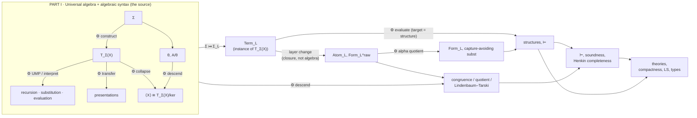

Three edges carry the integration. **$Σ ↦ Σ_L$**: the term layer *is* universal algebra by instantiation, no adaptation. **$Term_L → Atom_L$**: a layer change from a free algebra to an inductive closure, not another algebra. **`interpret`**: one engine reused with three targets — another free algebra (substitution), a structure (evaluation), another presentation (transfer).

---

# PART I · Universal Algebra and Algebraic Syntax

*The self-contained algebra of signatures, algebras, and free objects, then its syntax-theoretic life: presentations, substitution, contexts, evaluation, kernels, descent. No logic, no relation symbols as primitives, no formulas. This movement exports two things that never stop being used — the free algebra and the universal mapping property — plus the collapse-and-descent machinery the logic half quotients with.*

---

## I.0 · Sorting convention

*A standing convention, not a construction. Everything below is sorted; the one-sorted case is recovered by collapsing the sort set to a point. Single-sorted display is used when it is clearer, with the profiled wrapper given immediately wherever profile discipline matters.*

> [!definition] Definition I.0.1: Sort set
> The **sort set** $S$ is the index of typed universes.
>
> $$
> S,\qquad\text{one-sorted}\iff S=\{*\}.
> $$
>
> **Notation.** $S$  
> **Assumes.** nothing primitive.  
> **Provides.** the index of every sorted family below.  
> **Governance.** base of $w$, $Σ$, $X$, and all carriers.

> [!definition] Definition I.0.2: Sort-indexed family
> The **sort-indexed family** $(X_s)$ is a set assigned to each sort.
>
> $$
> X=(X_s)_{s\in S}.
> $$
>
> **Notation.** $(X_s)$  
> **Assumes.** $S$.  
> **Provides.** carriers, generator families, variable supplies.  
> **Governance.** maps between families act sortwise.

> [!definition] Definition I.0.3: Profile / arity word
> The **profile / arity word** $w$ is the finite input list of sorts an operation consumes.
>
> $$
> w=(s_1,\ldots,s_n)\in S^{<\omega},\qquad A_w:=A_{s_1}\times\cdots\times A_{s_n},\qquad A_{()}=1.
> $$
>
> **Notation.** $w$  
> **Assumes.** $S$.  
> **Provides.** the arity discipline; the domain of every operation.  
> **Governance.** input side of every operation symbol; relations later consume a profile but output no sort.

> [!definition] Definition I.0.4: Profile-correct map
> The **profile-correct map** $h:(A_s)\to(B_s)$ is a sortwise family of functions.
>
> $$
> h=(h_s:A_s\to B_s)_{s\in S}.
> $$
>
> **Notation.** $h:(A_s)\to(B_s)$  
> **Assumes.** two sorted families.  
> **Provides.** the only shape a homomorphism, assignment, or substitution can take.  
> **Governance.** sort-correctness is the single discipline carried through the entire atlas.

> [!note] Translation rule
> Each later construction has a one-sorted display and a sortwise wrapper obtained by the same substitution everywhere: set $X\rightsquigarrow(X_s)$, carrier $A\rightsquigarrow(A_s)$, operation $A^n\to A\rightsquigarrow A_w\to A_s$, map $A\to B\rightsquigarrow(A_s\to B_s)$. Typed syntax is then nothing but sort-correct free syntax.

> [!hands-up] Hands up
> $S$, sorted families, profiles, and profile-correct maps. Every signature, algebra, and term family in the rest of Part I is built over these.

---

## I.1 · Signatures and operation data

*The primitive datum of universal algebra: typed operation symbols. The room fixes what a signature is, where constants live, and how reducts and expansions move between signatures.*

> [!definition] Definition I.1.1: Profiled signature
> The **profiled signature** $Σ$ is typed operation symbols sorted by input profile and output sort.
>
> $$
> \Sigma=\big(S,(\operatorname{Op}_{w,s})_{(w,s)\in S^{<\omega}\times S}\big),\qquad |\Sigma|:=\coprod_{(w,s)}\operatorname{Op}_{w,s}.
> $$
>
> For $f\in\operatorname{Op}_{w,s}$ write $f:w\to s$, with $\operatorname{in}(f)=w$, $\operatorname{out}(f)=s$.
>
> **Notation.** $Σ$  
> **Assumes.** $S$, pairwise-disjoint symbol sets.  
> **Provides.** the notion of $Σ$-algebra and of free algebra.  
> **Governance.** instantiated as $Σ_L$, the functional reduct of a first-order language.

> [!definition] Definition I.1.2: Arity
> The **arity** $\operatorname{ar}(f)$ is the length of a symbol's input profile.
>
> $$
> \operatorname{ar}(f)=|w|\quad\text{for }f:w\to s.
> $$
>
> **Notation.** $\operatorname{ar}(f)$  
> **Assumes.** $Σ$.  
> **Provides.** the closure-stage and unique-readability bookkeeping.  
> **Governance.** in the one-sorted case the profile collapses to a single natural number.

> [!definition] Definition I.1.3: Nullary symbols / constants
> The **nullary symbols / constants** $\operatorname{Op}_{(),s}$ is operation symbols of empty profile.
>
> $$
> c\in\operatorname{Op}_{(),s}\ \Longleftrightarrow\ c:()\to s.
> $$
>
> **Notation.** $\operatorname{Op}_{(),s}$  
> **Assumes.** $Σ$.  
> **Provides.** atomic non-variable terms; named constants in algebras.  
> **Governance.** **constants are not a separate primitive** — they are exactly the empty-profile symbols.

> [!definition] Definition I.1.4: Generators versus constants
> The **generators versus constants** $X$ vs $\operatorname{Op}_{(),s}$ is two ways an atomic element can enter syntax.
>
> $$
> \text{generator }x\in X_s\ \text{(free, replaceable)};\qquad \text{constant }c\in\operatorname{Op}_{(),s}\ \text{(fixed by the signature)}.
> $$
>
> **Notation.** $X$ vs $\operatorname{Op}_{(),s}$  
> **Assumes.** $Σ$, a generator family $X$.  
> **Provides.** the variable/constant distinction that powers substitution.  
> **Governance.** evaluation may move generators freely but must fix constants.

> [!definition] Definition I.1.5: Reduct / expansion
> The **reduct / expansion** $\Sigma\!\restriction$ / $\Sigma\sqcup\Sigma'$ is forgetting or adjoining symbols.
>
> $$
> \Sigma'\subseteq\Sigma\ \Rightarrow\ \text{every }\Sigma\text{-algebra has a }\Sigma'\text{-reduct};\qquad \Sigma\subseteq\Sigma''\ \Rightarrow\ \text{an expansion adds interpretations.}
> $$
>
> **Notation.** $\Sigma\!\restriction$ / $\Sigma\sqcup\Sigma'$  
> **Assumes.** an inclusion of signatures.  
> **Provides.** the reduct functor on algebras.  
> **Governance.** the functional reduct $Σ_L ⊆ L$ is the key instance in the logic half.

> [!warning] Constants and variables
> $c\in\operatorname{Op}_{(),s}$ (a constant, fixed) and $x\in X_s$ (a generator, free) are different objects even when both are atomic terms. Confusing them breaks substitution and evaluation.

> [!hands-up] Hands up
> $Σ$ with its constants-as-nullary discipline, and the reduct relation. The next room interprets $Σ$ in carriers.

---

## I.2 · Algebras and homomorphisms

*A signature acquires meaning in a carrier. This room introduces the objects interpretation maps into and the structure-preserving maps between them.*

> [!definition] Definition I.2.1: Σ-algebra
> The **σ-algebra** $\mathbf A$ is a sorted carrier interpreting every operation symbol.
>
> $$
> \mathbf A=\big(A,(f^{\mathbf A})_{f\in|\Sigma|}\big),\qquad A=(A_s)_{s\in S},\qquad f^{\mathbf A}:A_w\to A_s.
> $$
>
> **Notation.** $\mathbf A$  
> **Assumes.** $Σ$.  
> **Provides.** the targets of homomorphisms, evaluation, and quotienting.  
> **Governance.** a first-order structure's algebraic reduct is one of these.

> [!definition] Definition I.2.2: Homomorphism
> The **homomorphism** $h:\mathbf A\to\mathbf B$ is a profile-correct map commuting with every operation.
>
> $$
> h_s\big(f^{\mathbf A}(a_1,\ldots,a_n)\big)=f^{\mathbf B}\big(h_{s_1}(a_1),\ldots,h_{s_n}(a_n)\big)\quad(\forall f:w\to s).
> $$
>
> **Notation.** $h:\mathbf A\to\mathbf B$  
> **Assumes.** two $Σ$-algebras.  
> **Provides.** isomorphisms, embeddings, kernels, images, composition.  
> **Governance.** out of a free algebra a homomorphism is determined by its generator values.

> [!definition] Definition I.2.3: Isomorphism
> The **isomorphism** $\cong$ is a sortwise-bijective homomorphism.
>
> $$
> h:\mathbf A\xrightarrow{\cong}\mathbf B\iff\text{each }h_s\text{ bijective and }h\text{ a hom.}
> $$
>
> **Notation.** $\cong$  
> **Assumes.** a `hom`.  
> **Provides.** identification of algebras up to relabelling.  
> **Governance.** generator-preserving isomorphisms are the rigidity used in transfer.

> [!definition] Definition I.2.4: Generator-preserving isomorphism
> The **generator-preserving isomorphism** $\theta_X$-preserving $\cong$ is an iso fixing a chosen generating set.
>
> $$
> h\circ\iota_X=\iota'_X.
> $$
>
> **Notation.** $\theta_X$-preserving $\cong$  
> **Assumes.** two algebras with marked generators.  
> **Provides.** the uniqueness that makes free objects canonical.  
> **Governance.** any two faithful presentations of syntax meet via exactly one of these.

> [!result] Core homomorphism facts
> - Composition of homomorphisms is a homomorphism; identities are homomorphisms.
> - The image of a homomorphism is a subalgebra of the codomain.
> - A homomorphism out of a generated algebra is determined by its values on the generators.

> [!hands-up] Hands up
> $Σ-Alg$, `hom`, and generator-preserving $≅$. The next room asks which subcarriers are closed, and what a generating set generates.

---

## I.3 · Subalgebras and generated structure

*Closure under operations is the first least-fixed-point construction in the atlas. It produces generated subalgebras, supplies structural induction, and separates two notions that are often conflated — generatedness and freeness.*

> [!definition] Definition I.3.1: Subuniverse / subalgebra
> The **subuniverse / subalgebra** $B\leq\mathbf A$ is a sorted subset closed under all operations.
>
> $$
> B=(B_s)_{s\in S},\qquad f^{\mathbf A}(B_w)\subseteq B_s\ (\forall f:w\to s).
> $$
>
> **Notation.** $B\leq\mathbf A$  
> **Assumes.** $\mathbf A$.  
> **Provides.** the lattice of subalgebras; the codomain of generation.  
> **Governance.** images of homomorphisms are subalgebras.

> [!definition] Definition I.3.2: Generated subalgebra
> The **generated subalgebra** $\langle X\rangle_{\mathbf A}$ is the least subuniverse containing `X`.
>
> $$
> \langle X\rangle_{\mathbf A}=\bigcap\{B\leq\mathbf A:X\subseteq B\}=\bigcup_{n<\omega}X^{(n)},
> $$
>
> $$
> X^{(0)}=X,\qquad X^{(n+1)}_s=X^{(n)}_s\cup\{f^{\mathbf A}(\vec a):f:w\to s,\ \vec a\in (X^{(n)})_w\}.
> $$
>
> **Notation.** $\langle X\rangle_{\mathbf A}$  
> **Assumes.** $\mathbf A$, a sorted subset $X$.  
> **Provides.** finite generation; induction over generated objects.  
> **Governance.** = the image of evaluation $\widehat g$ on the values of the variables.

> [!definition] Definition I.3.3: Finitary stage closure
> The **finitary stage closure** $X^{(n)}$ is the stratified construction of `⟨X⟩`.
>
> $$
> \langle X\rangle_{\mathbf A}=\bigcup_{n<\omega}X^{(n)}.
> $$
>
> **Notation.** $X^{(n)}$  
> **Assumes.** the one-step operation closure.  
> **Provides.** an induction principle: prove a property on $X$ and through each operation.  
> **Governance.** the same stratification generates congruences and (formally) term carriers.

> [!definition] Definition I.3.4: Homomorphic image
> The **homomorphic image** $\operatorname{im}(h)$ is the subalgebra reached by a homomorphism.
>
> $$
> \operatorname{im}(h)=\langle h[X]\rangle_{\mathbf B}\quad\text{when }X\text{ generates }\mathbf A.
> $$
>
> **Notation.** $\operatorname{im}(h)$  
> **Assumes.** a `hom`.  
> **Provides.** the image side of every factorization.  
> **Governance.** = $\langle g[X]\rangle$ for an evaluation, the bridge to the kernel quotient.

> [!engine] Engine I.3.1: Generated closure
> **Engine ID.** `gen-closure`
>
> The least subuniverse containing $X$ exists and is computed by stages; "closed under the operations and containing the generators" is a valid induction hypothesis.
>
> $$
> P(x)\ (\forall x\in X)\ \wedge\ \big[P(a_i)\,\forall i\Rightarrow P(f^{\mathbf A}(\vec a))\big]\ \Longrightarrow\ P\ \text{on }\langle X\rangle_{\mathbf A}.
> $$
>
> **drives** generators ⟶ everything they generate.
> **powered by** least-fixed-point existence for a monotone one-step closure.
> **enables** structural induction; the image description of homomorphisms; the formal carrier of term algebras.

> [!warning] Generatedness ≠ freeness
> $⟨X⟩$ says $X$ *reaches* everything (induction works). Freeness will say in addition that $X$ reaches everything *uniquely* (recursion works). Generatedness is necessary for both; freeness is the extra unique-reading condition introduced in I.5–I.6.

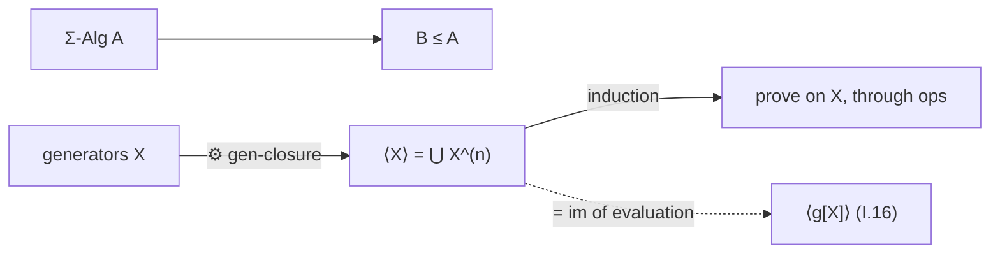

> [!hands-up] Hands up
> The generated-closure engine and the generatedness/freeness distinction. The next room turns closure on relations into congruences and quotients.

---

## I.4 · Kernels, congruences, and quotients

*Closure applied to relations produces congruences; congruences license quotients. This room builds the kernel–congruence–quotient cycle and closes it with the first isomorphism theorem, the universal hinge between maps and quotients.*

> [!definition] Definition I.4.1: Kernel of a homomorphism
> The **kernel of a homomorphism** $\ker h$ is the pairs a map identifies.
>
> $$
> a\,(\ker h)_s\,b\iff h_s(a)=h_s(b).
> $$
>
> **Notation.** $\ker h$  
> **Assumes.** a `hom`.  
> **Provides.** the measure of how much $h$ collapses.  
> **Governance.** kernels are exactly congruences; the input to factorization.

> [!definition] Definition I.4.2: Congruence
> The **congruence** $\theta$ is an operation-compatible equivalence.
>
> $$
> \theta=(\theta_s)_{s\in S},\qquad a_i\,\theta_{s_i}\,b_i\ (\forall i)\ \Longrightarrow\ f^{\mathbf A}(\vec a)\,\theta_s\,f^{\mathbf A}(\vec b).
> $$
>
> **Notation.** $\theta$  
> **Assumes.** $\mathbf A$.  
> **Provides.** the quotient $A/θ$; the descent obligation.  
> **Governance.** carrier of all collapse phenomena in the atlas.

> [!definition] Definition I.4.3: Congruence generated by a relation
> The **congruence generated by a relation** $\operatorname{Cg}(R)$ is the least congruence containing `R`.
>
> $$
> \operatorname{Cg}(R)=\bigcap\{\theta\in\operatorname{Con}(\mathbf A):R\subseteq\theta\}.
> $$
>
> **Notation.** $\operatorname{Cg}(R)$  
> **Assumes.** a relation $R$ on a carrier.  
> **Provides.** presented congruences; equational closures.  
> **Governance.** another least-closure object, like $⟨X⟩$ for relations.

> [!definition] Definition I.4.4: Quotient algebra
> The **quotient algebra** $\mathbf A/\theta$ is the algebra of equivalence classes.
>
> $$
> (\mathbf A/\theta)_s=A_s/\theta_s,\qquad f^{\mathbf A/\theta}([a_1],\ldots,[a_n])=[\,f^{\mathbf A}(\vec a)\,].
> $$
>
> **Notation.** $\mathbf A/\theta$  
> **Assumes.** a congruence $θ$.  
> **Provides.** representative-level computation.  
> **Governance.** every "syntax modulo equivalence" object is an instance of this.

> [!definition] Definition I.4.5: Quotient projection
> The **quotient projection** $q_\theta$ is the class map.
>
> $$
> q_\theta:\mathbf A\to\mathbf A/\theta,\qquad a\mapsto[a]_\theta.
> $$
>
> **Notation.** $q_\theta$  
> **Assumes.** $A/θ$.  
> **Provides.** the surjection every quotient construction factors through.  
> **Governance.** $\ker q_\theta=\theta$.

> [!engine] Engine I.4.1: First isomorphism theorem
> **Engine ID.** `first-iso`
>
> A homomorphism factors through a quotient exactly when the quotient relation is below its kernel, and its image is the quotient by its own kernel.
>
> $$
> \theta\subseteq\ker h\ \Longrightarrow\ h\ \text{factors as}\ \bar h\circ q_\theta;\qquad \mathbf A/\ker h\ \cong\ \operatorname{im}(h).
> $$
>
> **drives** map ⟶ quotient-by-kernel description of its image.
> **powered by** kernels are congruences plus representative-independence of the induced map.
> **enables** generated algebras as syntax-modulo-equations (I.17), term models, Lindenbaum–Tarski.

> [!result] Core quotient facts
> - Kernels of homomorphisms are congruences.
> - Quotient operations are well-defined exactly because $θ$ respects every operation.
> - $h$ factors through $A/θ$ iff $θ ⊆ ker h$.
> - $A/ker h ≅ im(h)$.

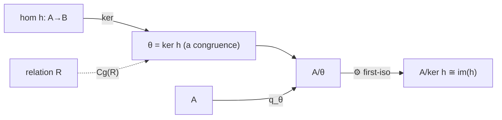

> [!hands-up] Hands up
> Congruences, quotients, the projection $q_θ$, and the first-iso engine. The next room produces the object the whole atlas turns on: the free algebra.

---

## I.5 · Free algebras and the universal mapping property

*The central room of Part I. A free algebra is a generated algebra with no relations among its generators beyond those the operations force. Its defining property — the UMP — is the single engine behind recursion, substitution, evaluation, and transfer.*

> [!definition] Definition I.5.1: Generator insertion
> The **generator insertion** $\eta$ is variables placed as atomic elements.
>
> $$
> \eta=(\eta_s:X_s\hookrightarrow \mathrm T_\Sigma(X)_s)_{s\in S}.
> $$
>
> **Notation.** $\eta$  
> **Assumes.** the carrier of the free algebra.  
> **Provides.** the comparison condition $\widehat g\circ\eta=g$ that pins extensions down.  
> **Governance.** each $\eta_s$ is injective; its image generates.

> [!definition] Definition I.5.2: Free algebra on X
> The **free algebra on x** $\mathbf T_\Sigma(X)$ is the syntax object.
>
> $$
> (\mathbf T_\Sigma(X),\eta),\qquad \mathrm T_\Sigma(X)=(\mathrm T_\Sigma(X)_s)_{s\in S}.
> $$
>
> **Notation.** $\mathbf T_\Sigma(X)$  
> **Assumes.** $Σ$, sorted generators $X$.  
> **Provides.** formal syntax, structural recursion, substitution, evaluation, transfer.  
> **Governance.** the canonical logic-side instance is $\mathbf{Term}_L$.

> [!engine] Engine I.5.1: Universal mapping property
> **Engine ID.** `UMP`
>
> Every sorted assignment of generators into a target algebra extends to a *unique* homomorphism agreeing with it on generators.
>
> $$
> g:X\to U\mathbf A\ \Longrightarrow\ \exists!\,\widehat g:\mathbf T_\Sigma(X)\to\mathbf A\ \text{with}\ \widehat g\circ\eta=g,
> $$
>
> $$
> \operatorname{Hom}_\Sigma(\mathbf T_\Sigma(X),\mathbf A)\ \cong\ \operatorname{Set}^S(X,U\mathbf A).
> $$
>
> **drives** generator assignment ⟶ unique interpretation of all syntax.
> **powered by** existence (least closure builds the carrier) plus freeness (unique reading makes the extension single-valued).
> **enables** the *same* mechanism at four targets — syntax (substitution, I.10), a semantic algebra (evaluation, I.16), another presentation (transfer, I.9), and the kernel quotient (I.17). One theorem, four tools, distinguished only by the target.

> [!result] Freeness package
> - **Existence**: $T_Σ(X)$ exists for every $Σ$, $X$.
> - **Uniqueness over generators**: the extension `ĝ` is the only homomorphism with $ĝ∘η = g$.
> - **Generatedness**: $η(X)$ generates $T_Σ(X)$; induction over generators is valid.
> - **Rigidity**: any two free algebras on $X$ are isomorphic by a *unique* generator-preserving isomorphism.
> - **Sorted UMP**: the statement holds verbatim with $X$, $A$, $g$, `ĝ` read sortwise — many-sortedness changes nothing but the bookkeeping.

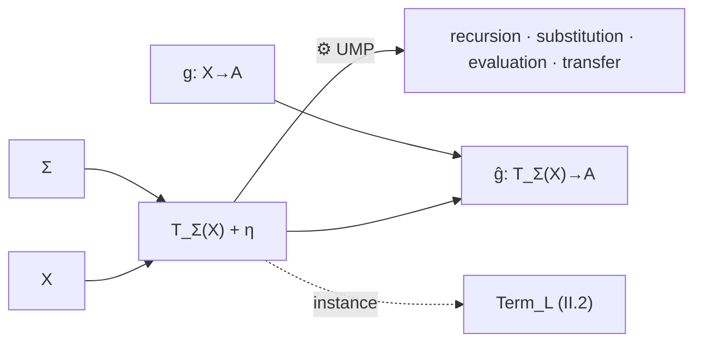

> [!hands-up] Hands up
> $T_Σ(X)$, $η$, the UMP, and the recursion/induction asymmetry (induction needs generatedness; recursion needs freeness). The next room realizes this abstract free object as raw term syntax.

---

## I.6 · Raw term algebras

*The free algebra realized concretely: formal expressions built from variables and operation symbols. The room certifies that this construction is free — unique readability is exactly the no-confusion condition that turns generated syntax into recursive syntax.*

> [!definition] Definition I.6.1: Formal term formation
> The **formal term formation** $\operatorname{Term}$ is the inductively generated expression family.
>
> $$
> x\in X_s\Rightarrow x\in\operatorname{Term}_s,\qquad c\in\operatorname{Op}_{(),s}\Rightarrow c\in\operatorname{Term}_s,
> $$
>
> $$
> f:w\to s,\ t_i\in\operatorname{Term}_{s_i}\Rightarrow f(t_1,\ldots,t_n)\in\operatorname{Term}_s.
> $$
>
> **Notation.** $\operatorname{Term}$  
> **Assumes.** $Σ$, $X$.  
> **Provides.** the carrier of $T_Σ(X)$; variable, constant, and compound terms.  
> **Governance.** least closure under the formal constructors.

> [!definition] Definition I.6.2: Formal constructor operation
> The **formal constructor operation** $f^{\mathbf T}$ is the operation symbol acting as a syntax builder.
>
> $$
> f^{\mathbf T}(t_1,\ldots,t_n):=f(t_1,\ldots,t_n).
> $$
>
> **Notation.** $f^{\mathbf T}$  
> **Assumes.** term formation.  
> **Provides.** the algebra structure on $Term$ making it a $Σ$-algebra.  
> **Governance.** $f^{\mathbf T}$ is injective with range disjoint from variables and from other symbols' ranges.

> [!definition] Definition I.6.3: Term algebra is the free algebra
> The **term algebra is the free algebra** $\cong$-to-$T_\Sigma(X)$ is the certification.
>
> $$
> (\operatorname{Term},(f^{\mathbf T}))\ \cong\ \mathbf T_\Sigma(X)\quad\text{over }X.
> $$
>
> **Notation.** $\cong$-to-$T_\Sigma(X)$  
> **Assumes.** term formation as a $Σ$-algebra.  
> **Provides.** all UMP consequences for concrete terms.  
> **Governance.** the abstract $T_Σ(X)$ and concrete $Term$ are identified by their shared UMP.

> [!engine] Engine I.6.1: Unique readability
> **Engine ID.** `unique-read`
>
> Every non-variable term decomposes uniquely as a top symbol applied to an argument tuple; variables, constants, and compounds are pairwise distinguishable.
>
> $$
> f(\vec t)=g(\vec u)\ \Longrightarrow\ f=g,\ \vec t=\vec u;\qquad \text{no variable is a compound.}
> $$
>
> **drives** generated syntax ⟶ *freely* generated syntax.
> **powered by** the disjoint-range / injective-constructor conditions on $f^{\mathbf T}$ (no-confusion).
> **enables** structural recursion: define a function by one clause per constructor and it is well-defined and total.

> [!warning] Syntax equality vs semantic equality
> $f(t)=g(u)$ as *terms* means the same expression (decided by unique readability). $f^{\mathbf A}(a)=g^{\mathbf A}(b)$ as *values* in an algebra is a different relation, decided by the algebra. The whole evaluation/kernel story (I.16–I.17) measures the gap between them.

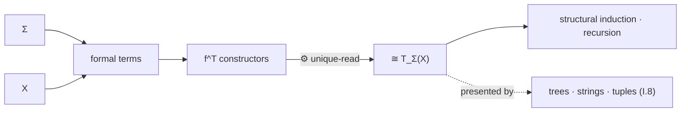

> [!hands-up] Hands up
> A concrete free term carrier and the unique-readability engine that makes recursion legal. The next room abstracts the certification: which *candidate* carriers count as free syntax.

---

## I.7 · Constructor presentations and free-syntax certification

*A general test for "is this concrete carrier the free syntax?" without re-deriving everything by hand. The criterion is two conditions — no-junk and no-confusion — that together force a candidate carrier to be isomorphic to the abstract term algebra over the generators.*

> [!definition] Definition I.7.1: Constructor system
> The **constructor system** $(\mathbf P,\iota,(c_f))$ is a candidate carrier with an insertion and a builder per symbol.
>
> $$
> \iota:X\to P,\qquad c_f:P_w\to P_s\ \ (f:w\to s).
> $$
>
> **Notation.** $(\mathbf P,\iota,(c_f))$  
> **Assumes.** a sorted set $P$, maps `ι`, $c_f$.  
> **Provides.** a candidate $Σ$-algebra on $P$.  
> **Governance.** trees, strings, tuples, and ASTs are all constructor systems.

> [!definition] Definition I.7.2: Comparison map
> The **comparison map** $\rho$ is the canonical homomorphism from abstract syntax.
>
> $$
> \rho:\mathbf T_\Sigma(X)\to\mathbf P,\qquad \rho\circ\eta=\iota\quad(\text{by UMP}).
> $$
>
> **Notation.** $\rho$  
> **Assumes.** a constructor system.  
> **Provides.** the single map whose bijectivity decides faithfulness.  
> **Governance.** always exists and is unique; the only question is whether it is an isomorphism.

> [!definition] Definition I.7.3: Generatedness of the candidate
> The **generatedness of the candidate** no-junk is $ι(X)$ generates $P$ under the $c_f$.
>
> $$
> \langle \iota(X)\rangle_{\mathbf P}=P\quad\Longleftrightarrow\quad \rho\ \text{surjective.}
> $$
>
> **Notation.** no-junk  
> **Assumes.** the constructor system.  
> **Provides.** surjectivity of $ρ$.  
> **Governance.** "no extra elements outside what the constructors build.".

> [!definition] Definition I.7.4: Injectivity of constructors
> The **injectivity of constructors** no-confusion is distinct builds give distinct elements.
>
> $$
> c_f\ \text{injective, ranges disjoint, disjoint from }\iota(X)\quad\Longrightarrow\quad \rho\ \text{injective.}
> $$
>
> **Notation.** no-confusion  
> **Assumes.** the constructor system.  
> **Provides.** injectivity of $ρ$.  
> **Governance.** the abstract form of unique readability. The converse can fail when the candidate carrier $P$ contains *junk* on which constructors collide outside the image of $ρ$: globally, no-confusion is strictly stronger than $ρ$-injectivity. Equivalence is restored after no-junk (then constructor injectivity and disjointness are equivalent to $ρ$-injectivity), or by restricting attention to the generated subalgebra $\langle\iota(X)\rangle_{\mathbf P}$.

> [!engine] Engine I.7.1: Free-syntax certification
> **Engine ID.** `constructor-cert`
>
> A constructor system is a faithful presentation of free syntax exactly when it satisfies no-junk and no-confusion; then the comparison map is an isomorphism over the generators.
>
> $$
> \text{no-junk}\ \wedge\ \text{no-confusion}\ \Longrightarrow\ \rho:\mathbf T_\Sigma(X)\xrightarrow{\cong}\mathbf P.
> $$
>
> **drives** candidate carrier ⟶ certified free syntax.
> **powered by** surjectivity from generatedness, injectivity from constructor disjointness, both routed through the UMP.
> **enables** defining once on abstract syntax and transporting to any certified carrier (I.9).

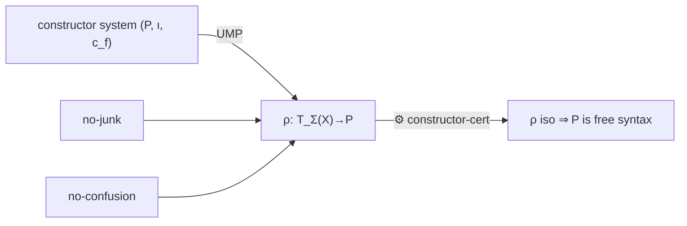

> [!hands-up] Hands up
> The certification engine and the no-junk/no-confusion criterion. The next room runs it on the standard concrete carriers.

---

## I.8 · Concrete syntax carriers

*The carriers people actually compute with. Each is a constructor system; each is certified free by the previous room. The room's real content is the distinction between a carrier and the invariant syntax object it presents.*

> [!definition] Definition I.8.1: Recursive expression syntax
> The **recursive expression syntax** $\mathrm{Expr}$ is terms as nested constructor applications.
>
> $$
> \mathrm{Expr}\ni f(t_1,\ldots,t_n),\quad t_i\in\mathrm{Expr}.
> $$
>
> **Notation.** $\mathrm{Expr}$  
> **Assumes.** a constructor system on expressions.  
> **Provides.** the default inductive datatype carrier.  
> **Governance.** certified free by no-junk/no-confusion.

> [!definition] Definition I.8.2: Tree syntax
> The **tree syntax** $\mathrm{Tree}$ is labelled ordered trees, symbol at each node, children = arguments.
>
> $$
> \text{node label }f:w\to s,\quad \deg=|w|.
> $$
>
> **Notation.** $\mathrm{Tree}$  
> **Assumes.** ordered labelled trees over $|Σ| ∪ X$.  
> **Provides.** positions, subterms, occurrences (I.12).  
> **Governance.** the carrier that exposes addresses; faithful as an algebra.

> [!definition] Definition I.8.3: Addressed syntax trees
> The **addressed syntax trees** $\mathrm{AddrTree}$ is trees with explicit position addresses.
>
> $$
> \text{position}\ p\in\mathbb N^{<\omega},\quad t|_p=\text{subtree at }p.
> $$
>
> **Notation.** $\mathrm{AddrTree}$  
> **Assumes.** $Tree$ plus an addressing scheme.  
> **Provides.** positional surgery; replacement.  
> **Governance.** addresses are presentation-bound, not invariant syntax data.

> [!definition] Definition I.8.4: Tagged-tuple syntax
> The **tagged-tuple syntax** $\mathrm{Tup}$ is terms as tagged tuples $(f,t_1,\ldots,t_n)$.
>
> $$
> (f,\vec t),\quad f:w\to s.
> $$
>
> **Notation.** $\mathrm{Tup}$  
> **Assumes.** disjoint tagging.  
> **Provides.** a set-theoretic carrier with trivial unique readability.  
> **Governance.** the von Neumann-style explicit encoding.

> [!definition] Definition I.8.5: String syntax
> The **string syntax** $\mathrm{Str}$ is terms as parenthesized symbol strings.
>
> $$
> f(t_1,\ldots,t_n)\ \text{as a string over an alphabet.}
> $$
>
> **Notation.** $\mathrm{Str}$  
> **Assumes.** a parsing/hygiene discipline (matched delimiters, unique parse).  
> **Provides.** an I/O carrier.  
> **Governance.** faithful only once parsing is unambiguous.

> [!definition] Definition I.8.6: DAG / implementation carrier
> The **dag / implementation carrier** $\mathrm{DAG}$ is shared-subterm representation.
>
> $$
> \text{shared node}\ \Rightarrow\ \text{one node for repeated subterms.}
> $$
>
> **Notation.** $\mathrm{DAG}$  
> **Assumes.** a hashing/sharing scheme.  
> **Provides.** an efficient carrier.  
> **Governance.** sharing identity is presentation-bound; the underlying term is the invariant.

> [!warning] Carrier vs syntax object
> A tree, a string, a tuple, and a DAG can all present the *same* term. Statements about addresses, substrings, parse stacks, pointer identity, or sharing are about the carrier, not the term. Only what is definable from the algebra structure and $η$ is invariant syntax.

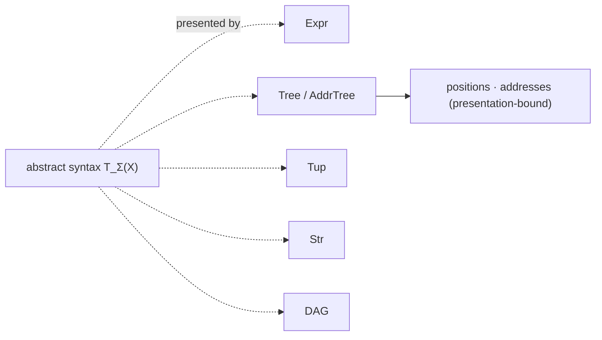

> [!hands-up] Hands up
> A family of certified carriers and the carrier/invariant distinction. The next room makes "define once, transport everywhere" precise.

---

## I.9 · Presentation-neutral syntax and transfer

*Syntax is the abstract free object; the carriers of I.8 are its presentations. This room exports the licence to define a construction once, on whichever carrier is convenient, and transport it to all of them by conjugation — together with the exact boundary of what transports.*

> [!definition] Definition I.9.1: The invariant object
> The **the invariant object** abstract syntax is `T_Σ(X)` up to unique generator-preserving isomorphism.
>
> $$
> \mathbf T_\Sigma(X)\ \text{considered up to the unique }\theta\text{ over }X.
> $$
>
> **Notation.** abstract syntax  
> **Assumes.** $Σ$, $X$.  
> **Provides.** the definitions all presentations must agree on.  
> **Governance.** operations, induction, recursion, substitution, contexts live here; addresses and pointers do not.

> [!definition] Definition I.9.2: Faithful presentation
> The **faithful presentation** $\mathcal P=(\mathbf P,\iota,\rho)$ is a certified concrete model.
>
> $$
> \rho:\mathbf T_\Sigma(X)\xrightarrow{\cong}\mathbf P,\qquad \rho\circ\eta=\iota.
> $$
>
> **Notation.** $\mathcal P=(\mathbf P,\iota,\rho)$  
> **Assumes.** a constructor system passing certification (I.7).  
> **Provides.** a usable carrier.  
> **Governance.** faithful iff $ρ$ is an isomorphism.

> [!definition] Definition I.9.3: Transfer map between presentations
> The **transfer map between presentations** $\tau_{P,Q}$ is the canonical carrier comparison.
>
> $$
> \tau_{P,Q}:=\rho_Q\circ\rho_P^{-1}:\mathbf P\xrightarrow{\cong}\mathbf Q.
> $$
>
> **Notation.** $\tau_{P,Q}$  
> **Assumes.** two faithful presentations.  
> **Provides.** the unique generator-preserving comparison.  
> **Governance.** instance of rigidity.

> [!definition] Definition I.9.4: presentation-bound data
> The **presentation-bound data** presentation-bound data is encoding-specific structure that does not transfer.
>
> $$
> \text{tree address},\quad \text{string index},\quad \text{pointer identity},\quad \text{DAG sharing}.
> $$
>
> **Notation.** presentation-bound data  
> **Assumes.** a chosen carrier.  
> **Provides.** useful notation/implementation data.  
> **Governance.** quarantined unless an invariance theorem ties it back.

> [!engine] Engine I.9.1: Conjugation across presentations
> **Engine ID.** `transfer`
>
> An invariant operation on abstract syntax transports to any faithful presentation by conjugation, and all comparison isomorphisms commute.
>
> $$
> F_{\mathcal P}:=\rho\circ F\circ(\rho^{-1})^{\times n};\qquad \tau_{P,Q}\big(F_P(\vec p)\big)=F_Q\big(\tau_{P,Q}(\vec p)\big).
> $$
>
> **drives** invariant definition ⟶ presentation-level operation.
> **powered by** rigidity: any two faithful presentations are uniquely isomorphic over $X$.
> **enables** proving operations, substitution, contexts, induction, recursion *once*; frees logic from caring what a term "really is."

> [!result] Invariance criterion
> A construction transfers iff it is preserved by every generator-preserving isomorphism. Operations, substitution, evaluation, and contexts pass. Positions and addresses fail — which is exactly why positional surgery (I.12) needs a chosen carrier and reappears only where binding demands occurrences.

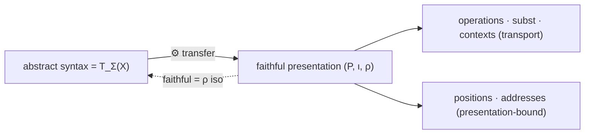

> [!hands-up] Hands up
> Abstract syntax, faithful presentations, the transfer engine, and the invariance criterion. Every later construction is defined on the abstract object; carriers are chosen only for convenience. The next room defines the first such construction — substitution.

---

## I.10 · Substitution as syntax-valued evaluation

*The first reuse of the UMP with a syntactic target. Substitution is not textual replacement: it is the unique homomorphism extending a syntax-valued assignment. Its laws — identity, composition, evaluation compatibility — are exactly the monad laws of free syntax.*

> [!definition] Definition I.10.1: Syntax-valued assignment
> The **syntax-valued assignment** $\sigma$ is variables sent to terms.
>
> $$
> \sigma:X\to U\mathbf T_\Sigma(Y).
> $$
>
> **Notation.** $\sigma$  
> **Assumes.** $T_Σ(Y)$.  
> **Provides.** the data substitution extends.  
> **Governance.** in logic $X=Y=\operatorname{Var}$.

> [!definition] Definition I.10.2: Substitution extension
> The **substitution extension** $\widehat\sigma$ is the homomorphism it induces.
>
> $$
> \widehat\sigma:\mathbf T_\Sigma(X)\to\mathbf T_\Sigma(Y),\qquad \widehat\sigma\circ\eta_X=\sigma.
> $$
>
> **Notation.** $\widehat\sigma$  
> **Assumes.** $σ$, the UMP.  
> **Provides.** substitution as a structure-preserving map.  
> **Governance.** the first exact reuse of `interpret` with a syntactic target.

> [!definition] Definition I.10.3: Identity substitution
> The **identity substitution** $\eta_X$ is generators to themselves.
>
> $$
> \widehat{\eta_X}=\operatorname{id}_{\mathbf T_\Sigma(X)}.
> $$
>
> **Notation.** $\eta_X$  
> **Assumes.** $η$.  
> **Provides.** the unit law.  
> **Governance.** the monad unit.

> [!definition] Definition I.10.4: Kleisli composition
> The **kleisli composition** $\tau\star\sigma$ is substitute, then substitute.
>
> $$
> (\tau\star\sigma)(x):=\widehat\tau(\sigma(x)),\qquad \widehat{\tau\star\sigma}=\widehat\tau\circ\widehat\sigma.
> $$
>
> **Notation.** $\tau\star\sigma$  
> **Assumes.** $σ:X→T(Y)$, $τ:Y→T(Z)$.  
> **Provides.** associativity of substitution.  
> **Governance.** the monad multiplication; renaming is the special case where $σ$ lands in $η(Y)$.

> [!engine] Engine I.10.1: Substitution = evaluation into syntax
> **Engine ID.** `subst`
>
> A substitution is the homomorphic extension of a syntax-valued assignment; composing substitutions is interpreting one inside another.
>
> $$
> \widehat{\eta_X}=\operatorname{id},\qquad \widehat{\tau\star\sigma}=\widehat\tau\circ\widehat\sigma,\qquad \operatorname{ev}_v\circ\widehat\sigma=\operatorname{ev}_{v\star\sigma}.
> $$
>
> **drives** assignment $X→T(Y)$ ⟶ map $T(X)→T(Y)$.
> **powered by** the UMP with target a free algebra.
> **enables** the substitution lemma, context plugging (I.11), clone superposition (I.14), and the term monad.

> [!result] Four-corner calculus
> For $\sigma:X\to T(Y)$, $v:Y\to A$, $h:\mathbf A\to\mathbf B$, every composite of substitution, evaluation, and homomorphism normalizes to a single evaluation:
> $$
> \operatorname{ev}_v\circ\widehat\sigma=\operatorname{ev}_{v\star\sigma},\qquad h\circ\operatorname{ev}_g=\operatorname{ev}_{h\circ g}.
> $$
> Both faces are the UMP's uniqueness applied to a map that agrees with an evaluation on generators.

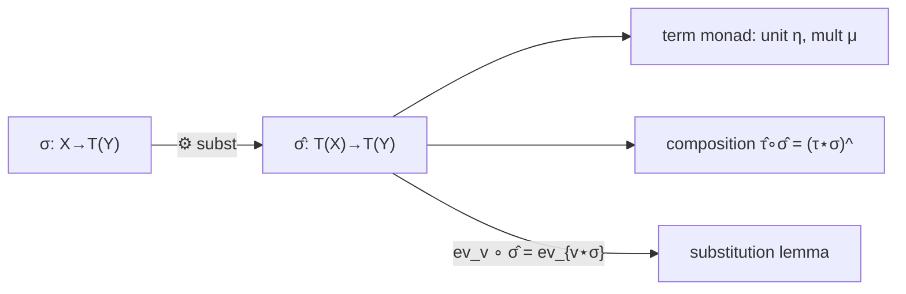

> [!hands-up] Hands up
> Substitution, its monad laws, and the four-corner calculus. The next room exposes holes inside syntax so that substitution can act at marked positions.

---

## I.11 · Contexts, holes, and plugging

*A context is a term with marked holes. Plugging a context is substitution restricted to the hole variables while ordinary variables stay fixed. Context composition is associative because substitution is. No tree address is needed — holes are just a distinguished generator family.*

> [!definition] Definition I.11.1: Hole variables
> The **hole variables** $H$ / $E_n$ is a distinguished sorted family of generators.
>
> $$
> H=(H_s)_{s\in S},\qquad E_n=\{\square_1,\ldots,\square_n\}.
> $$
>
> **Notation.** $H$ / $E_n$  
> **Assumes.** $S$.  
> **Provides.** marked positions as generators.  
> **Governance.** holes are ordinary generators kept disjoint from $X$.

> [!definition] Definition I.11.2: Hole-extended syntax
> The **hole-extended syntax** $\operatorname{Ctx}_H(X)$ is terms over variables and holes.
>
> $$
> \operatorname{Ctx}_H(X):=\mathbf T_\Sigma(X\sqcup H).
> $$
>
> **Notation.** $\operatorname{Ctx}_H(X)$  
> **Assumes.** the coproduct generator family.  
> **Provides.** the carrier of contexts.  
> **Governance.** a one-hole context uses a single distinguished generator in one sort.

> [!definition] Definition I.11.3: Multi-hole context
> The **multi-hole context** $C[\,\square_1,\ldots,\square_n\,]$ is an element of hole-extended syntax.
>
> $$
> C\in\mathbf T_\Sigma(X\sqcup E_n)_s.
> $$
>
> **Notation.** $C[\,\square_1,\ldots,\square_n\,]$  
> **Assumes.** $Ctx_H(X)$.  
> **Provides.** the object plugging acts on.  
> **Governance.** repeated holes give nonlinear contexts; distinct holes used once give linear contexts.

> [!definition] Definition I.11.4: Plugging
> The **plugging** $C[\vec t]$ is fill holes, keep variables fixed.
>
> $$
> \alpha:H\to U\mathbf T_\Sigma(X),\qquad C[\alpha]:=\widehat\sigma(C)\ \text{with}\ \sigma|_X=\eta_X,\ \sigma|_H=\alpha.
> $$
>
> **Notation.** $C[\vec t]$  
> **Assumes.** a context and a sorted filling.  
> **Provides.** the filled term.  
> **Governance.** plugging *is* substitution at holes.

> [!engine] Engine I.11.1: Plugging = substitution at holes
> **Engine ID.** `plug`
>
> Filling the holes of a context is the substitution that maps holes to fillings and fixes ordinary variables.
>
> $$
> C[\alpha]=\widehat{(\eta_X\sqcup\alpha)}(C).
> $$
>
> **drives** context + filling ⟶ filled term.
> **powered by** the coproduct generator family $X ⊔ H$ and the substitution engine.
> **enables** context composition, induced (polynomial) operations, and congruence tests by unary contexts.

> [!result] Context laws
> - **Composition**: $(C\circ D)[\alpha]=C[\,D[\alpha]\,]$ — associative because substitution is associative.
> - **Distribution**: substitution distributes over plugging, $\widehat\sigma(C[\alpha])=(\widehat\sigma C)[\widehat\sigma\circ\alpha]$.
> - **Identity context**: a single hole $\square$ is the identity for composition.
> - In the **single-sorted** case, one-hole contexts under composition form a monoid acting on syntax. In the **many-sorted** case (I.13), one-hole contexts form a *category* whose objects are sorts and whose arrows are one-hole contexts with matching hole and output sorts; endo-contexts at a fixed sort then form a monoid; multi-hole contexts form a *multicategory* (coloured operad) whose colours are sorts.

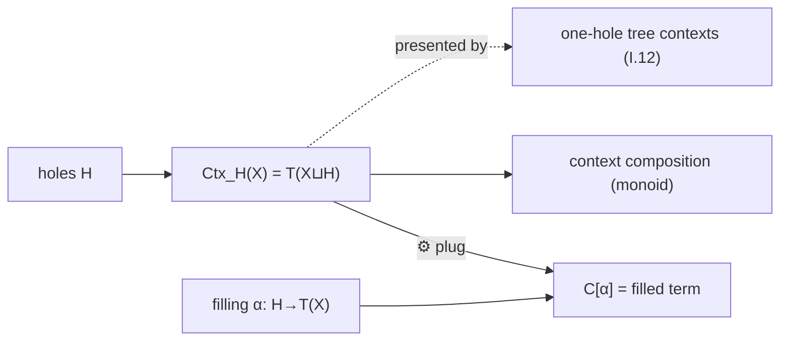

> [!hands-up] Hands up
> Holes, contexts, plugging, and the context monoid. The next room gives the concrete tree picture of contexts — the one place where positional data legitimately enters.

---

## I.12 · Trees, positions, extraction, and replacement

*The presentation-bound room. On a tree carrier, terms acquire positions; subterm extraction, context extraction, and replacement become available. These are exactly the constructions the invariance criterion quarantined — useful, but defined on a chosen carrier.*

> [!definition] Definition I.12.1: Tree position
> The **tree position** $p$ is an address in a term tree.
>
> $$
> p\in\mathbb N^{<\omega},\qquad \varepsilon\ \text{the root.}
> $$
>
> **Notation.** $p$  
> **Assumes.** a tree presentation.  
> **Provides.** the index set for subterms and occurrences.  
> **Governance.** presentation-bound; does not transfer.

> [!definition] Definition I.12.2: Subtree extraction
> The **subtree extraction** $t|_p$ is the subterm at a position.
>
> $$
> t|_\varepsilon=t,\qquad f(t_1,\ldots,t_n)|_{i\cdot p}=t_i|_p.
> $$
>
> **Notation.** $t|_p$  
> **Assumes.** a position in a term.  
> **Provides.** occurrences and the subterm partial order.  
> **Governance.** feeds replacement and context extraction.

> [!definition] Definition I.12.3: Context extraction at a position
> The **context extraction at a position** $C_{t,p}$ is the one-hole context left by removing a subterm.
>
> $$
> t=C_{t,p}[\,t|_p\,].
> $$
>
> **Notation.** $C_{t,p}$  
> **Assumes.** a term and a position.  
> **Provides.** the master decomposition of a term into context plus subterm.  
> **Governance.** reconciles the carrier-free context (I.11) with the tree picture.

> [!definition] Definition I.12.4: Replacement at a position
> The **replacement at a position** $t[p:=u]$ is substitute one subterm.
>
> $$
> t[p:=u]:=C_{t,p}[u].
> $$
>
> **Notation.** $t[p:=u]$  
> **Assumes.** a term, a position, a replacement (sort-matched).  
> **Provides.** local surgery on syntax.  
> **Governance.** = plugging the extracted context.

> [!result] Master decomposition
> Every term factors as $t=C_{t,p}[t|_p]$: a one-hole context times the subterm at $p$. Replacement is plugging; extraction is its inverse. Address arithmetic under plugging composes positions: filling at $p$ then reading at $q$ reads at $p·q$.

> [!warning] Tree-relative vs carrier-free
> The *context object* $C_{t,p}$ is invariant (it is a one-hole context, I.11). The *position* $p$ and the address arithmetic are tree-relative. Keep the invariant context separate from the address that produced it.

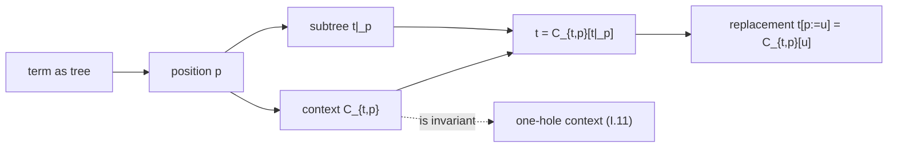

> [!hands-up] Hands up
> Positions, extraction, the master decomposition, and replacement — with the invariant context separated from its address. The next room types the holes, making contexts profile-aware.

---

## I.13 · Typed contexts and sort-correct filling

*The many-sorted wrapper for contexts. Holes carry sorts; a context carries an input profile and an output sort; filling is legal only when sorts match. This is the profile discipline of I.0 applied to plugging — the same engine, sort-indexed.*

> [!definition] Definition I.13.1: Typed holes
> The **typed holes** $\square_i:s_i$ is holes tagged by sort.
>
> $$
> H=(H_s)_{s\in S},\qquad \square_i\in H_{s_i}.
> $$
>
> **Notation.** $\square_i:s_i$  
> **Assumes.** $S$.  
> **Provides.** sort-tagged marked positions.  
> **Governance.** a hole of sort $s$ accepts only terms of sort $s$.

> [!definition] Definition I.13.2: Context profile
> The **context profile** $C:(s_1,\ldots,s_n)\Rightarrow s$ is input hole sorts and output sort.
>
> $$
> C\in\mathbf T_\Sigma(X\sqcup\{\square_1{:}s_1,\ldots,\square_n{:}s_n\})_s.
> $$
>
> **Notation.** $C:(s_1,\ldots,s_n)\Rightarrow s$  
> **Assumes.** typed holes.  
> **Provides.** the typing judgement for contexts.  
> **Governance.** the arrow $⇒$ records hole profile and output sort.

> [!definition] Definition I.13.3: Sort-correct filling
> The **sort-correct filling** $C[\vec t]$ is plugging that respects sorts.
>
> $$
> t_i\in\mathbf T_\Sigma(X)_{s_i}\ \Longrightarrow\ C[t_1,\ldots,t_n]\in\mathbf T_\Sigma(X)_s.
> $$
>
> **Notation.** $C[\vec t]$  
> **Assumes.** a typed context, sort-matched fillings.  
> **Provides.** a well-typed filled term.  
> **Governance.** ill-typed filling is simply not defined.

> [!definition] Definition I.13.4: Profiled context composition
> The **profiled context composition** $C\circ D$ is output sort meets matching hole sort.
>
> $$
> \big[(s_1,\ldots,s_n)\Rightarrow s\big]\circ\big[(r_1,\ldots,r_m)\Rightarrow s_i\big]\ \text{plugs at hole }i.
> $$
>
> **Notation.** $C\circ D$  
> **Assumes.** composable profiles.  
> **Provides.** for one-hole contexts ($n=1$), a category whose **objects are sorts** and whose arrows are typed one-hole contexts; for multi-hole contexts, a **multicategory (coloured operad)** whose colours are sorts and whose multi-arrows are typed contexts of profile $(s_1,\ldots,s_n)\Rightarrow s$.  
> **Governance.** the typed analogue of the single-sorted context monoid; the one-hole, fixed-sort endo-arrows reduce to a monoid.

> [!result] Sorted plugging
> Typed plugging is sort-indexed substitution: it is exactly the engine of I.11 with $X ⊔ H$ read sortwise and the filling required to match hole sorts. Nothing new is proved; the profile bookkeeping is the whole content.

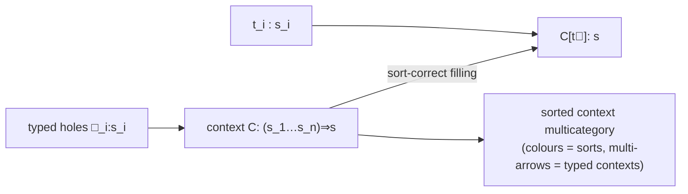

> [!hands-up] Hands up
> Typed holes, context profiles, sort-correct filling, and the context category by sorts. The next room organizes these typed term-operations into a clone.

---

## I.14 · Syntax clone and superposition

*Terms in finitely many marked variables are operations. Collecting them by arity (single-sorted) or profile (many-sorted) gives the syntactic clone, where composition is substitution. Presentation transfer becomes a clone isomorphism.*

> [!definition] Definition I.14.1: Fixed-profile term set
> The **fixed-profile term set** $\operatorname{SynClo}(\Sigma)_{w,s}$ is terms in distinguished variables, by profile.
>
> $$
> \operatorname{SynClo}(\Sigma)_{w,s}=\mathbf T_\Sigma(x_1{:}s_1,\ldots,x_n{:}s_n)_s.
> $$
>
> **Notation.** $\operatorname{SynClo}(\Sigma)_{w,s}$  
> **Assumes.** terms on finite profiled generators.  
> **Provides.** the graded carrier of formal operations.  
> **Governance.** single-sorted case indexes by arity $n$.

> [!definition] Definition I.14.2: Projection
> The **projection** $\pi_i$ is a distinguished variable as an operation.
>
> $$
> \pi_i:=x_i\in\operatorname{SynClo}(\Sigma)_{(s_1,\ldots,s_n),s_i}.
> $$
>
> **Notation.** $\pi_i$  
> **Assumes.** the variable generators.  
> **Provides.** the clone's projection operations.  
> **Governance.** projections are the identities for superposition in each coordinate.

> [!definition] Definition I.14.3: Superposition
> The **superposition** $\circ$ is simultaneous substitution of terms into a term.
>
> $$
> t\circ(u_1,\ldots,u_n):=\widehat\sigma(t),\qquad \sigma(x_i)=u_i.
> $$
>
> **Notation.** $\circ$  
> **Assumes.** a term and an argument tuple of terms.  
> **Provides.** the clone composition.  
> **Governance.** superposition *is* substitution.

> [!engine] Engine I.14.1: Syntax clone
> **Engine ID.** `clone`
>
> The fixed-profile term sets, with projections and superposition, form a clone whose laws are precisely the substitution laws; presentation transfer is a clone isomorphism.
>
> $$
> \text{associativity, projection laws}\ \Longleftrightarrow\ \text{Kleisli laws of substitution.}
> $$
>
> **drives** terms ⟶ operations organized by profile.
> **powered by** substitution (composition) and the projections (variables).
> **enables** interpretation as a clone homomorphism into any algebra (I.16), and the operation-level kernel (I.17).

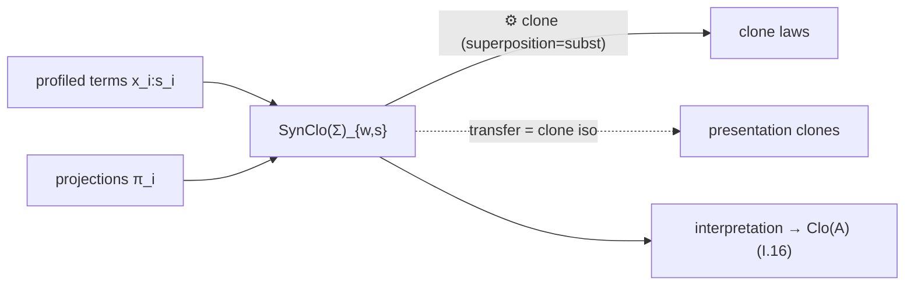

> [!hands-up] Hands up
> The syntactic clone, superposition, and the clone laws. The next room compares three closely related syntax-side gadgets — terms, templates, contexts — before semantics begins.

---

## I.15 · Templates and context operations

*A short reconciliation room. Terms with argument variables, templates with parameters, and contexts with holes are three faces of the same syntax-valued machinery; the room fixes how each acts on syntax and how contexts close relations.*

> [!definition] Definition I.15.1: Term with argument variables
> The **term with argument variables** $t(x_1,\ldots,x_n)$ is a term viewed as awaiting argument terms.
>
> $$
> t\in\mathbf T_\Sigma(x_1,\ldots,x_n)_s.
> $$
>
> **Notation.** $t(x_1,\ldots,x_n)$  
> **Assumes.** distinguished argument variables.  
> **Provides.** a term operation by superposition.  
> **Governance.** the clone element of I.14.

> [!definition] Definition I.15.2: Template with parameters
> The **template with parameters** $P[p_1,\ldots,p_k]$ is a term with marked parameter slots filled by substitution.
>
> $$
> P\in\mathbf T_\Sigma(X\sqcup\{p_1,\ldots,p_k\}),\quad\text{parameters held fixed across a family.}
> $$
>
> **Notation.** $P[p_1,\ldots,p_k]$  
> **Assumes.** parameter generators.  
> **Provides.** parametric families of terms.  
> **Governance.** parameters held fixed yield polynomial operations.

> [!definition] Definition I.15.3: Context with holes
> The **context with holes** $C[\square_1,\ldots,\square_n]$ is a template whose marked slots are holes.
>
> $$
> C\in\mathbf T_\Sigma(X\sqcup H).
> $$
>
> **Notation.** $C[\square_1,\ldots,\square_n]$  
> **Assumes.** hole generators.  
> **Provides.** plugging (I.11).  
> **Governance.** holes vs argument variables differ only in role, not in mechanism.

> [!definition] Definition I.15.4: Context closure of a relation
> The **context closure of a relation** $\theta^{\mathrm{ctx}}$ is close a relation under all one-hole contexts.
>
> $$
> a\,R\,b\ \Longrightarrow\ C[a]\,\theta^{\mathrm{ctx}}\,C[b]\quad(\forall\text{ one-hole }C).
> $$
>
> **Notation.** $\theta^{\mathrm{ctx}}$  
> **Assumes.** a relation $R$, the context monoid.  
> **Provides.** the *compatible* closure of $R$ (the smallest compatible relation containing $R$).  
> **Governance.** **the congruence generated by $R$ is obtained by additionally taking the equivalence closure**: $\operatorname{Cg}(R) = \mathrm{EqCl}(\theta^{\mathrm{ctx}}(R))$, equivalently the reflexive, symmetric, transitive closure of the context closure. Context closure alone is not yet a congruence; the calculus of contexts and the calculus of congruences agree only modulo equivalence closure.

> [!result] Hole-variable vs argument-variable
> Argument variables, parameters, and holes are all distinguished generators; what differs is the *role* — arguments are superposed (I.14), parameters are held fixed (polynomial operations), holes are plugged (I.11). One substitution mechanism underlies all three. Context closure of a relation gives its compatible closure; closing additionally under equivalence reproduces $Cg(R)$ exactly.

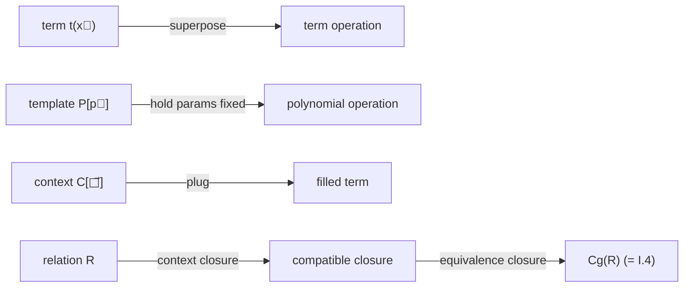

> [!hands-up] Hands up
> The three syntax-side roles unified, and context closure identified with congruence generation. The next room finally points syntax at a semantic target.

---

## I.16 · Evaluation into target algebras

*The third reuse of the UMP — this time with a semantic target. An assignment of variables into an algebra extends uniquely to evaluation; its image is the generated subalgebra; build-then-evaluate equals evaluate-then-build. This is the algebraic prototype of term denotation in a structure.*

> [!definition] Definition I.16.1: Target algebra
> The **target algebra** $\mathbf B$ is the semantic codomain.
>
> $$
> \mathbf B=\big(B,(f^{\mathbf B})\big).
> $$
>
> **Notation.** $\mathbf B$  
> **Assumes.** $Σ$.  
> **Provides.** the target evaluation maps into.  
> **Governance.** a first-order structure's algebraic reduct is this kind of object (II.8).

> [!definition] Definition I.16.2: Generator assignment into a target
> The **generator assignment into a target** $g:X\to B$ is a valuation of variables.
>
> $$
> g=(g_s:X_s\to B_s)_{s\in S}.
> $$
>
> **Notation.** $g:X\to B$  
> **Assumes.** $X$, $B$.  
> **Provides.** the data evaluation extends.  
> **Governance.** in logic this is a variable assignment into a structure.

> [!definition] Definition I.16.3: Term evaluation
> The **term evaluation** $\operatorname{ev}_g$ is the unique homomorphic extension of `g`.
>
> $$
> \operatorname{ev}_g=\widehat g:\mathbf T_\Sigma(X)\to\mathbf B,\qquad \widehat g\circ\eta=g.
> $$
>
> **Notation.** $\operatorname{ev}_g$  
> **Assumes.** $g$, the UMP.  
> **Provides.** the value of every term under the valuation.  
> **Governance.** sorted evaluation sends a term of sort $s$ to an element of $B_s$.

> [!definition] Definition I.16.4: Generated semantic subalgebra
> The **generated semantic subalgebra** $\langle g[X]\rangle_{\mathbf B}$ is the image of evaluation.
>
> $$
> \operatorname{im}(\operatorname{ev}_g)=\langle g[X]\rangle_{\mathbf B}.
> $$
>
> **Notation.** $\langle g[X]\rangle_{\mathbf B}$  
> **Assumes.** $ev_g$.  
> **Provides.** the reachable part of $B$.  
> **Governance.** image = generated subalgebra (I.3); the bridge to the kernel quotient (I.17).

> [!engine] Engine I.16.1: Evaluation = homomorphic extension
> **Engine ID.** `evaluate`
>
> Evaluating terms under a valuation is the UMP extension into a semantic algebra; its image is precisely what the values generate.
>
> $$
> \operatorname{ev}_g=\widehat g,\qquad \operatorname{im}(\operatorname{ev}_g)=\langle g[X]\rangle_{\mathbf B}.
> $$
>
> **drives** valuation $g$ ⟶ value of every term.
> **powered by** the UMP with a semantic target.
> **enables** the evaluation kernel and the first-iso comparison (I.17); in logic, term denotation (II.9).

> [!result] Build–evaluate
> Evaluation is a homomorphism, so it commutes with the operations: $\operatorname{ev}_g(f(\vec t))=f^{\mathbf B}(\operatorname{ev}_g(\vec t))$. Build-then-evaluate (form the term, then evaluate) equals evaluate-then-build (evaluate arguments, then apply the operation). This is the recursion clause of denotation.

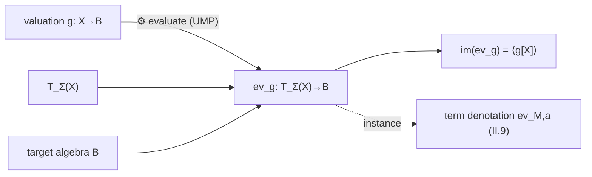

> [!hands-up] Hands up
> Evaluation, its image as a generated subalgebra, and the build–evaluate clause. The next room measures what evaluation collapses.

---

## I.17 · Semantic collapse and quotient comparison

*Evaluation forgets distinctions: different terms can have the same value. The evaluation kernel records exactly which, and the first isomorphism theorem identifies the image with syntax modulo that kernel. The room also separates one-valuation collapse from all-valuation identities.*

> [!definition] Definition I.17.1: Evaluation kernel
> The **evaluation kernel** $\kappa_g$ is terms identified by one valuation.
>
> $$
> \kappa_g:=\ker(\operatorname{ev}_g),\qquad (t,u)\in\kappa_g\iff \operatorname{ev}_g(t)=\operatorname{ev}_g(u).
> $$
>
> **Notation.** $\kappa_g$  
> **Assumes.** $ev_g$.  
> **Provides.** the measure of semantic collapse under that valuation.  
> **Governance.** a congruence on $T_Σ(X)$.

> [!definition] Definition I.17.2: Semantic equality under one assignment
> The **semantic equality under one assignment** $=_g$ is the relation `κ_g` decides.
>
> $$
> t=_g u\iff \operatorname{ev}_g(t)=\operatorname{ev}_g(u).
> $$
>
> **Notation.** $=_g$  
> **Assumes.** a fixed valuation $g$.  
> **Provides.** value-level identification.  
> **Governance.** distinct from syntactic equality; a single-valuation notion.

> [!definition] Definition I.17.3: Operation-level collapse / identities
> The **operation-level collapse / identities** $\operatorname{Id}(\mathbf B)$ is terms equal under *all* valuations.
>
> $$
> (t,u)\in\operatorname{Id}(\mathbf B)\iff \operatorname{ev}_g(t)=\operatorname{ev}_g(u)\ \text{for all }g.
> $$
>
> **Notation.** $\operatorname{Id}(\mathbf B)$  
> **Assumes.** the clone interpretation (I.14).  
> **Provides.** the equational theory of $B$.  
> **Governance.** the kernel of the clone homomorphism $SynClo(Σ)→Clo(B)$; an all-assignments notion, not a one-assignment one.

> [!engine] Engine I.17.1: Kernel factorization for evaluation
> **Engine ID.** `collapse`
>
> The generated semantic image is syntax modulo exactly the identifications the valuation forces.
>
> $$
> \mathbf T_\Sigma(X)/\kappa_g\ \cong\ \langle g[X]\rangle_{\mathbf B}.
> $$
>
> **drives** valuation ⟶ syntax-modulo-semantic-collapse.
> **powered by** kernels are congruences plus the first isomorphism theorem.
> **enables** term models, presented algebras, and every later quotient-of-syntax construction (Lindenbaum–Tarski, II.16; canonical models, II.15).

> [!warning] One kernel vs the other
> $\kappa_g$ identifies terms equal under *one* fixed valuation $g$. $\operatorname{Id}(\mathbf B)$ identifies terms equal under *all* valuations. The first is element-level collapse; the second is the equational theory. A typed equation $t=u$ between sort-$s$ terms is the all-valuations statement within sort $s$.

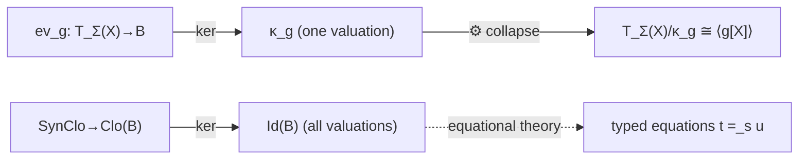

> [!hands-up] Hands up
> The evaluation kernel, the collapse engine, and the one-valuation/all-valuations distinction. The next room makes the quotient side systematic: which constructions descend.

---

## I.18 · Quotient syntax and descent

*A quotient forgets distinctions; descent is the proof that an operation or map never needed the forgotten information. This room collects the descent obligations for every syntax operation and identifies the unconditional cases — exactly the ones the logic half will rely on.*

> [!definition] Definition I.18.1: Quotient syntax
> The **quotient syntax** $\mathbf T_\Sigma(X)/\theta$ is syntax modulo a congruence.
>
> $$
> \theta\in\operatorname{Con}(\mathbf T_\Sigma(X)),\qquad \mathbf T_\Sigma(X)/\theta.
> $$
>
> **Notation.** $\mathbf T_\Sigma(X)/\theta$  
> **Assumes.** a syntactic congruence.  
> **Provides.** equivalence-class syntax.  
> **Governance.** term models and Lindenbaum–Tarski are instances.

> [!definition] Definition I.18.2: Quotient projection on syntax
> The **quotient projection on syntax** $\operatorname{nat}_\theta$ is the class map.
>
> $$
> \operatorname{nat}_\theta:\mathbf T_\Sigma(X)\to\mathbf T_\Sigma(X)/\theta.
> $$
>
> **Notation.** $\operatorname{nat}_\theta$  
> **Assumes.** $θ$.  
> **Provides.** the surjection descent factors through.  
> **Governance.** the natural transformation every descended map commutes with.

> [!definition] Definition I.18.3: Descended operation
> The **descended operation** $\widetilde F$ is an operation lifted to classes.
>
> $$
> \widetilde F([t_1],\ldots,[t_n]):=[F(t_1,\ldots,t_n)]\quad\text{(when well-defined).}
> $$
>
> **Notation.** $\widetilde F$  
> **Assumes.** an operation $F$ and a congruence $θ$.  
> **Provides.** quotient-level structure.  
> **Governance.** well-defined iff $F$ respects $θ$.

> [!engine] Engine I.18.1: Compatibility = well-definedness
> **Engine ID.** `descend`
>
> A representative-defined operation, map, substitution, or context operation descends to a quotient exactly when it respects the congruence.
>
> $$
> \operatorname{nat}_\theta\circ F=\widetilde F\circ(\operatorname{nat}_\theta)^{\times n}\ \Longleftrightarrow\ \big[t_i\,\theta\,u_i\,\forall i\Rightarrow F(\vec t)\,\theta\,F(\vec u)\big].
> $$
>
> **drives** raw construction ⟶ quotient-level construction.
> **powered by** representative-independence.
> **enables** quotient algebras (I.4), alpha-quotient operations (II.6), term models (II.15), Lindenbaum–Tarski (II.16).

> [!result] What descends, and what owes a proof
> - **Unconditional**: every basic term operation $f^{\mathbf T}$ and every polynomial / one-hole context operation $C[\,\cdot\,]$ preserves every congruence — so plugging a fixed context descends automatically.
> - **Conditional (substitution)**: an arbitrary substitution $\widehat\sigma$ is *not* automatic on a given congruence $θ$. The implication $s\,\theta\,t\Rightarrow \widehat\sigma(s)\,\theta\,\widehat\sigma(t)$ requires $θ$ to be **substitution-stable**, i.e. *fully invariant* — closed under all substitutions. When that holds, substitution descends to the quotient and the quotient carries substitution — the seed of equational logic and schema instantiation.
> - **Conditional (general)**: arbitrary syntax-inspecting operations (those reading positions or representatives) owe a compatibility proof.

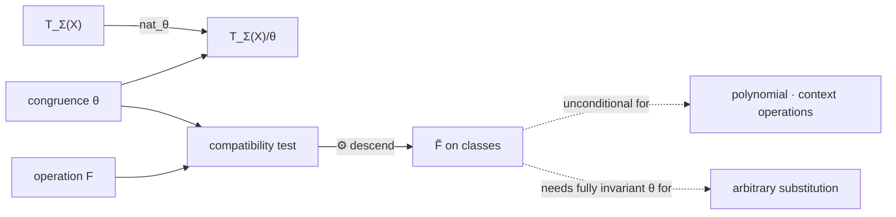

> [!hands-up] Hands up
> Quotient syntax, the descent engine, and the unconditional/conditional split. The next room consolidates the entire left side into layers and ledgers.

---

## I.19 · Algebraic-syntax synthesis

*The left-side hands-up room. It names the five layers the movement built, records the map-type and equality ledgers local to algebraic syntax, and draws the single diagram the logic half will instantiate.*

**Free syntax layer** · $T_Σ(X)$, $η$, the UMP — construct and interpret. The invariant object; everything else is defined on it.

**Concrete presentation layer** · faithful presentations, `transfer`, the invariance criterion — choose a carrier, transport invariant constructions, quarantine addresses.

**Internal syntax-operation layer** · substitution $σ̂$, contexts $Ctx_H(X)$, plugging, the syntax clone — the UMP reused with syntactic targets; superposition = substitution; context closure = congruence generation.

**Semantic evaluation layer** · evaluation $ev_g$, image $⟨g[X]⟩$, build–evaluate — the UMP reused with semantic targets.

**Kernel / image / quotient / descent layer** · $κ_g$, first-iso $T_Σ(X)/κ_g ≅ ⟨g[X]⟩$, quotient syntax, the descent engine — collapse and quotient, with basic term operations and polynomial/context operations descending unconditionally; arbitrary substitutions descend only on a fully invariant (substitution-stable) congruence.

> [!result] Left-side map-type ledger
> generator insertion $η$ · comparison/transfer $ρ, τ$ · substitution $σ̂$ · context operation / plugging · evaluation $ev_g$ · homomorphism $h$ · quotient projection $nat_θ$ · descended map `F̃`.

> [!result] Left-side equality ledger
> raw syntax equality (unique readability) · presentation equality / transferred equality ($τ$-conjugate) · semantic equality under one valuation ($=_g$, kernel $κ_g$) · operation equality / identities ($Id(B)$, all valuations) · quotient equality ($θ$-classes).

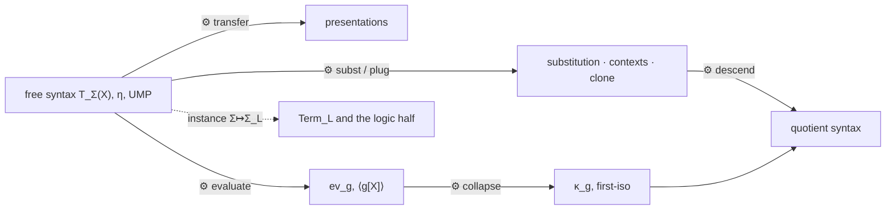

**Hands up — left side complete.** The free algebra, the UMP, presentation transfer, substitution and contexts, evaluation, kernels, and descent. Every one of these is now invoked in Part II *only at the exact point where logic runs on it* — and nowhere else.

---

# PART II · First-Order Logic

*Now the atlas develops first-order logic as logic. The language is logical vocabulary; terms denote objects; atoms and formulas make assertions; binding, semantics, deduction, theories, and models are built from their own primitives. Universal algebra is invoked only where an already-built engine genuinely powers a logical construction — term formation, term denotation, term substitution, term models, formula quotients — and nowhere else. Every room here reads correctly even if Part I were deleted; the UA notes are exact transfers, not metaphors.*

---

## II.0 · Logic-side standing convention

*A short convention room. It fixes the discipline for the whole movement: logic motivates each object in its own terms, the term layer is separated from the formula layer, binding is treated as a new layer, and a universal-algebra transfer note appears only at an exact construction point.*

**logic-first** · Develop each object logically first. State the logical role, then the formal datum; insert a UA transfer note only where an exact engine applies.

**term ≠ formula layer** · The functional signature builds terms (a free algebra). Relations, equality, connectives, and quantifiers build formulas (an inductive closure). These are different layers.

**binding is new** · Quantifiers introduce variable binding, which is not present in term algebra. Free/bound occurrence, alpha-equivalence, and capture-avoidance are genuinely new data.

**single-sorted display, sorted where needed** · Display single-sorted formation when clearer; give the profiled/sorted wrapper where sort discipline matters. Many-sortedness is a profile wrapper, not a late appendix.

> [!warning] UA-insertion limit
> A logic room takes 0 or 1 universal-algebra transfer notes as normal; 2 only for terms, term substitution, and term models. More than that is overfitting logic to an algebraic shape. The whole functional content of a language lives in its functional reduct; relations, binding, and truth are not algebra.

**Hands up.** The standing discipline. The next room lays out the language datum.

---

## II.1 · First-order language data

*The nonlogical vocabulary, plus the variable supply and logical symbols. The single algebraically relevant move is the extraction of the functional reduct — the one place Part I attaches.*

> [!definition] Definition II.1.1: First-order language
> The **first-order language** $L$ is the nonlogical vocabulary.
>
> $$
> L=(S,\operatorname{Func}_{L},\operatorname{Rel}_{L}),\qquad \operatorname{Func}_L=(\operatorname{Func}_{L,w,s}),\qquad \operatorname{Rel}_L=(\operatorname{Rel}_{L,w}),
> $$
>
> all symbol sets pairwise disjoint; write $f:w\to s$ and $R:w$.
>
> **Notation.** $L$  
> **Assumes.** a sort set $S$.  
> **Provides.** terms, atoms, formulas, structures.  
> **Governance.** constants are the $()\to s$ function symbols; there is **no formula sort**.

> [!definition] Definition II.1.2: Variable supply
> The **variable supply** $\operatorname{Var}$ is sorted, pairwise-disjoint, infinite families.
>
> $$
> \operatorname{Var}=(\operatorname{Var}_s)_{s\in S},\qquad \text{each }\operatorname{Var}_s\ \text{infinite.}
> $$
>
> **Notation.** $\operatorname{Var}$  
> **Assumes.** $S$.  
> **Provides.** the generators of terms.  
> **Governance.** infinitude powers freshness and renaming (II.5–II.6); disjointness recovers a variable's sort.

> [!definition] Definition II.1.3: Function and constant symbols
> The **function and constant symbols** $\operatorname{Func}_L$, $c$ is *not yet* term constructors, but the symbols that *induce* them.
>
> $$
> f\in\operatorname{Func}_{L,w,s}\ (f:w\to s),\qquad c\in\operatorname{Func}_{L,(),s}.
> $$
>
> **Notation.** $\operatorname{Func}_L$, $c$  
> **Assumes.** $L$.  
> **Provides.** the data from which term-formation operations are built.  
> **Governance.** each symbol $f$ induces a constructor operation $f^{\mathbf T}$ on $Term_L$ (preserving the Part I distinction between $f$ and $f^{\mathbf T}$, I.5–I.7); constants are nullary function symbols — no separate primitive.

> [!definition] Definition II.1.4: Relation symbols and equality
> The **relation symbols and equality** $\operatorname{Rel}_L$, $=$ is *not yet* atom builders, but the symbols that induce them.
>
> $$
> R\in\operatorname{Rel}_{L,w},\qquad =_s\ \text{a logical relation per sort.}
> $$
>
> **Notation.** $\operatorname{Rel}_L$, $=$  
> **Assumes.** $L$, $S$.  
> **Provides.** the data from which atom-formation operations are built.  
> **Governance.** each $R$ induces an atom-formation operation taking a term tuple to an atom (II.3); relation symbols consume term tuples but build **no terms**; equality is logical, not a nonlogical symbol.

> [!definition] Definition II.1.5: Logical symbols
> The **logical symbols** $\neg,\to,\forall$ is *not yet* formula constructors, but the symbols that induce them.
>
> $$
> \neg,\ \to,\ (\forall x)_{x\in\operatorname{Var}}.
> $$
>
> **Notation.** $\neg,\to,\forall$  
> **Assumes.** nothing from $L$.  
> **Provides.** the data from which the formula-constructor signature is built (II.4).  
> **Governance.** each logical symbol induces a formation operation on $\operatorname{Form}^{\mathrm{raw}}_L$; not members of $Func$ or $Rel$; $\wedge,\vee,\leftrightarrow,\exists$ are defined abbreviations.

> [!definition] Definition II.1.6: Functional reduct
> The **functional reduct** $\Sigma_L$ is the algebraic signature inside `L`.
>
> $$
> \Sigma_L:=\big(S,(\operatorname{Func}_{L,w,s})_{(w,s)}\big).
> $$
>
> **Notation.** $\Sigma_L$  
> **Assumes.** the function-symbol part of $L$.  
> **Provides.** the signature term formation runs on.  
> **Governance.** **this is $Σ$ from Part I, instantiated**; relations and logical symbols are deliberately absent.

> [!result] Language decomposition
> $L$ splits cleanly as $(Σ_L, Rel_L)$ with no shared primitive. The functional reduct carries all algebraic content; the relational part feeds only the atomic layer. This split is the entire interface between Part I and Part II.

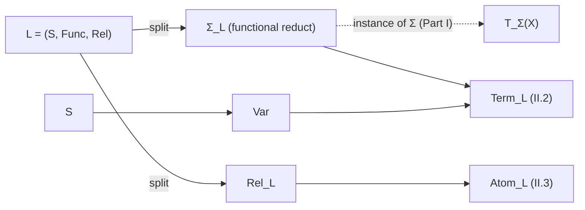

> [!hands-up] Hands up
> The language datum, the variable supply, the logical symbols, and the functional reduct $Σ_L$. The next room builds terms — the one logic-side object that *is* universal algebra.

---

## II.2 · Terms

*Terms are the object-denoting expressions of the language. Logically, they are generated from variables and constants by function application. This is the exact point where the free-algebra engine attaches: the term family is the free $Σ_L$-algebra on the variables.*

> [!definition] Definition II.2.1: Term family
> The **term family** $\operatorname{Term}_L$ is object-denoting expressions.
>
> $$
> x\in\operatorname{Var}_s\Rightarrow x\in\operatorname{Term}_{L,s},\qquad c:()\to s\Rightarrow c\in\operatorname{Term}_{L,s},
> $$
>
> $$
> f:w\to s,\ t_i\in\operatorname{Term}_{L,s_i}\Rightarrow f(t_1,\ldots,t_n)\in\operatorname{Term}_{L,s}.
> $$
>
> **Notation.** $\operatorname{Term}_L$  
> **Assumes.** $L$, $Var$.  
> **Provides.** term induction, recursion, substitution, denotation.  
> **Governance.** terms feed atomic formulas (II.3).

> [!definition] Definition II.2.2: Term constructors
> The **term constructors** $x$, $c$, $f(\vec t)$ is the three formation cases.
>
> $$
> \text{variable } x,\qquad \text{constant } c,\qquad \text{application } f(\vec t).
> $$
>
> **Notation.** $x$, $c$, $f(\vec t)$  
> **Assumes.** term formation.  
> **Provides.** the case analysis for every recursion on terms.  
> **Governance.** unique readability separates the three and recovers the outer symbol.

> [!definition] Definition II.2.3: Variables occurring in a term
> The **variables occurring in a term** $\operatorname{Var}(t)$ is the finite sorted support.
>
> $$
> \operatorname{Var}(x)=\{x\},\quad \operatorname{Var}(c)=\varnothing,\quad \operatorname{Var}(f(\vec t))=\textstyle\bigcup_i\operatorname{Var}(t_i).
> $$
>
> **Notation.** $\operatorname{Var}(t)$  
> **Assumes.** term recursion.  
> **Provides.** support, freshness, locality of denotation.  
> **Governance.** assignment dependence (II.9).

> [!definition] Definition II.2.4: Term substitution
> The **term substitution** $t[\sigma]$ is replacement of variables by terms.
>
> $$
> \sigma:\operatorname{Var}\to\operatorname{Term}_L,\qquad t[\sigma]=\widehat\sigma(t).
> $$
>
> **Notation.** $t[\sigma]$  
> **Assumes.** a term assignment $σ$.  
> **Provides.** substituted terms.  
> **Governance.** the homomorphic-extension engine (I.10), here with $X=Y=Var$.

> [!engine] Engine II.2.1: Terms as the free algebra
> **Engine ID.** `term-construct`
>
> The logical formation of terms *is* the free-algebra construction on the variables for the functional reduct.
>
> $$
> \mathbf{Term}_L\ \cong\ \mathbf T_{\Sigma_L}(\operatorname{Var}).
> $$
>
> **drives** logical vocabulary ⟶ object-denoting syntax.
> **powered by** the construct engine (I.5–I.6) at $Σ = Σ_L$, $X = Var$. No new mechanism — the term layer is universal algebra.
> **enables** term induction, recursion, substitution, and denotation, all inherited verbatim from Part I.
> **boundary** relation symbols are not term constructors; they enter only at the atomic layer.

> [!result] Inherited term facts
> Term induction and recursion are the generatedness and UMP faces of the free object. Unique readability holds. Finite support holds. Term substitution is the homomorphic extension; its identity, composition, and substitution-lemma laws are exactly those of I.10. These are *imported*, not re-proved.

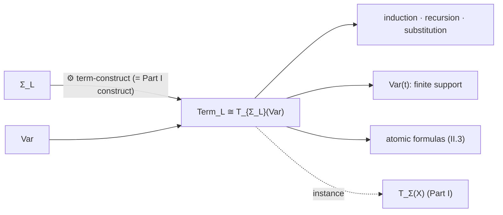

> [!hands-up] Hands up
> $Term_L$ as the exact free-algebra instance, with term induction, recursion, substitution, and support imported from Part I. The next room changes layers: terms become inputs to relations and equality, producing atomic formulas.

---

## II.3 · Atomic formulas

*The first formula-producing layer. Terms denote; atoms assert. Equality compares two same-sort terms; a relation symbol predicates of a sort-matched term tuple. This is the term→formula boundary — a layer change, not an extension of $Σ_L$.*

> [!definition] Definition II.3.1: Equality atom
> The **equality atom** $t=_s u$ is a same-sort term pair as an assertion.
>
> $$
> t,u\in\operatorname{Term}_{L,s}\ \Longrightarrow\ (t=_s u)\in\operatorname{Atom}_L.
> $$
>
> **Notation.** $t=_s u$  
> **Assumes.** two terms of a common sort.  
> **Provides.** the equality atoms.  
> **Governance.** equality is logical and sort-indexed; mixed-sort equality is not formed.

> [!definition] Definition II.3.2: Relation atom
> The **relation atom** $R(\vec t)$ is a relation symbol on a profile-matching tuple.
>
> $$
> R\in\operatorname{Rel}_{L,w},\ \vec t\in\operatorname{Term}_{L,w}\ \Longrightarrow\ R(\vec t)\in\operatorname{Atom}_L.
> $$
>
> **Notation.** $R(\vec t)$  
> **Assumes.** a relation symbol, a sort-correct term tuple.  
> **Provides.** the relation atoms.  
> **Governance.** relations consume terms but never become term operations.

> [!definition] Definition II.3.3: Atomic formula set
> The **atomic formula set** $\operatorname{Atom}_L$ is equality atoms and relation atoms together.
>
> $$
> \operatorname{Atom}_L=\{t=_s u\}\ \sqcup\ \{R(\vec t)\}.
> $$
>
> **Notation.** $\operatorname{Atom}_L$  
> **Assumes.** $Term_L$, equality, $Rel_L$.  
> **Provides.** the base cases of formula formation.  
> **Governance.** the seam between term denotation and truth.

> [!warning] The term→formula layer change
> An atom is *not* a term and *not* an element of any sort. Passing from $Term_L$ to $Atom_L$ leaves the free $Σ_L$-algebra entirely: relations and equality are not operations of the term signature. "Syntax is a free algebra" stops being literally true here and is recovered for formulas only by the separate constructor layer of II.4.

```mermaid
flowchart LR
    TERM["Term_L"] --> EQ["equality atoms t =_s u"]
    TERM --> RT["relation atoms R(t⃗)"]
    REL["Rel_L"] --> RT
    EQ --> ATOM["Atom_L"]
    RT --> ATOM
    ATOM --> RAW["raw formulas (II.4)"]
```

> [!hands-up] Hands up
> The atomic layer — equality and relation atoms over terms. The next room closes atoms under connectives and quantifiers into raw formulas.

---

## II.4 · Raw formulas

*Formulas are generated from atoms by negation, implication, and quantification. This is an inductive closure with its own constructor signature — a free algebra for that signature, but emphatically not the term algebra. Formula recursion runs on these constructors, not on the UMP of $Term_L$.*

> [!definition] Definition II.4.1: Raw formula set
> The **raw formula set** $\operatorname{Form}^{\mathrm{raw}}_L$ is the least closure of atoms under the constructors.
>
> $$
> \operatorname{Atom}_L\subseteq\operatorname{Form}^{\mathrm{raw}}_L,\quad \varphi,\psi\in\operatorname{Form}^{\mathrm{raw}}_L\Rightarrow \neg\varphi,\ (\varphi\to\psi),\ \forall x\,\varphi\in\operatorname{Form}^{\mathrm{raw}}_L.
> $$
>
> **Notation.** $\operatorname{Form}^{\mathrm{raw}}_L$  
> **Assumes.** $Atom_L$, the constructors $¬$, $→$, $∀x$.  
> **Provides.** formula induction and recursion.  
> **Governance.** generated independently of semantics.

> [!definition] Definition II.4.2: Logical constructors
> The **logical constructors** $\neg,\to,\forall_x$ is the formula builders.
>
> $$
> \neg:\mathrm{Form}\to\mathrm{Form},\quad \to:\mathrm{Form}^2\to\mathrm{Form},\quad \forall_x:\mathrm{Form}\to\mathrm{Form}\ (x\in\operatorname{Var}).
> $$
>
> **Notation.** $\neg,\to,\forall_x$  
> **Assumes.** the formula set.  
> **Provides.** the constructor signature of formulas.  
> **Governance.** a *separate* signature from $Σ_L$; quantifier constructors are indexed by a variable.

> [!definition] Definition II.4.3: Constructor view
> The **constructor view** formula tree is a formula as a tree over its own constructors.
>
> $$
> \text{nodes: atoms (leaves), }\neg,\to,\forall_x\ \text{(internal).}
> $$
>
> **Notation.** formula tree  
> **Assumes.** raw formula formation.  
> **Provides.** unique readability for formulas.  
> **Governance.** the basis of formula recursion.

> [!engine] Engine II.4.1: Formula formation (least closure)
> **Engine ID.** `form-close`
>
> Raw formulas are the least set containing the atoms and closed under the logical constructors; recursion on formulas is defined by one clause per constructor.
>
> $$
> \operatorname{Form}^{\mathrm{raw}}_L=\mu Z.\ \big(\operatorname{Atom}_L\cup \neg Z\cup (Z\to Z)\cup\textstyle\bigcup_x\forall_x Z\big).
> $$
>
> **drives** atoms ⟶ all formulas.
> **powered by** least closure under the constructor signature, with its own unique readability.
> **enables** free-variable analysis (II.5), substitution clauses (II.7), and truth clauses (II.10).
> **boundary** this is **not** the UMP of $Term_L$; it is recursion for a separate constructor algebra.

> [!result] Formula layer facts
> Formula induction follows from least closure; formula recursion follows from constructor unique readability; finite support holds. Defined connectives $\wedge,\vee,\leftrightarrow,\exists$ add notation, not primitive formation power, unless explicitly promoted to constructors. Raw formulas may be viewed as a free algebra for the *formula* constructor signature — an additional construction, not part of $T_{Σ_L}(Var)$.

```mermaid
flowchart LR
    ATOM["Atom_L"] -->|"⚙ form-close"| RAW["Form^raw_L"]
    NEG["¬"] --> RAW
    IMP["→"] --> RAW
    ALL["∀x"] --> RAW
    RAW --> REC["formula induction · recursion"]
    RAW -. "free for formula signature, ≠ Term_L" .-> SEP["separate constructor algebra"]
    RAW --> BIND["binding analysis (II.5)"]
```

> [!hands-up] Hands up
> Raw formulas, their constructor signature, and formula recursion — kept distinct from the term algebra. The next room analyses the variable occurrences the quantifiers create.

---

## II.5 · Variables, occurrence, and binding

*Quantifiers introduce binding — genuinely new data absent from terms. The room distinguishes free from bound occurrences, computes free-variable sets by formula recursion, defines sentences, and sets up freshness, the resource that makes renaming possible.*

> [!definition] Definition II.5.1: Variable occurrence
> The **variable occurrence** occurrence is a position of a variable in a formula tree.
>
> $$
> \text{an occurrence of }x\ \text{at a leaf of the formula tree.}
> $$
>
> **Notation.** occurrence  
> **Assumes.** the formula tree (II.4).  
> **Provides.** the substrate for free/bound classification.  
> **Governance.** occurrences are tree-relative; the classification is invariant.

> [!definition] Definition II.5.2: Free vs bound occurrence
> The **free vs bound occurrence** free / bound is relative to enclosing quantifiers.
>
> $$
> x\ \text{bound at an occurrence}\iff\text{it lies under some }\forall x;\quad\text{else free.}
> $$
>
> **Notation.** free / bound  
> **Assumes.** binding scope.  
> **Provides.** the free/bound split.  
> **Governance.** the same variable can occur both free and bound in one formula.

> [!definition] Definition II.5.3: Free-variable set
> The **free-variable set** $\operatorname{FV}(\varphi)$ is variables with a free occurrence.
>
> $$
> \operatorname{FV}(R(\vec t))=\textstyle\bigcup\operatorname{Var}(t_i),\quad \operatorname{FV}(\neg\varphi)=\operatorname{FV}(\varphi),\quad \operatorname{FV}(\varphi\to\psi)=\operatorname{FV}(\varphi)\cup\operatorname{FV}(\psi),
> $$
>
> $$
> \operatorname{FV}(\forall x\,\varphi)=\operatorname{FV}(\varphi)\setminus\{x\}.
> $$
>
> **Notation.** $\operatorname{FV}(\varphi)$  
> **Assumes.** formula recursion.  
> **Provides.** the variables whose values can affect the formula.  
> **Governance.** feeds substitution guards (II.7) and semantic locality (II.10).

> [!definition] Definition II.5.4: Sentences
> The **sentences** $\operatorname{Sent}_L$ is closed formulas.
>
> $$
> \sigma\in\operatorname{Sent}_L\iff \operatorname{FV}(\sigma)=\varnothing.
> $$
>
> **Notation.** $\operatorname{Sent}_L$  
> **Assumes.** `FV`.  
> **Provides.** formulas whose truth needs no assignment.  
> **Governance.** theories are sets of sentences (II.14).

> [!definition] Definition II.5.5: Fresh variable
> The **fresh variable** $\operatorname{fresh}$ is a same-sort variable outside a finite support.
>
> $$
> y\in\operatorname{Var}_s\setminus F\quad(F\ \text{finite}).
> $$
>
> **Notation.** $\operatorname{fresh}$  
> **Assumes.** infinite $Var_s$, a finite support.  
> **Provides.** a name safe for renaming.  
> **Governance.** the resource behind alpha-equivalence and capture-avoidance.

> [!result] Binding facts
> Free-variable sets are finite and computed by formula recursion; quantification removes exactly the bound variable from one sort component. Because each $Var_s$ is infinite and every formula has finite support, a fresh same-sort variable always exists. Binding scope and renaming boundaries are determined by the quantifier nodes of the formula tree.

```mermaid
flowchart LR
    RAW["Form^raw_L"] --> OCC["occurrences"]
    OCC --> FB["free / bound (under ∀x)"]
    FB --> FV["FV(φ)"]
    FV --> SENT["Sent_L (FV = ∅)"]
    INF["infinite Var_s"] --> FRESH["fresh variable"]
    FV --> FRESH
    FRESH --> ALPHA["alpha-equivalence (II.6)"]
```

> [!hands-up] Hands up
> Free/bound occurrence, free-variable sets, sentences, and freshness. The next room forgets bound-variable names by quotienting under alpha-equivalence.

---

## II.6 · Alpha-equivalence

*Bound-variable names are inessential. Alpha-equivalence is the least constructor-compatible equivalence generated by capture-free renaming of bound variables; the quotient is binding-aware formulas. This is the descent engine of Part I applied to a logical congruence.*

> [!definition] Definition II.6.1: Fresh renaming step
> The **fresh renaming step** bound renaming is rename a bound variable to a fresh one.
>
> $$
> \forall x\,\varphi\ \rightsquigarrow\ \forall y\,(\varphi[x\!\mapsto\! y]),\qquad y\ \text{fresh, capture-free.}
> $$
>
> **Notation.** bound renaming  
> **Assumes.** `fresh` (II.5), capture-free substitution of a variable.  
> **Provides.** the generating steps of $≡_α$.  
> **Governance.** legitimate only when $y$ is fresh for $φ$.

> [!definition] Definition II.6.2: Alpha-equivalence
> The **alpha-equivalence** $\equiv_\alpha$ is equality up to consistent capture-free bound renaming.
>
> $$
> \equiv_\alpha\ :=\ \text{least constructor-compatible equivalence containing the renaming steps.}
> $$
>
> **Notation.** $\equiv_\alpha$  
> **Assumes.** renaming steps, closure under the formula constructors.  
> **Provides.** name-insensitive formula identity.  
> **Governance.** preserves free variables and (later) satisfaction.

> [!definition] Definition II.6.3: Binding-aware formulas
> The **binding-aware formulas** $\operatorname{Form}_L$ is raw formulas modulo `≡_α`.
>
> $$
> \operatorname{Form}_L:=\operatorname{Form}^{\mathrm{raw}}_L/\!\equiv_\alpha.
> $$
>
> **Notation.** $\operatorname{Form}_L$  
> **Assumes.** $Form^raw_L$, $≡_α$.  
> **Provides.** the formulas all later constructions descend to.  
> **Governance.** capture-avoiding substitution and satisfaction live here.

> [!definition] Definition II.6.4: alpha-compatible operation
> The **alpha-compatible operation** alpha-compatible operation is an operation descending to alpha-classes.
>
> $$
> \varphi\equiv_\alpha\varphi'\Rightarrow F(\varphi)\equiv_\alpha F(\varphi').
> $$
>
> **Notation.** alpha-compatible operation  
> **Assumes.** a raw-formula operation.  
> **Provides.** a quotient-level operation.  
> **Governance.** every operation used on $Form_L$ owes this descent proof.

> [!engine] Engine II.6.1: Alpha quotient (descent of binding)
> **Engine ID.** `alpha-quotient`
>
> Forgetting bound-variable names is the quotient by alpha-equivalence; an operation acts on $Form_L$ exactly when it is alpha-compatible.
>
> $$
> \operatorname{Form}^{\mathrm{raw}}_L\ \xrightarrow{\ /\equiv_\alpha\ }\ \operatorname{Form}_L,\qquad \text{operation descends}\iff\text{alpha-compatible.}
> $$
>
> **drives** raw formulas ⟶ binder-insensitive formulas.
> **powered by** the descent engine (I.18): compatibility is well-definedness, here for the congruence $≡_α$.
> **enables** total capture-avoiding substitution (II.7) and alpha-invariant satisfaction (II.10).

> [!result] Alpha facts
> Alpha-equivalence preserves free-variable sets. Every finite obstruction admits a fresh same-sort variable, so any two bound names can be reconciled. Connectives and quantifiers are alpha-compatible, so they descend; but each new operation on classes still owes its own compatibility proof.

```mermaid
flowchart LR
    RAW["Form^raw_L"] --> REN["capture-free bound renaming"]
    REN --> ALPHA["≡_α (constructor-compatible)"]
    RAW -->|"⚙ alpha-quotient (descent)"| FORM["Form_L"]
    ALPHA --> FORM
    FORM --> OPS["alpha-compatible operations only"]
    ALPHA -. "preserves" .-> FV["FV(φ)"]
```

> [!hands-up] Hands up
> Alpha-equivalence and binding-aware formulas, with the descent obligation made explicit. The next room defines substitution through binders without capture.

---

## II.7 · Term substitution inside formulas

*Substituting terms for free variables inside a formula is delicate: a quantifier can capture a variable the substitution introduces. The room records the capture obstruction, the raw admissibility guard, and the resolution — total capture-avoiding substitution on alpha-classes.*

> [!definition] Definition II.7.1: Term substitution datum
> The **term substitution datum** $\sigma$ is sort-preserving terms for variables.
>
> $$
> \sigma:\operatorname{Var}\to\operatorname{Term}_L.
> $$
>
> **Notation.** $\sigma$  
> **Assumes.** $Var$, $Term_L$.  
> **Provides.** the data formula substitution uses at atomic leaves.  
> **Governance.** extends homomorphically on terms (II.2); formulas apply that extension only at atoms.

> [!definition] Definition II.7.2: Atomic action
> The **atomic action** substitution at leaves is apply $σ̂$ inside atoms.
>
> $$
> (R(\vec t))[\sigma]=R(\widehat\sigma(\vec t)),\qquad (t=u)[\sigma]=(\widehat\sigma t=\widehat\sigma u).
> $$
>
> **Notation.** substitution at leaves  
> **Assumes.** term substitution (II.2).  
> **Provides.** substitution on atoms.  
> **Governance.** the only place terms are touched; connectives recurse.

> [!definition] Definition II.7.3: Capture obstruction
> The **capture obstruction** $\operatorname{Cap}_{x,\sigma}(\varphi)$ is a binder would capture a substituted variable.
>
> $$
> \operatorname{Cap}\iff \exists y\in\operatorname{FV}(\varphi),\ x\in\operatorname{FV}(\sigma(y))\ \text{under }\forall x.
> $$
>
> **Notation.** $\operatorname{Cap}_{x,\sigma}(\varphi)$  
> **Assumes.** `FV`, the supports of the $σ(y)$.  
> **Provides.** the danger condition.  
> **Governance.** negating it is part of the raw guard.

> [!definition] Definition II.7.4: Raw admissibility guard
> The **raw admissibility guard** $\operatorname{SubstOK}$ is the safe domain of raw substitution.
>
> $$
> \varphi[\sigma]\ \text{defined on raw formulas only where no capture occurs.}
> $$
>
> **Notation.** $\operatorname{SubstOK}$  
> **Assumes.** $Cap$, binder-erased substitutions.  
> **Provides.** a *partial* operation on raw formulas.  
> **Governance.** makes the failure of naive textual replacement explicit.

> [!engine] Engine II.7.1: Capture-avoiding substitution
> **Engine ID.** `avoid-capture`
>
> On alpha-classes, substitution is total: rename bound variables to fresh names before descending under a binder, then substitute.
>
> $$
> (\forall x\,\varphi)[\sigma]:=\forall x'\,\big(\varphi[x\!\mapsto\! x'][\sigma]\big),\qquad x'\ \text{fresh for }\varphi,\sigma.
> $$
>
> **drives** guarded raw substitution ⟶ total substitution on $Form_L$.
> **powered by** finite support + infinite same-sort supplies + alpha-renaming + descent.
> **enables** schema instantiation, the substitution lemma, and the quantifier rules of deduction (II.12) — without accidental rebinding.

> [!result] Substitution-lemma boundary
> Capture-avoiding substitution exists on alpha-classes and is independent of representatives and fresh-name choices. The *semantic* substitution lemma is proved later (II.10): truth of $φ[σ]$ under an assignment equals truth of $φ$ under the pulled-back assignment. Raw substitution remains legitimately partial when no renaming convention has been fixed.

```mermaid
flowchart LR
    SIG["σ: Var→Term_L"] --> LEAF["substitute at atomic leaves"]
    RAW["Form^raw_L"] --> GUARD["Cap + SubstOK (partial)"]
    SIG --> GUARD
    FRESH["fresh + ≡_α"] -->|"⚙ avoid-capture"| TOTAL["total subst on Form_L"]
    GUARD --> TOTAL
    TOTAL --> LEMMA["substitution lemma (II.10)"]
```

> [!hands-up] Hands up
> Capture-avoiding term substitution inside formulas, total on $Form_L$. The next room introduces the semantic side: structures and assignments.

---

## II.8 · Structures and assignments

*Semantics begins. A structure interprets the nonlogical vocabulary in carriers; an assignment interprets variables. The single algebraic observation is that the function-symbol part of a structure is a $Σ_L$-algebra — the target term denotation will use.*

> [!definition] Definition II.8.1: Structure
> The **structure** $\mathcal M$ is a sort-correct interpretation of `L`.
>
> $$
> \mathcal M=\big((M_s)_{s\in S},\,(f^{\mathcal M}),\,(R^{\mathcal M})\big),\quad f^{\mathcal M}:M_w\to M_s,\ R^{\mathcal M}\subseteq M_w,
> $$
>
> each $M_s$ nonempty.
>
> **Notation.** $\mathcal M$  
> **Assumes.** $L$.  
> **Provides.** the semantic universe.  
> **Governance.** functions belong to the algebraic reduct; relations are extra structure.

> [!definition] Definition II.8.2: Algebraic reduct
> The **algebraic reduct** $\mathcal M_{\mathrm{alg}}$ is forget the relations.
>
> $$
> \mathcal M_{\mathrm{alg}}=\big((M_s)_{s\in S},(f^{\mathcal M})_f\big).
> $$
>
> **Notation.** $\mathcal M_{\mathrm{alg}}$  
> **Assumes.** $\mathcal M$.  
> **Provides.** the target of term denotation.  
> **Governance.** **this is a $Σ_L$-algebra** — the one place evaluation attaches; it is not the whole structure.

> [!definition] Definition II.8.3: $f^{\mathcal M}$, $c^{\mathcal M}$, $R^{\mathcal M}$
> The **$f^{\mathcal m}$, $c^{\mathcal m}$, $r^{\mathcal m}$** $f^{\mathcal M}$, $c^{\mathcal M}$, $R^{\mathcal M}$ is symbol interpretations.
>
> $$
> f^{\mathcal M}:M_w\to M_s,\qquad c^{\mathcal M}\in M_s,\qquad R^{\mathcal M}\subseteq M_w.
> $$
>
> **Notation.** $f^{\mathcal M}$, $c^{\mathcal M}$, $R^{\mathcal M}$  
> **Assumes.** $\mathcal M$.  
> **Provides.** the data atoms are checked against.  
> **Governance.** equality is interpreted as genuine identity on $M_s$, not as a relation symbol.

> [!definition] Definition II.8.4: Assignment
> The **assignment** $a$ is a sorted interpretation of variables.
>
> $$
> a=(a_s:\operatorname{Var}_s\to M_s)_{s\in S}.
> $$
>
> **Notation.** $a$  
> **Assumes.** $Var$, the carriers of $\mathcal M$.  
> **Provides.** values for free variables.  
> **Governance.** an assignment *is* a generator assignment into $\mathcal M_{alg}$.

> [!definition] Definition II.8.5: Assignment update
> The **assignment update** $a[x\mapsto m]$ is vary at one variable within its sort.
>
> $$
> a[x\!\mapsto\! m](y)=\begin{cases}m & y=x\\ a(y)&\text{else,}\end{cases}\quad x\in\operatorname{Var}_s,\ m\in M_s.
> $$
>
> **Notation.** $a[x\mapsto m]$  
> **Assumes.** $a$, $x$, $m$.  
> **Provides.** the quantifier clause's variation.  
> **Governance.** supplies satisfaction of $∀$ (II.10).

> [!warning] Equality atom vs meta-equality
> $=_s$ in the object language is interpreted by *actual identity* on $M_s$; it is not a relation symbol and is not the meta-level "=" used to state the semantics. Keeping the two apart is essential when relations are quotiented (II.15).

```mermaid
flowchart LR
    L["L"] --> M["structure M"]
    M --> RED["M_alg (Σ_L-algebra)"]
    M --> REL["R^M ⊆ M_w"]
    VAR["Var"] --> A["assignment a"]
    M --> A
    A --> UPD["a[x↦m] (quantifier variation)"]
    RED -. "target of evaluation" .-> EV["term denotation (II.9)"]
```

> [!hands-up] Hands up
> Structures, their algebraic reducts, assignments, and updates. The next room evaluates terms in a structure — the evaluation engine of Part I, refired.

---

## II.9 · Term denotation

*A term denotes an element of the structure under an assignment. Logically this is "read off the value by recursion on the term"; algebraically it is the unique homomorphic extension of the assignment into the algebraic reduct — the evaluation engine at the logic target.*

> [!definition] Definition II.9.1: Term denotation
> The **term denotation** $\operatorname{ev}^{\mathcal M}_a$ is the value of a term under an assignment.
>
> $$
> \operatorname{ev}^{\mathcal M}_a:\mathbf{Term}_L\to\mathcal M_{\mathrm{alg}},\qquad \operatorname{ev}^{\mathcal M}_a=\widehat a.
> $$
>
> **Notation.** $\operatorname{ev}^{\mathcal M}_a$  
> **Assumes.** $Term_L$, $M_alg$, $a$.  
> **Provides.** a value in $M_s$ for each term of sort $s$.  
> **Governance.** the UMP extension of $a$.

> [!definition] Definition II.9.2: denotation clauses
> The **denotation clauses** denotation clauses is the three recursion cases.
>
> $$
> \operatorname{ev}_a(x)=a(x),\quad \operatorname{ev}_a(c)=c^{\mathcal M},\quad \operatorname{ev}_a(f(\vec t))=f^{\mathcal M}(\operatorname{ev}_a(\vec t)).
> $$
>
> **Notation.** denotation clauses  
> **Assumes.** term recursion.  
> **Provides.** the compositional value.  
> **Governance.** the build–evaluate clause (I.16).

> [!definition] Definition II.9.3: Assignment dependence
> The **assignment dependence** locality is denotation depends only on occurring variables.
>
> $$
> a\!\restriction_{\operatorname{Var}(t)}=a'\!\restriction_{\operatorname{Var}(t)}\ \Longrightarrow\ \operatorname{ev}_a(t)=\operatorname{ev}_{a'}(t).
> $$
>
> **Notation.** locality  
> **Assumes.** finite support (II.2).  
> **Provides.** the locality used by satisfaction.  
> **Governance.** only free data matters.

> [!engine] Engine II.9.1: Term denotation = homomorphic extension *(refired)*
> **Engine ID.** `evaluate`
>
> Term denotation is the evaluation engine of Part I with target the algebraic reduct of the structure.
>
> $$
> \operatorname{ev}^{\mathcal M}_a=\widehat a:\mathbf T_{\Sigma_L}(\operatorname{Var})\to\mathcal M_{\mathrm{alg}}.
> $$
>
> **drives** assignment $a$ ⟶ value of every term.
> **powered by** the UMP into $M_alg$ — Part I's `evaluate` (I.16) at $B = M_alg$.
> **enables** the atomic truth clauses (II.10) and the term-substitution compatibility lemma.

> [!result] Substitution compatibility
> For a term substitution $σ$ and the pulled-back assignment $a_\sigma(x)=\operatorname{ev}^{\mathcal M}_a(\sigma(x))$,
> $$
> \operatorname{ev}^{\mathcal M}_a(\widehat\sigma(t))=\operatorname{ev}^{\mathcal M}_{a_\sigma}(t).
> $$
> This is the four-corner identity $\operatorname{ev}_v\circ\widehat\sigma=\operatorname{ev}_{v\star\sigma}$ (I.10) read in the structure. It is the term half of the substitution lemma.

```mermaid
flowchart LR
    A["assignment a"] -->|"⚙ evaluate (UMP)"| EV["ev_M,a"]
    TERM["Term_L"] --> EV
    RED["M_alg"] --> EV
    EV --> LOCAL["locality on Var(t)"]
    EV --> COMPAT["ev_a(σ̂ t) = ev_{a_σ}(t)"]
    EV --> AT["atomic truth clauses (II.10)"]
```

> [!hands-up] Hands up
> Term denotation as homomorphic extension, with locality and substitution compatibility. The next room defines truth of every formula.

---

## II.10 · Satisfaction

*Truth is defined by recursion on formula formation: atoms compare denotations and test relations, connectives recurse, quantifiers range over a carrier by assignment variation. Truth descends to alpha-classes. This is a genuinely logical recursion — the formula engine, not the term UMP.*

> [!definition] Definition II.10.1: Satisfaction
> The **satisfaction** $\mathcal M\models\varphi[a]$ is truth of a formula under an assignment.
>
> $$
> \mathcal M\models (t=u)[a]\iff \operatorname{ev}_a(t)=\operatorname{ev}_a(u),\qquad \mathcal M\models R(\vec t)[a]\iff (\operatorname{ev}_a(\vec t))\in R^{\mathcal M},
> $$
>
> $$
> \mathcal M\models\neg\varphi[a]\iff \mathcal M\not\models\varphi[a],\qquad \mathcal M\models(\varphi\to\psi)[a]\iff (\mathcal M\models\varphi[a]\Rightarrow\mathcal M\models\psi[a]),
> $$
>
> $$
> \mathcal M\models\forall x\,\varphi[a]\iff \text{for all }m\in M_s,\ \mathcal M\models\varphi[a[x\!\mapsto\! m]].
> $$
>
> **Notation.** $\mathcal M\models\varphi[a]$  
> **Assumes.** term denotation, relation interpretations, assignment update.  
> **Provides.** the truth value of every formula.  
> **Governance.** equality atoms compare denotations; relation atoms test membership.

> [!definition] Definition II.10.2: locality of satisfaction
> The **locality of satisfaction** locality of satisfaction is truth depends only on free variables.
>
> $$
> a\!\restriction_{\operatorname{FV}(\varphi)}=a'\!\restriction_{\operatorname{FV}(\varphi)}\ \Longrightarrow\ (\mathcal M\models\varphi[a]\iff\mathcal M\models\varphi[a']).
> $$
>
> **Notation.** locality of satisfaction  
> **Assumes.** `FV`, denotation locality.  
> **Provides.** assignment-independence of sentences.  
> **Governance.** sentence truth needs no assignment.

> [!engine] Engine II.10.1: Truth recursion
> **Engine ID.** `satisfy`
>
> Satisfaction extends atomic truth through the logical constructors by recursion on formula formation, with quantifiers ranging via assignment variation.
>
> $$
> \text{atoms (via ev)}\ \rightarrow\ \neg,\to\ (\text{recurse})\ \rightarrow\ \forall x\ (\text{vary }a\ \text{at }x).
> $$
>
> **drives** evaluated atoms ⟶ truth of every formula.
> **powered by** formula recursion (II.4) plus assignment update (II.8); *not* the UMP of $Term_L$.
> **enables** semantic consequence, model classes, and all of model theory.

> [!result] Substitution lemma and alpha-invariance
> The full substitution lemma is the binding-aware analogue of II.9:
> $$
> \mathcal M\models\varphi[\sigma][a]\iff \mathcal M\models\varphi[a_\sigma].
> $$
> Satisfaction depends only on free variables and is invariant under $≡_α$, so it descends to $Form_L$. Sentence truth is assignment-independent: write $\mathcal M\models\sigma$.

```mermaid
flowchart LR
    EV["term denotation"] --> AT["atom truth"]
    M["relations R^M"] --> AT
    AT -->|"⚙ satisfy (recursion)"| SAT["M ⊨ φ[a]"]
    UPD["a[x↦m]"] --> SAT
    SAT --> LOCAL["locality on FV(φ)"]
    SAT -. "alpha-invariant" .-> FORM["descends to Form_L"]
    SAT --> CONS["semantic consequence (II.11)"]
```

> [!hands-up] Hands up
> Satisfaction, the substitution lemma, and alpha-invariance. The next room lifts truth to consequence between sentences.

---

## II.11 · Semantic consequence

*From truth in a structure to relations between sentences: a model satisfies a set; consequence is truth-preservation across all models; validity and satisfiability are the extremes. This is purely semantic — derivability is not yet in sight.*

> [!definition] Definition II.11.1: Model of a set
> The **model of a set** $\mathcal M\models\Gamma$ is a structure satisfying every member.
>
> $$
> \mathcal M\models\Gamma\iff \mathcal M\models\sigma\ \text{for all }\sigma\in\Gamma.
> $$
>
> **Notation.** $\mathcal M\models\Gamma$  
> **Assumes.** satisfaction, $Γ ⊆ Sent_L$.  
> **Provides.** the model relation.  
> **Governance.** the model class $Mod(Γ)$ (II.14, II.17).

> [!definition] Definition II.11.2: Semantic consequence
> The **semantic consequence** $\Gamma\models\varphi$ is truth preserved in every model and assignment.
>
> $$
> \Gamma\models\varphi
> \iff
> \forall\,\mathcal M,\,a\ \Big[\big(\forall\gamma\in\Gamma\;\mathcal M\models\gamma[a]\big)\Rightarrow \mathcal M\models\varphi[a]\Big].
> $$
>
> **Notation.** $\Gamma\models\varphi$  
> **Assumes.** satisfaction.  
> **Provides.** the semantic consequence relation.  
> **Governance.** when $\Gamma\subseteq\operatorname{Sent}_L$ the assignment plays no role in $\Gamma$ and the definition collapses to $\forall\mathcal M\,(\mathcal M\models\Gamma\Rightarrow\forall a\,\mathcal M\models\varphi[a])$; compared with derivability only after a calculus is fixed (II.13).

> [!definition] Definition II.11.3: validity / satisfiability
> The **validity / satisfiability** validity / satisfiability is the extremes of consequence.
>
> $$
> \models\varphi\iff \varnothing\models\varphi;\qquad \Gamma\ \text{satisfiable}\iff \operatorname{Mod}(\Gamma)\neq\varnothing.
> $$
>
> **Notation.** validity / satisfiability  
> **Assumes.** consequence.  
> **Provides.** logical truth and consistency-of-meaning.  
> **Governance.** satisfiability is the model-existence question completeness answers.

> [!definition] Definition II.11.4: Theory of a structure
> The **theory of a structure** $\operatorname{Th}(\mathcal M)$ is its true sentences.
>
> $$
> \operatorname{Th}(\mathcal M)=\{\sigma\in\operatorname{Sent}_L:\mathcal M\models\sigma\}.
> $$
>
> **Notation.** $\operatorname{Th}(\mathcal M)$  
> **Assumes.** satisfaction.  
> **Provides.** a complete, consistent set.  
> **Governance.** elementary equivalence: $\mathcal M\equiv\mathcal N\iff\operatorname{Th}(\mathcal M)=\operatorname{Th}(\mathcal N)$.

> [!result] Consequence facts
> Validity is consequence from no premises; satisfiability is a nonempty model class. $Th(M)$ is complete and consistent. Elementary equivalence is sameness of complete theory and is implied by — but does not imply — isomorphism. Semantic consequence is defined with no reference to any proof system.

```mermaid
flowchart LR
    SAT["satisfaction"] --> MOD["M ⊨ Γ"]
    MOD --> CONS["Γ ⊨ φ"]
    CONS --> VAL["validity ⊨φ"]
    CONS --> SATis["satisfiability"]
    SAT --> TH["Th(M) (complete)"]
    TH -. "M ≡ N" .-> EE["elementary equivalence"]
```

> [!hands-up] Hands up
> Semantic consequence, validity, satisfiability, and $Th(M)$. The next room introduces the syntactic counterpart — a deductive calculus.

---

## II.12 · Deductive calculi

*A proof system is additional data: syntax and semantics do not select axioms or rules. The room records the calculus datum, schemata, derivations, and derivability as the least closure under the rules, with structural induction on derivations as its proof principle.*

> [!definition] Definition II.12.1: Calculus datum
> The **calculus datum** $\mathsf C$ is axioms and finitary rules over a judgement form.
>
> $$
> \mathsf C=(\text{axiom schemata},\ \text{inference rules},\ \text{side conditions}).
> $$
>
> **Notation.** $\mathsf C$  
> **Assumes.** $Form_L$, explicit side conditions.  
> **Provides.** a proof system (Hilbert, natural deduction, sequents).  
> **Governance.** quantifier and equality rules depend on substitution, freshness, and sort discipline.

> [!definition] Definition II.12.2: Schematic axiom/rule
> The **schematic axiom/rule** schema is parameters, admissible substitutions, side conditions, output.
>
> $$
> \text{a controlled family of instances, not one formula.}
> $$
>
> **Notation.** schema  
> **Assumes.** a parameter domain, an instantiation map.  
> **Provides.** axiom and rule instances.  
> **Governance.** prevents a metalinguistic ellipsis from masquerading as a single object; instantiation uses capture-avoiding substitution (II.7).

> [!definition] Definition II.12.3: Proof object
> The **proof object** derivation is a finite tree/sequence from assumptions, axioms, rules.
>
> $$
> \text{a finite witness for a judgement } \Gamma\vdash\varphi.
> $$
>
> **Notation.** derivation  
> **Assumes.** $\mathsf C$, premises $Γ$.  
> **Provides.** a checkable certificate.  
> **Governance.** supports induction on the last rule.

> [!definition] Definition II.12.4: Derivability
> The **derivability** $\Gamma\vdash_{\mathsf C}\varphi$ is the least consequence relation generated by `C`.
>
> $$
> \Gamma\vdash_{\mathsf C}\varphi\iff \exists\ \text{a finite derivation of }\varphi\ \text{from }\Gamma.
> $$
>
> **Notation.** $\Gamma\vdash_{\mathsf C}\varphi$  
> **Assumes.** $\mathsf C$, $Γ$.  
> **Provides.** syntactic consequence.  
> **Governance.** distinct from $Γ ⊨ φ$ until soundness/completeness connect them.

> [!engine] Engine II.12.1: Closure under rules
> **Engine ID.** `rule-close`
>
> Derivability is the least set of judgements containing the axioms and closed under the rules; derivations are its witnesses.
>
> $$
> \vdash\ =\ \mu Z.\ (\text{axioms}\cup\{c\,:\,\text{premises of a rule}\in Z\}).
> $$
>
> **drives** assumptions + axioms + rules ⟶ $⊢$.
> **powered by** least finitary closure (I.3 closure, on judgements).
> **enables** proof search, metatheorems, structural induction on derivations, and substitution instances of rules.

> [!result] Calculus facts
> Derivability is calculus-relative and finitary: every derivation uses finitely many assumptions. Structural induction on derivations proves properties of $⊢$ by the last rule applied. Substitution instances of rules are governed by the same capture-avoidance discipline as schema instantiation.

```mermaid
flowchart LR
    DATA["axioms + rules + side conditions"] -->|"⚙ rule-close"| DER["derivations"]
    SCHEMA["schemata"] --> DATA
    DER --> PROV["Γ ⊢ φ"]
    PROV --> IND["structural induction on derivations"]
    PROV -. "≠ (yet)" .-> SEM["Γ ⊨ φ (II.11)"]
```

> [!hands-up] Hands up
> The calculus, derivations, and derivability. The next room connects $⊢$ and $⊨$ through soundness and completeness.

---

## II.13 · Soundness and completeness

*The two theorems that tie syntax to semantics. Soundness is a rule-by-rule check lifted by induction on derivations. Completeness is proved by building a model from a consistent theory — the Henkin construction, where free syntax, provable equality, descent, and satisfaction meet.*

> [!definition] Definition II.13.1: Soundness
> The **soundness** $\Gamma\vdash\varphi\Rightarrow\Gamma\models\varphi$ is derivable implies semantically forced.
>
> $$
> \Gamma\vdash\varphi\ \Longrightarrow\ \Gamma\models\varphi.
> $$
>
> **Notation.** $\Gamma\vdash\varphi\Rightarrow\Gamma\models\varphi$  
> **Assumes.** a calculus and semantics.  
> **Provides.** semantic reliability of proofs.  
> **Governance.** established rule-by-rule, lifted by derivation induction.

> [!definition] Definition II.13.2: Syntactic consistency
> The **syntactic consistency** consistency is no contradiction is derivable.
>
> $$
> \Gamma\ \text{consistent}\iff \Gamma\nvdash\bot.
> $$
>
> **Notation.** consistency  
> **Assumes.** $⊢$.  
> **Provides.** the hypothesis of model existence.  
> **Governance.** completeness is proved contrapositively from consistency.

> [!definition] Definition II.13.3: maximal consistent set
> The **maximal consistent set** maximal consistent set is a consistent set deciding every sentence.
>
> $$
> \Gamma^*\ \text{consistent and}\ \forall\sigma\,(\sigma\in\Gamma^*\ \text{or}\ \neg\sigma\in\Gamma^*).
> $$
>
> **Notation.** maximal consistent set  
> **Assumes.** a Lindenbaum extension.  
> **Provides.** a complete syntactic theory.  
> **Governance.** the index from which the term model reads truth.

> [!definition] Definition II.13.4: Witness data
> The **witness data** Henkin witnesses is fresh constants and witnessing axioms.
>
> $$
> \exists x\,\varphi\ \rightsquigarrow\ \varphi[x\!\mapsto\! c_\varphi]\ \text{for a fresh constant }c_\varphi.
> $$
>
> **Notation.** Henkin witnesses  
> **Assumes.** a consistent theory, an expanded language.  
> **Provides.** named witnesses for every existential.  
> **Governance.** supplies the elements of the canonical model. The Henkin extension `L'` must contain **at least one closed term in every sort** (the witnessing constants ensure this for every inhabited sort).

> [!definition] Definition II.13.5: Canonical syntactic model
> The **canonical syntactic model** term model is *closed* terms of the Henkin language modulo provable equality.
>
> $$
> M_s=\operatorname{Term}_{L',s}^{\mathrm{closed}}/\!\equiv_T,\qquad t\equiv_T u\iff T\vdash t=_s u.
> $$
>
> **Notation.** term model  
> **Assumes.** Henkin data (closed term per sort), provable equality.  
> **Provides.** a structure read off the syntax.  
> **Governance.** functions and relations are representative-defined; needs the descent conditions of Part I.

> [!engine] Engine II.13.1: Henkin model construction
> **Engine ID.** `henkin`
>
> A consistent theory is extended to a Henkin-complete maximal consistent theory and its **closed-term model** is built; the truth lemma equates membership in the theory with satisfaction *for sentences*.
>
> $$
> T\ \text{consistent}\ \Rightarrow\ \exists\,\mathcal M\models T;\qquad \text{for every sentence }\sigma:\ \mathcal M\models\sigma\iff \sigma\in T^*.
> $$
>
> **drives** consistent theory ⟶ witnessed maximal extension ⟶ closed-term model ⟶ truth lemma on sentences.
> **powered by** fresh constants (one per existential, hence at least one closed term per sort), Lindenbaum extension, quotient/descent (I.18), and the first-iso collapse (I.17) on syntax.
> **enables** completeness and, via it, compactness.
>
> **variant** if instead the term model is built from *all* terms of `L'` (not only closed ones) modulo $≡_T$, the truth lemma must take the canonical assignment $a_{\mathrm{can}}(x):=[x]$; the closed-term presentation above and the all-term presentation are two distinct, equivalent constructions and must not be mixed.

> [!result] The two theorems
> **Completeness**: $\Gamma\models\varphi\Rightarrow\Gamma\vdash\varphi$, proved contrapositively by building a model of $\Gamma\cup\{\neg\varphi\}$ from its consistency. **Compactness**: $\Gamma$ is satisfiable iff every finite subset is — immediate from completeness and the finitary character of $⊢$. Soundness and completeness make $⊢$ and $⊨$ coincide, but their *constructions* remain distinct.

```mermaid
flowchart LR
    PROV["Γ ⊢ φ"] -->|"⚙ soundness induction"| SEM["Γ ⊨ φ"]
    CONS["consistent Γ"] --> HEN["Henkin witnesses + maximal extension"]
    HEN -->|"⚙ descend / collapse"| TM["term model M/≡_T"]
    TM --> TRUTH["truth lemma"]
    TRUTH --> COMP["Γ ⊨ φ ⇒ Γ ⊢ φ"]
    COMP --> CPT["compactness"]
```

> [!hands-up] Hands up
> Soundness, the Henkin construction, completeness, and compactness. The next room organizes sentences into theories.

---

## II.14 · Theories

*A theory is a set of sentences, with two closures — semantic and deductive — that coincide for a sound and complete calculus. The room records completeness and consistency of theories, their extensions, and the morphisms between them.*

> [!definition] Definition II.14.1: Theory
> The **theory** $T$ is a set of sentences.
>
> $$
> T\subseteq\operatorname{Sent}_L.
> $$
>
> **Notation.** $T$  
> **Assumes.** $Sent_L$.  
> **Provides.** a model class and closures.  
> **Governance.** an axiomatized theory need not already be closed.

> [!definition] Definition II.14.2: Semantic and deductive closure
> The **semantic and deductive closure** $\operatorname{Cn}^{\models}(T)$, $\operatorname{Cn}^{\vdash}(T)$ is kept notationally apart.
>
> $$
> \operatorname{Cn}^{\models}(T)=\{\sigma:T\models\sigma\},\qquad \operatorname{Cn}^{\vdash}(T)=\{\sigma:T\vdash\sigma\}.
> $$
>
> **Notation.** $\operatorname{Cn}^{\models}(T)$, $\operatorname{Cn}^{\vdash}(T)$  
> **Assumes.** consequence / derivability.  
> **Provides.** two *a priori distinct* closure operators.  
> **Governance.** soundness gives $\operatorname{Cn}^{\vdash}(T)\subseteq\operatorname{Cn}^{\models}(T)$; completeness gives the reverse inclusion; only after both is one entitled to write a single $Cn(T)$.

> [!definition] Definition II.14.3: complete $T$ / consistent $T$ / satisfiable $T$
> The **complete $t$ / consistent $t$ / satisfiable $t$** complete $T$ / consistent $T$ / satisfiable $T$ is three distinct properties, two coinciding under completeness.
>
> $$
> \text{complete}:\ \forall\sigma\,(T\vdash\sigma\ \text{or}\ T\vdash\neg\sigma);\qquad \text{consistent}:\ T\nvdash\bot;\qquad \text{satisfiable}:\ \operatorname{Mod}(T)\neq\varnothing.
> $$
>
> **Notation.** complete $T$ / consistent $T$ / satisfiable $T$  
> **Assumes.** $T$.  
> **Provides.** the classification of theories.  
> **Governance.** syntactic consistency and satisfiability are **equivalent by soundness and completeness**, not by definition; soundness gives satisfiable $\Rightarrow$ consistent, the Henkin construction gives the converse. $Th(M)$ is satisfiable, complete, and consistent (II.11).

> [!definition] Definition II.14.4: extension / $T'\supseteq T$
> The **extension / $t'\supseteq t$** extension / $T'\supseteq T$ is adding axioms.
>
> $$
> T\subseteq T'\ \Rightarrow\ \operatorname{Mod}(T')\subseteq\operatorname{Mod}(T).
> $$
>
> **Notation.** extension / $T'\supseteq T$  
> **Assumes.** two theories.  
> **Provides.** the order on theories.  
> **Governance.** conservative extensions add no new theorems in the old language.

> [!definition] Definition II.14.5: theory morphism
> The **theory morphism** theory morphism is reduct/expansion translation between theories.
>
> $$
> \text{a symbol translation taking theorems to theorems.}
> $$
>
> **Notation.** theory morphism  
> **Assumes.** a language map.  
> **Provides.** reducts and expansions of theories.  
> **Governance.** generated theories are deductive closures of axiom sets.

> [!result] Theory facts
> Semantic and deductive closure coincide for a sound and complete calculus. A theory is complete iff all its models are elementarily equivalent. Consistency equals having a model (by completeness). Extensions shrink the model class; conservative extensions preserve the old-language theory.

```mermaid
flowchart LR
    SENT["Sent_L"] --> T["theory T"]
    T --> CN["Cn(T) = deductive closure"]
    T --> MODC["Mod(T)"]
    T --> CLASS["complete / consistent"]
    T --> EXT["extensions T' ⊇ T"]
    T --> MOR["theory morphisms"]
```

> [!hands-up] Hands up
> Theories, their closures, completeness/consistency, extensions, and morphisms. The next room builds canonical models out of terms — the descent engine again.

---
## II.15 · Term models and definable quotients

*The completeness room built a model out of syntax but left the construction implicit. This room makes it explicit: closed terms become the carrier, provable equality becomes the congruence, and the function and relation symbols descend onto equivalence classes. The result is the canonical term model — the descent engine applied to logic.*

> [!definition] Definition II.15.1: Closed terms
> The **closed terms** $\operatorname{ClTerm}_L$ is variable-free object expressions.
>
> $$
> \operatorname{ClTerm}_L=\{t\in\operatorname{Term}_L:\operatorname{Var}(t)=\varnothing\}.
> $$
>
> **Notation.** $\operatorname{ClTerm}_L$  
> **Assumes.** $Term_L$.  
> **Provides.** the carrier of the canonical model.  
> **Governance.** the subalgebra of $Term_L$ generated by constants alone; nonempty exactly when the language has a constant or witnesses are added.

> [!definition] Definition II.15.2: Provable equality on terms
> The **provable equality on terms** $\approx_T$ is terms a theory forces equal.
>
> $$
> t\approx_T u\iff T\vdash t= u.
> $$
>
> **Notation.** $\approx_T$  
> **Assumes.** a theory $T$; closed terms.  
> **Provides.** the identification used to build the model.  
> **Governance.** an equivalence relation; congruence with respect to every function symbol by the equality axioms.

> [!result] Provable equality is a congruence
> Reflexivity, symmetry, transitivity, and the congruence rule for function symbols are exactly the equality axioms of the calculus. So $≈_T$ is a congruence on the closed-term algebra for the functional reduct $Σ_L$.

> [!definition] Definition II.15.3: Term model carrier
> The **term model carrier** $\operatorname{TM}(T)$ is closed terms modulo provable equality.
>
> $$
> \operatorname{TM}(T)=\operatorname{ClTerm}_L/{\approx_T},\qquad [t]=\{u:T\vdash t= u\}.
> $$
>
> **Notation.** $\operatorname{TM}(T)$  
> **Assumes.** $ClTerm_L$, $≈_T$.  
> **Provides.** the underlying set of the canonical structure.  
> **Governance.** instance of the quotient-syntax construction $A/θ$ from I.4 and I.18.

> [!engine] Engine II.15.1: Symbol interpretation on classes
> **Engine ID.** `descend`
>
> Function and relation symbols descend from closed terms to provable-equality classes because $≈_T$ is a congruence and provable relation membership respects it.
>
> $$
> f^{\operatorname{TM}(T)}([t_1],\ldots,[t_n])=[f(t_1,\ldots,t_n)],
> $$
>
> $$
> R^{\operatorname{TM}(T)}([t_1],\ldots,[t_n])\iff T\vdash R(t_1,\ldots,t_n).
> $$
>
> **drives** syntactic theory $\to$ genuine structure.
>
> **powered by** independence of representatives — the descent test of I.18 applied to $≈_T$.
>
> **enables** the canonical model whose satisfaction of an atom is its provability, the engine inside completeness.
>
> **boundary** relation descent needs $T\vdash t= u \Rightarrow (T\vdash R(\ldots t\ldots)\leftrightarrow T\vdash R(\ldots u\ldots))$, which is again an equality axiom, not an extra hypothesis.

> [!definition] Definition II.15.4: $\operatorname{TM}(T)$ as structure
> The **$\operatorname{tm}(t)$ as structure** $\operatorname{TM}(T)$ as structure is the canonical model.
>
> $$
> \operatorname{TM}(T)=\big(\operatorname{TM}(T),(f^{\operatorname{TM}(T)}),(R^{\operatorname{TM}(T)})\big).
> $$
>
> **Notation.** $\operatorname{TM}(T)$ as structure  
> **Assumes.** descended interpretations.  
> **Provides.** a structure in which closed atomic truth is provability.  
> **Governance.** with Henkin witnesses added, satisfaction equals provability for all sentences (the truth lemma of II.13).

```mermaid
flowchart LR
    CLT["ClTerm_L"] --> EQ["≈_T = provable equality"]
    EQ -->|"⚙ descend"| TMC["TM(T) = ClTerm_L / ≈_T"]
    TMC --> FUN["f on classes"]
    TMC --> REL["R on classes = provability"]
    FUN --> CANON["canonical term model"]
    REL --> CANON
    TMC -. "instance of A/θ" .-> AQ["quotient syntax (I.18)"]
```

> [!hands-up] Hands up
> Closed terms, provable equality as a congruence, the descended interpretations, and the canonical term model. The next room runs the same quotient construction one layer up — on formulas modulo provable equivalence — to recover the algebra of the logic itself.

---
## II.16 · Lindenbaum–Tarski quotients

*Terms modulo provable equality gave an algebra of objects. Formulas modulo provable equivalence give an algebra of propositions. Raw formulas are already a free algebra for the **formula** constructor signature (II.4); the Lindenbaum–Tarski construction quotients them by $≡_T$, descending connectives to Boolean operations and quantifiers to cylindric/polyadic operators. The resulting algebra $LT(T)$ is a genuine algebra, but in general **not free** — it is a quotient of the free formula algebra by a fully invariant congruence, and only in degenerate cases (e.g. the propositional skeleton with no theory) does it remain free.*

> [!definition] Definition II.16.1: Provable equivalence
> The **provable equivalence** $\equiv_T$ is formulas a theory proves interderivable.
>
> $$
> \varphi\equiv_T\psi\iff T\vdash\varphi\leftrightarrow\psi.
> $$
>
> **Notation.** $\equiv_T$  
> **Assumes.** theory $T$; formulas.  
> **Provides.** the identification used to algebraize formulas.  
> **Governance.** an equivalence relation; with $T=\varnothing$ over a propositional skeleton it is tautological equivalence $≡_taut$.

> [!definition] Definition II.16.2: Lindenbaum–Tarski algebra
> The **lindenbaum–tarski algebra** $\operatorname{LT}(T)$ is formulas modulo provable equivalence.
>
> $$
> \operatorname{LT}(T)=\operatorname{Form}_L/{\equiv_T},\qquad [\varphi]=\{\psi:T\vdash\varphi\leftrightarrow\psi\}.
> $$
>
> **Notation.** $\operatorname{LT}(T)$  
> **Assumes.** $Form_L$, $≡_T$.  
> **Provides.** a Boolean algebra carrying the logical operations.  
> **Governance.** the formula quotient analogue of the term quotient $TM(T)$; for propositional logic $LT(P)=\operatorname{Fm}(P)/\equiv_{\mathrm{taut}}$ is the free Boolean algebra on $P$.

> [!engine] Engine II.16.1: Descent of logical constructors
> **Engine ID.** `lindenbaum-tarski`
>
> Connectives and quantifiers respect provable equivalence, so they descend to operations on classes — turning the formula layer into an algebra.
>
> $$
> [\varphi]\wedge[\psi]:=[\varphi\wedge\psi],\quad
> [\varphi]\vee[\psi]:=[\varphi\vee\psi],\quad
> \neg[\varphi]:=[\neg\varphi],
> $$
>
> $$
> \exists x.[\varphi]:=[\exists x\,\varphi]\ \text{(a cylindric/quantifier operator, not a Boolean op).}
> $$
>
> **drives** logical equivalence $\to$ algebra of propositions.
>
> **powered by** the descent engine: each constructor preserves $≡_T$, the well-definedness obligation of I.18.
>
> **enables** the Boolean structure of provability, Stone-type representation, and the algebraic reading of completeness — consistent theories are proper filters, complete consistent theories are ultrafilters.
>
> **boundary** quantifiers are not Boolean operations; they need variable data and yield a cylindric/polyadic enrichment, the precise place the term-level free-algebra story stops being enough.

> [!definition] Definition II.16.3: $[\varphi]$ Boolean order
> The **$[\varphi]$ boolean order** $[\varphi]$ Boolean order is the provability order on classes.
>
> $$
> [\varphi]\le[\psi]\iff T\vdash\varphi\to\psi.
> $$
>
> **Notation.** $[\varphi]$ Boolean order  
> **Assumes.** $LT(T)$.  
> **Provides.** $\mathbf 0=[\bot]$, $\mathbf 1=[\top]$, complementation by $\neg$.  
> **Governance.** $T$ is consistent iff $\mathbf 0\neq\mathbf 1$. Completeness decides **sentences**, not arbitrary open formulas: the cleanest two-element collapse holds for the **sentence Lindenbaum algebra** $\operatorname{LT}^{\mathrm{sent}}(T)=\operatorname{Sent}_L/{\equiv_T}$, not for the full $LT(T)$ on all formulas with free variables.

> [!result] Completeness, algebraically (on sentences)
> A consistent theory corresponds to a nontrivial Boolean quotient of $Sent_L$; a **complete** consistent theory collapses the **sentence** Lindenbaum algebra $\operatorname{LT}^{\mathrm{sent}}(T)$ to $\{\mathbf 0,\mathbf 1\}$, i.e. an ultrafilter on the propositional skeleton of sentences. This does **not** say $LT(T)$ on all formulas is two-element — open formulas with free variables generically remain undecided by $T$. Maximal consistent extensions (II.13) are exactly ultrafilters of the sentence Lindenbaum algebra — the algebraic face of the Henkin construction.

```mermaid
flowchart LR
    FORM["Form_L"] --> EQT["≡_T = provable equivalence"]
    EQT -->|"⚙ lindenbaum-tarski"| LT["LT(T) = Form_L / ≡_T"]
    LT --> BOOL["Boolean ops ∧ ∨ ¬"]
    LT --> QUANT["quantifier operators ∃ ∀"]
    LT --> ORD["order [φ]≤[ψ] ⟺ T⊢φ→ψ"]
    ORD -. "ultrafilter = complete theory" .-> COMP["completeness (II.13)"]
```

> [!hands-up] Hands up
> Provable equivalence, the Lindenbaum–Tarski algebra, the descent of connectives and quantifiers, and the algebraic reading of consistency/completeness. The final logic room opens up the model class itself: substructures, embeddings, elementary maps, types, and the two genuinely first-order theorems.

---
## II.17 · Model-theoretic layer

*The closing logic room turns from single structures to the category of models of a theory. Substructures and embeddings refine the homomorphisms of I.2; elementary maps refine them again by preserving all of first-order truth. Two results here are genuinely first-order — not universal-algebra consequences — and the room marks them as such.*

> [!definition] Definition II.17.1: Substructure
> The **substructure** $\mathbf N\subseteq\mathbf M$ is a structure on a closed subdomain.
>
> $$
> N\subseteq M\ \text{closed under all }f^{\mathbf M},\ \text{with induced }f^{\mathbf N},R^{\mathbf N}=R^{\mathbf M}\!\restriction N.
> $$
>
> **Notation.** $\mathbf N\subseteq\mathbf M$  
> **Assumes.** a structure $M$; a domain subset closed under functions and containing constants.  
> **Provides.** the notion of generated substructure and embedding.  
> **Governance.** the closure condition is exactly the subalgebra condition $⟨X⟩$ of I.3 on the algebraic reduct; relations are merely restricted.

> [!definition] Definition II.17.2: Generated substructure
> The **generated substructure** $\langle A\rangle_{\mathbf M}$ is least substructure containing a set.
>
> $$
> \langle A\rangle_{\mathbf M}=\text{closure of }A\text{ under }f^{\mathbf M}\text{ and constants}.
> $$
>
> **Notation.** $\langle A\rangle_{\mathbf M}$  
> **Assumes.** $M$, a subset $A$.  
> **Provides.** finitely generated models.  
> **Governance.** carried entirely by the functional reduct — the relation symbols add no closure obligation.

> [!definition] Definition II.17.3: Embedding
> The **embedding** $h:\mathbf M\hookrightarrow\mathbf N$ is injective, relation-reflecting morphism.
>
> $$
> h\ \text{injective},\quad R^{\mathbf M}(\vec a)\iff R^{\mathbf N}(h\vec a),\quad h(f^{\mathbf M}\vec a)=f^{\mathbf N}(h\vec a).
> $$
>
> **Notation.** $h:\mathbf M\hookrightarrow\mathbf N$  
> **Assumes.** two structures.  
> **Provides.** isomorphic copies, chains, unions.  
> **Governance.** a hom of algebraic reducts that additionally reflects relations and equality.

> [!definition] Definition II.17.4: Elementary embedding
> The **elementary embedding** $h:\mathbf M\preceq\mathbf N$ is preserves all formulas.
>
> $$
> \mathbf M\models\varphi[\vec a]\iff\mathbf N\models\varphi[h\vec a]\quad\text{for every }\varphi.
> $$
>
> **Notation.** $h:\mathbf M\preceq\mathbf N$  
> **Assumes.** an embedding; agreement on all first-order formulas.  
> **Provides.** elementary substructures $M ≺ N$, elementary chains.  
> **Governance.** strictly stronger than embedding; the relation that makes Löwenheim–Skolem meaningful.

> [!definition] Definition II.17.5: Diagram
> The **diagram** $\operatorname{Diag}(\mathbf M)$ is the atomic (or elementary) theory of named elements.
>
> $$
> \operatorname{Diag}(\mathbf M)=\{\text{atomic and negated-atomic }\varphi(\vec c_a):\mathbf M\models\varphi\},\quad \operatorname{Diag}_{\mathrm{el}}(\mathbf M)\text{ uses all }\varphi.
> $$
>
> **Notation.** $\operatorname{Diag}(\mathbf M)$  
> **Assumes.** $M$ expanded with a constant per element.  
> **Provides.** the diagram lemma: models of $Diag(M)$ are exactly structures embedding $M$.  
> **Governance.** the engine behind extension and amalgamation arguments.

> [!definition] Definition II.17.6: Type
> The **type** $p(\bar x)$ is a *finitely satisfiable* set of formulas in fixed variables (a "partial" type); **complete type** when additionally maximal: for every $\varphi(\bar x)$, either $\varphi\in p$ or $\neg\varphi\in p$.
>
> $$
> p(\bar x)\subseteq\operatorname{Form}_L(\bar x),\quad T\cup p(\bar x)\ \text{finitely satisfiable}\quad(\text{maximal if complete}).
> $$
>
> **Notation.** $p(\bar x)$  
> **Assumes.** a theory $T$; a variable tuple.  
> **Provides.** realizing/omitting distinctions, type spaces ($S_n(T)$ = space of complete $n$-types).  
> **Governance.** realized when some model has an element tuple satisfying all of $p$; omitted otherwise. A general type need not decide every formula; only complete types correspond to points of the Stone space.

> [!engine] Engine II.17.1: Finite satisfiability suffices
> **Engine ID.** `compactness`
>
> A set of sentences with a model for every finite subset has a model.
>
> $$
> \big(\forall\,\text{finite }T_0\subseteq T)\ \operatorname{Mod}(T_0)\neq\varnothing\ \Longrightarrow\ \operatorname{Mod}(T)\neq\varnothing.
> $$
>
> **drives** finite consistency $\to$ global models.
>
> **powered by** completeness (derivations are finite) or directly by an ultraproduct.
>
> **enables** Löwenheim–Skolem, nonstandard models, type realization, elementary extensions.
>
> **boundary** this is a theorem of first-order logic, not a universal-algebra consequence; it fails for second-order logic and is the dividing line of the whole subject.

> [!warning] Where the algebra stops
> Compactness, Löwenheim–Skolem, and the existence of nonstandard models are first-order phenomena. They are not instances of UMP, descent, or first-isomorphism. The universal-algebra engine builds and quotients syntax; it does not deliver these model-existence theorems. The ultraproduct construction below is the genuinely model-theoretic engine that does.

> [!definition] Definition II.17.7: Ultraproduct
> The **ultraproduct** $\prod_{\mathcal U}\mathbf M_i$ is reduced product over an ultrafilter.
>
> $$
> \textstyle\prod_{\mathcal U}\mathbf M_i=\big(\prod_i M_i\big)/{\sim_{\mathcal U}},\qquad [\vec a]\!\sim_{\mathcal U}\![\vec b]\iff\{i:a_i=b_i\}\in\mathcal U.
> $$
>
> **Notation.** $\prod_{\mathcal U}\mathbf M_i$  
> **Assumes.** structures $(M_i)$; an ultrafilter $U$.  
> **Provides.** Łoś's theorem: truth in the ultraproduct is truth on a $U$-large index set.  
> **Governance.** a quotient construction whose congruence is supplied by the ultrafilter; gives a one-line proof of compactness.

> [!result] Löwenheim–Skolem and Łoś
> Downward LS: a structure in a countable language has an elementary substructure of size at most $\aleph_0$ (or $|\,\text{formulas}\,|$). Upward LS: an infinite model has elementary extensions of every larger cardinality. Łoś's theorem: $\prod_{\mathcal U}\mathbf M_i\models\varphi[[\vec a]]$ iff $\{i:\mathbf M_i\models\varphi[\vec a]\}\in\mathcal U$. Together they fix what first-order theories can and cannot pin down.

```mermaid
flowchart LR
    M["structure M"] --> SUB["N ⊆ M (substructure)"]
    SUB --> EMB["embedding M ↪ N"]
    EMB --> ELEM["elementary M ≼ N"]
    ELEM --> DIAG["Diag(M) → embeddings"]
    ELEM --> TYPES["types p(x̄)"]
    TYPES -->|"⚙ compactness"| REAL["realized in some elementary extension"]
    TYPES -. "Omitting Types Theorem (separate)" .-> OMIT["can be omitted (under conditions)"]
    M -. "ultraproduct quotient" .-> ULTRA["∏_U M_i (Łoś)"]
    ULTRA -->|"⚙ compactness"| REAL
```

> [!hands-up] Hands up
> Substructures and generated substructures (algebraic-reduct closure), embeddings and elementary embeddings, diagrams, types, and the two first-order engines — compactness and ultraproducts — with Löwenheim–Skolem. This closes Part II. Part III now reads back across both halves: the engines used, the kinds of maps and equalities encountered, and the precise points where universal algebra entered the logic.

---
# PART III · Cross-Spine Synthesis

*Parts I and II built objects. Part III reads back across them. It does not introduce new mathematics; it tabulates the recurring engines, the recurring kinds of maps, and — the central payload — the kinds of equality that the atlas keeps carefully apart. It then states exactly where universal algebra entered the logic half and nowhere else, and closes with the dependency maps of the whole development.*

---

## III.1 · Engine ledger

*Every engine that fired, what it consumed and produced, and the single fact that powers it. An engine is a move, not a definition: it appears in the atlas only where it does work, and each row below points back to the rooms where it did.*

| Engine | Consumes → produces | Powered by | Fired in |
|---|---|---|---|
| **generated closure** | base set + operations → least closed subalgebra | least-fixed-point of one-step closure | I.3, I.16; II.17 (substructures) |
| **UMP / homomorphic extension** | generator assignment → unique homomorphism | freeness of $T_Σ(X)$ | I.5, I.16; II.2, II.9 |
| **unique readability** | raw constructors → free-syntax certificate | no-junk + no-confusion | I.6, I.7; II.2, II.4 |
| **presentation transfer** | one faithful presentation → another | unique generator-preserving iso | I.8, I.9 |
| **syntax-valued substitution** | syntax assignment → syntax endomorphism | UMP into a free algebra (term monad) | I.10, I.14; II.7 |
| **context plugging** | context + fillings → term | substitution on $X ⊔ H$ | I.11, I.12, I.13, I.15 |
| **semantic evaluation** | structure + assignment + term → value | UMP into the algebraic reduct | I.16; II.9 |
| **first-isomorphism collapse** | homomorphism → quotient by kernel | kernel is a congruence | I.4, I.17; II.13, II.15 |
| **quotient descent** | compatible raw operation → operation on classes | independence of representatives | I.18; II.6, II.15, II.16 |
| **truth recursion / satisfy** | structure + assignment + formula → truth | recursion on formula formation | II.10 |
| **rule closure** | base data + inference rules → least closed set | induction on generation | II.4, II.12, II.14 |
| **Henkin / completeness** | consistent theory → model | maximal consistency + witnesses | II.13 |
| **Lindenbaum–Tarski** | formulas + provable equivalence → Boolean algebra | descent of connectives | II.16 |
| **compactness / ultraproduct** | finite satisfiability → model | first-order compactness / Łoś | II.17 |

> [!result] Engine reuse, not engine multiplication
> Four engines do most of the work and recur under different targets: UMP (one theorem, four uses — recursion, substitution, evaluation, transfer), first-isomorphism collapse, descent, and rule/closure. The Lindenbaum–Tarski engine is *not* a new engine in this sense — it is exactly the descent / quotient machinery applied to the formula layer, and so reduces to the algebraic toolkit. The genuinely new engines in the logic half — those *not* reducible to the algebraic toolkit — are **truth recursion**, **Henkin completeness**, and **compactness / ultraproducts**.

---

## III.2 · Map-type ledger

*The atlas uses a small number of map species repeatedly. Distinguishing them is how the development avoids calling everything "a function." Each is fixed by what it preserves.*

| Map | Form | Preserves / characterized by | Where |
|---|---|---|---|
| **generator insertion** $η$ | $X\to T_\Sigma(X)$ | universal among maps from $X$ | I.5; II.2 |
| **homomorphism** $h$ | $\mathbf A\to\mathbf B$ | all operations | I.2 |
| **presentation comparison** $ρ$, $τ$ | $T_\Sigma(X)\xrightarrow{\cong}\mathbf P$ | generator-preserving iso | I.9 |
| **parser / read-off** | concrete carrier $\to$ abstract syntax | inverse of a faithful presentation | I.8 |
| **substitution** $σ̂$ | $T_\Sigma(X)\to T_\Sigma(Y)$ | operations, extends $σ$ on generators | I.10; II.7 |
| **context operation / plug** | $\operatorname{Ctx}\times\text{fillings}\to T_\Sigma(X)$ | substitution at holes | I.11–I.13 |
| **evaluation** $ev = ĝ$ | $T_\Sigma(X)\to\mathbf M_{\mathrm{alg}}$ | operations, into a semantic target | I.16; II.9 |
| **quotient projection** $π_θ$ | $\mathbf A\to\mathbf A/\theta$ | surjective hom with kernel $θ$ | I.4; II.15, II.16 |
| **descended map** `F̃` | $\mathbf A/\theta\to\mathbf B/\psi$ | well-defined on classes | I.18; II.6 |
| **embedding** $↪$ | $\mathbf M\hookrightarrow\mathbf N$ | injective, reflects relations | II.17 |
| **elementary embedding** $≼$ | $\mathbf M\preceq\mathbf N$ | all formulas | II.17 |
| **derivation / proof transform** | premises $\to$ conclusion | rule-closed | II.12, II.13 |

> [!warning] Two maps that look alike but are not
> Substitution $σ̂$ and evaluation `ev` are both UMP extensions, distinguished only by target: substitution maps into a *free algebra* (output is syntax), evaluation into a *semantic algebra* (output is a value). The four-corner law of I.10 is precisely the statement that these two commute correctly; conflating them is the most common error the atlas is built to prevent.

---
## III.3 · Equality taxonomy

*The central payload of the synthesis. The word "equal" carries at least ten distinct meanings across the atlas, and most confusion in syntax-and-semantics comes from sliding between them. Each row gives the relation, the objects it relates, and the engine or condition that governs it. They are listed roughly from most syntactic to most semantic.*

| # | Equality | Relates | Holds when | Governed by |
|---|---|---|---|---|
| 1 | **raw syntax equality** | terms/raw formulas as abstract free elements | identical elements of $T_Σ(X)$ / $Form^{raw}_L$ | unique readability (I.6) |
| 2 | **presentation equality** | concrete carriers (trees, strings) | equal in a chosen presentation | presentation-bound; in a **faithful** presentation it corresponds **exactly** to (1) via the comparison iso $ρ$ (I.8); only on an unfaithful candidate carrier can it differ from (1) |
| 3 | **transferred equality** | elements across presentations | corresponding under $τ_{P,Q}$ | transfer / invariance criterion (I.9) |
| 4 | **alpha-equivalence** $≡_α$ | raw formulas with binders | differ only by bound renaming | alpha-quotient descent (II.6) |
| 5 | **semantic equality under an assignment** | terms | $ev_{M,a}(t)=ev_{M,a}(u)$ | evaluation kernel $κ_a$ (I.17, II.9) |
| 6 | **equality in a structure** | elements / equality atoms | $M,a ⊨ t = u$ | interpretation of $=$ (II.8, II.10) |
| 7 | **provable equality** $≈_T$ | terms | $T ⊢ t = u$ | equality axioms, a congruence (II.15) |
| 8 | **quotient equality** | classes in $A/θ$, $TM(T)$, $LT(T)$ | same $θ$/$≈_T$/$≡_T$ class | descent (I.18, II.15, II.16) |
| 9 | **operation equality / identity** | term operations | equal under *all* assignments | $Id(A)$, clone kernel (I.17) |
| 10 | **definitional equality in a presentation** | defined vs primitive symbols | equal by a definitional extension | conservative definition (II.14) |

> [!warning] The four collapses that must never be silently merged
> (1) raw $≠$ (5) semantic: distinct terms can evaluate equally. (5) one-assignment $≠$ (9) all-assignment: equal under a valuation is weaker than an identity. (6) structure equality $≠$ (7) provable equality: $M ⊨ t=u$ for one model is weaker than $T ⊢ t=u$. (1) raw $≠$ (4) alpha: $\forall x\,\varphi$ and $\forall y\,\varphi[y/x]$ are alpha-equal but not raw-equal. Every quotient in the atlas exists precisely to turn one of these weaker equalities into genuine identity of classes — and is legal only when descent (row 8) has been checked.

> [!result] The taxonomy as a refinement order
> Reading down the semantic columns: raw equality (1) refines into provable equality (7) by adding the theory's axioms, and provable equality refines into structure equality (6) in each model (soundness). Conversely completeness says structure equality in *all* models climbs back up to provable equality. Identities (9) are the all-assignment ceiling of one-assignment semantic equality (5). The atlas is, in one sentence, the bookkeeping that keeps these levels distinct and names the engine that moves between adjacent ones.

---

## III.4 · Where universal algebra enters logic

*The boundary statement of the whole atlas. Universal algebra is used in the logic half at exactly the following points and nowhere else. Each entry names the logical construction, the algebraic engine it invokes, and the precise reason the invocation is legitimate.*

1. **Functional reduct of a language.** The function and constant symbols of $L$, stripped of relations and logical symbols, are a signature $Σ_L$. *Legitimate because* a signature is exactly operation-symbol data; relations are deliberately excluded (II.1).

2. **Term formation as free algebra.** $\operatorname{Term}_L\cong T_{\Sigma_L}(\operatorname{Var})$. *Legitimate because* term formation is least-closure under the operation symbols with variables as generators — the defining property of the free algebra (II.2).

3. **Term denotation as homomorphic extension.** $\operatorname{ev}_{M,a}=\widehat{a}:T_{\Sigma_L}(\operatorname{Var})\to M_{\mathrm{alg}}$. *Legitimate because* an assignment is a generator map into the algebraic reduct, and the UMP extends it uniquely (II.9).

4. **Term substitution as syntax-valued extension.** $\widehat\sigma:T_{\Sigma_L}(X)\to T_{\Sigma_L}(Y)$ with the term monad's Kleisli law. *Legitimate because* substitution is the UMP applied with a *free* algebra as target (II.7, with capture-avoidance the extra logical obligation).

5. **Term model quotient by provable equality.** $\operatorname{TM}(T)=\operatorname{ClTerm}_L/{\approx_T}$. *Legitimate because* $≈_T$ is a congruence on $Σ_L$ (the equality axioms), so the quotient algebra and its descended interpretations exist (II.15).

6. **Descent checks for quotient-level syntax.** Connectives and quantifiers descend to $≡_α$-classes and $≡_T$-classes; relation symbols descend to $≈_T$-classes. *Legitimate because* each constructor preserves the relevant congruence — the well-definedness obligation of I.18 (II.6, II.15, II.16).

7. **Closure patterns for theories and derivations.** Deductive closure, rule closure, and generated theories are least-closed-set constructions. *Legitimate because* they are instances of the same closure engine as generated subalgebras, now over formulas and derivations rather than carriers (II.12, II.14).

> [!warning] Where universal algebra does *not* enter
> Relation symbols, equality atoms, Boolean connectives, quantifiers, binding, alpha-equivalence, satisfaction, soundness, completeness, compactness, Löwenheim–Skolem, and ultraproducts are **not** universal-algebra constructions. Formula formation is a separate inductive layer over the term algebra — a free algebra for its own formula-constructor signature, not for $Σ_L$. The Lindenbaum–Tarski quotient then collapses that free formula algebra by provable equivalence, producing a Boolean (or cylindric) algebra that is in general no longer free. The logic half reads correctly as logic with all seven entry points above deleted; they are accelerations, not foundations.

---
## III.5 · Final dependency maps

*Five maps close the atlas: the left-side algebraic-syntax spine, the right-side logic spine, the targeted transfer between them, the equality/descent skeleton, and the map of maps. None is the everything-graph the package warns against; each answers one question.*

**Left-side algebraic-syntax map** — *what Part I builds and hands forward.*

```mermaid
flowchart LR
    SIG["Σ"] --> FREE["T_Σ(X) + η"]
    FREE -->|"⚙ UMP"| MOVE["recursion · substitution · evaluation · transfer"]
    SIG --> CONG["θ, A/θ"]
    FREE -->|"evaluation"| KER["κ_g"]
    KER -->|"⚙ first-iso"| IMG["⟨g[X]⟩ ≅ T_Σ(X)/κ_g"]
    CONG -->|"⚙ descend"| QS["quotient syntax"]
    FREE --> CTX["contexts · clone · templates"]
```

**Right-side logic map** — *what Part II builds, logic-first.*

```mermaid
flowchart LR
    L["L"] --> SIGL["Σ_L"]
    SIGL --> TERM["Term_L"]
    TERM --> ATOM["Atom_L"]
    ATOM --> RAW["Form^raw_L"]
    RAW -->|"⚙ alpha"| FORM["Form_L"]
    STR["M + assignment a"] --> EVAL["term denotation"]
    TERM --> EVAL
    EVAL --> SAT["⊨ satisfaction"]
    FORM --> SAT
    SAT --> SEM["consequence ⊨"]
    FORM -->|"⚙ rule closure"| DED["⊢ deduction"]
    SEM <-->|"sound + complete"| DED
    DED --> THY["theories · TM(T) · LT(T)"]
    THY --> MT["models · types · compactness"]
```

**Targeted UA-transfer map** — *the seven entry points of III.4, and only those.*

```mermaid
flowchart LR
    SIG["Σ (UA)"] -. "functional reduct" .-> SIGL["Σ_L"]
    FREE["T_Σ(X) (UA)"] -. "term formation" .-> TERM["Term_L"]
    UMP["⚙ UMP (UA)"] -. "term denotation" .-> EVAL["ev_M,a"]
    UMP -. "term substitution" .-> SUBST["σ̂ on Term_L"]
    DESC["⚙ descend (UA)"] -. "term/formula quotient" .-> QUOT["TM(T) · LT(T)"]
    CLOSE["⚙ closure (UA)"] -. "theories · derivations" .-> CLOS["Cn(T) · ⊢-closure"]
```

**Equality / descent skeleton** — *the refinement ladder of III.3.*

```mermaid
flowchart TD
    RAW["1 · raw syntax ="] --> ALPHA["4 · ≡_α"]
    RAW --> PROV["7 · provable = (≈_T)"]
    PROV --> STRUCT["6 · = in a structure (one M)"]
    SEMA["5 · semantic = under a"] --> IDENT["9 · identity (all a)"]
    ALPHA -->|"⚙ descend"| QUOTE["8 · quotient ="]
    PROV -->|"⚙ descend"| QUOTE
    PROV <-->|"sound / complete"| ALLM["= in **all** models<br/>(semantic consequence on equations)"]
    STRUCT -. "one model is weaker than all" .-> ALLM
```

**Final atlas map of maps** — *the three movements and the single thread between them.*

```mermaid
flowchart LR
    subgraph PI["PART I · algebraic syntax"]
        A1["free syntax"] --> A2["operations · evaluation"] --> A3["kernels · quotients · descent"]
    end
    subgraph PII["PART II · first-order logic"]
        B1["language · terms"] --> B2["formulas · binding · semantics"] --> B3["deduction · theories · models"]
    end
    subgraph PIII["PART III · synthesis"]
        C1["engines"] --- C2["maps"] --- C3["equalities"] --- C4["transfer points"]
    end
    A1 -. "term formation" .-> B1
    A2 -. "denotation · substitution" .-> B2
    A3 -. "term/LT quotients" .-> B3
    PI --> PIII
    PII --> PIII
```

**Hands up — the whole atlas.** Universal algebra supplies one reusable engine room: free syntax, the UMP, kernels, and descent. First-order logic is developed in its own terms and reaches into that engine room at exactly seven points — functional reduct, term formation, denotation, substitution, term-model quotient, descent checks, and closure — while supplying its own irreducible content in binding, satisfaction, completeness, and the model theory that compactness and ultraproducts make possible. The discipline of the atlas is to name each transfer precisely, keep the term layer apart from the formula layer, fix the equivalence before quotienting, and prove descent before using representatives.

$$
\boxed{\text{free algebra builds terms; inductive closure builds formulas; the term UMP interprets terms, structural recursion interprets formulas; kernels measure collapse; descent licenses quotients.}}
$$
