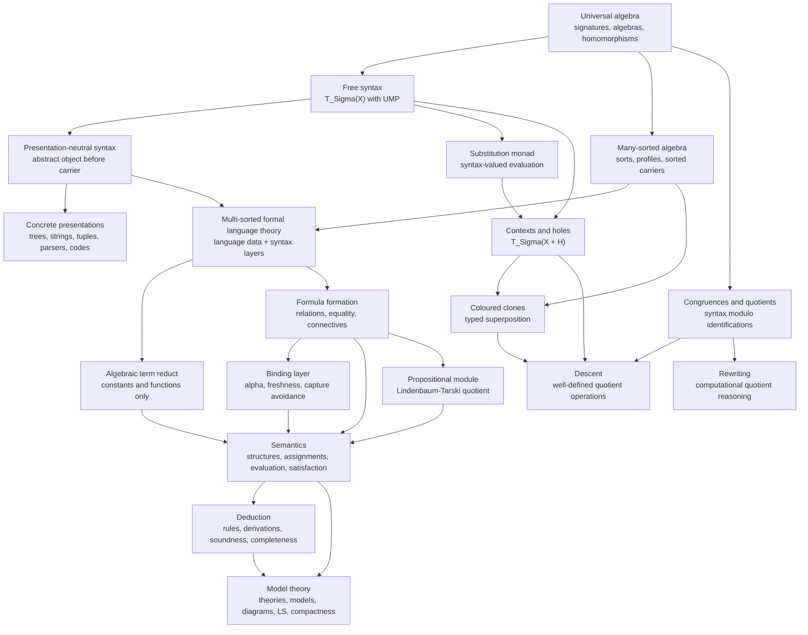
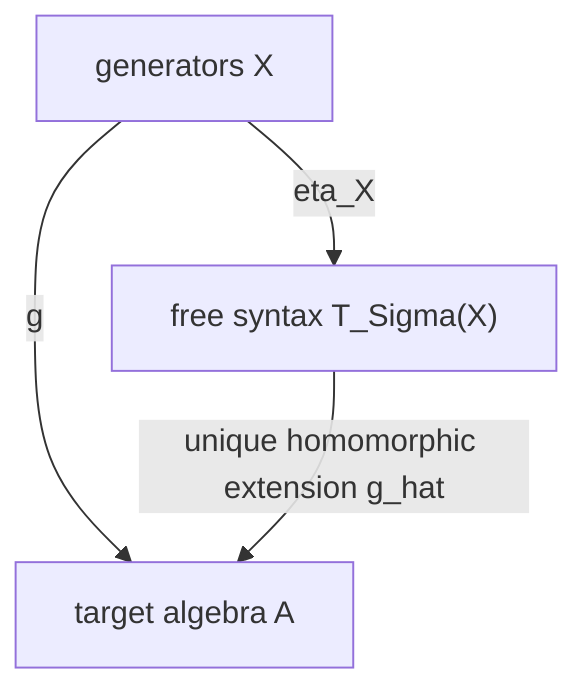
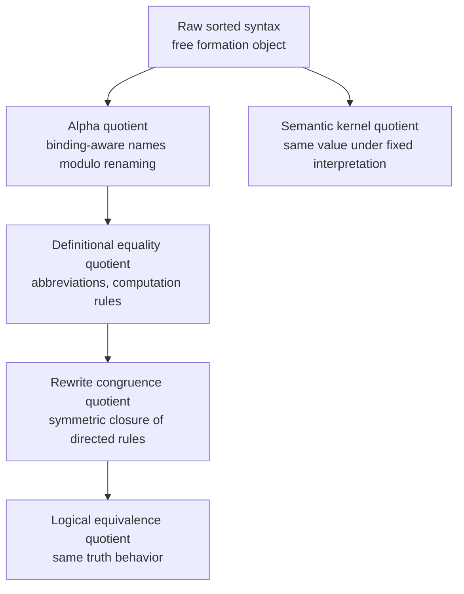
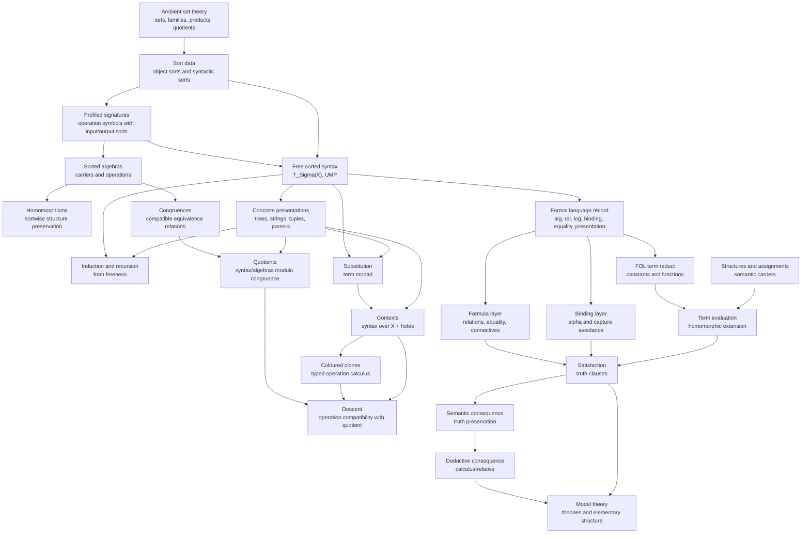

# Core Theory Overview - Final Corrected

## Purpose

This document summarizes the common mathematical spine behind the project's theory files.

The central point is that the theory is **not one monolithic first-order logic note**. It is a stack of independent but composable theories:

1. **Universal algebra** supplies signatures, algebras, homomorphisms, free objects, substitutions, congruences, quotients, kernels, clones, and descent.
2. **Presentation-neutral syntax theory** uses universal algebra to define syntax as an abstract free object before choosing trees, strings, tuples, parse records, or implementation nodes.
3. **Multi-sorted formal language theory** generalizes the free-syntax engine from one carrier to a family of sort-indexed carriers and records the extra data needed for formal languages: relation symbols, equality policies, formula constructors, binders, schemas, deduction, semantics, model theory, and presentations.
4. **First-order logic** is an instance of the formal-language architecture: its term fragment is an algebraic reduct; formulas, satisfaction, proof rules, and model theory are additional layers over that reduct.
5. **Binding-aware syntax** is a boundary layer: raw quantifier formation can be represented algebraically, but alpha-equivalence and capture-avoiding substitution require additional binding data.

The reusable slogan is:

$$
\boxed{\text{free syntax builds expressions; substitution composes syntax; evaluation interprets syntax; kernels measure collapse; quotients require descent.}}
$$

---

## 0. Master architecture



---

## 1. Independence of the component theories

The project should be read as a system of interfaces, not as a sequence where each later subject erases the previous one.

The integration is therefore not:

```text
universal algebra = first-order logic
```

but rather:

```text
universal algebra supplies the term/syntax engine
formal language theory packages additional syntax and binding data
first-order logic adds structures, assignments, satisfaction, deduction, and model theory
```

---

## 2. Universal algebra as the independent core

Universal algebra starts with a signature and studies algebras of that signature.

A finitary signature is data of operation symbols and arities. In the many-sorted case, arities become **profiles**:

$$
f:(s_0,\dots,s_{n-1})\to s.
$$

An algebra interprets each symbol by an actual operation on a carrier, or on a family of carriers in the sorted case:

$$
f^{\mathbf A}:A_{s_0}\times\cdots\times A_{s_{n-1}}\to A_s.
$$

A homomorphism preserves all operations. A congruence is an equivalence relation compatible with all operations. A quotient is well-defined exactly because the congruence compatibility condition guarantees independence from representatives.

This theory is independent of logic. It does not require relation symbols, truth values, satisfaction, quantifiers, formulas, or proof rules.

### Core universal-algebraic engine

The core construction is the free algebra:

$$
(\mathbf T_\Sigma(X),\eta_X).
$$

It is free on the generator family $X$ when every generator assignment into any algebra extends uniquely to a homomorphism:

$$
\mathbf{Alg}(\Sigma)(\mathbf T_\Sigma(X),\mathbf A)
\cong
\mathbf{Set}^{S}(X,U\mathbf A).
$$

This universal mapping property is the source of:

- structural induction;
- structural recursion;
- substitution;
- term evaluation;
- generated subalgebras;
- evaluation kernels;
- quotient descriptions;
- term operations and clones.

### Universal extension triangle



Commutativity:

$$
\widehat g\circ\eta_X=g.
$$

Everything else is a controlled reuse of this triangle.

---

## 3. Free syntax versus concrete presentations

The abstract syntax object is the free algebra. A tree carrier, string grammar, tuple encoding, parser object, AST class, de Bruijn representation, or nominal representation is a **presentation** of that object.

A faithful presentation consists of:

1. a concrete algebra $\mathbf P$;
2. an insertion of generators into $\mathbf P$;
3. a unique homomorphism
   $$
   \rho:\mathbf T_\Sigma(X)\to\mathbf P;
   $$
4. proof that $\rho$ is an isomorphism.

If $\mathbf P$ and $\mathbf Q$ are two free presentations of the same syntax, there is a unique generator-preserving isomorphism:

$$
\theta:\mathbf P\cong\mathbf Q.
$$

The point is not that trees, strings, and tuples are irrelevant. The point is that they are **not primitive** in the invariant theory.

### Transfer principle

Any invariant operation $F$ on abstract syntax transports to a presentation $P$ by conjugation:

$$
F_P = \rho\circ F\circ(\rho^{-1})^n.
$$

Thus:

```text
abstract definition first
then presentation transport
then implementation-specific algorithms
```

Presentation-specific data include addresses, substrings, parse stacks, pointer identity, sharing nodes in DAGs, and concrete codes. These become theoretical only after an invariance or correctness theorem connects them back to the abstract object.

---

## 4. Many-sorted formal language theory as the integration node

The corrected integration node is **presentation-neutral multi-sorted formal language theory**.

It is broader than pure many-sorted first-order logic. It gives the data discipline for building formal languages from the sorted algebraic core while keeping presentations separate.

A formal language record has the shape:

$$
\mathcal L=(O,S,X,\Sigma_{\mathrm{alg}},\Sigma_{\mathrm{rel}},\Sigma_{\mathrm{log}},\mathcal B,\mathcal E,\mathcal P).
$$

The components are:

| Component | Meaning |
|---|---|
| $O$ | object sorts, used by semantic domains |
| $S$ | syntactic sorts, used by expression carriers |
| $X$ | sorted variables or generators |
| $\Sigma_{\mathrm{alg}}$ | algebraic constructors, usually term-forming symbols |
| $\Sigma_{\mathrm{rel}}$ | relation-symbol declarations |
| $\Sigma_{\mathrm{log}}$ | logical constructors such as connectives, equality, judgments |
| $\mathcal B$ | binder declarations and binding policy |
| $\mathcal E$ | equality policy: logical equality, equations, quotient relations, definitional equality |
| $\mathcal P$ | presentation policy: trees, strings, tuples, parser, printer, code |

Only the algebraic constructor part belongs to bare universal algebra. The rest explains how the free object is used as a formal language.

### Object sorts versus syntactic sorts

This distinction is fundamental.

An object sort $\tau$ indexes semantic domains such as $M_\tau$.

A syntactic sort $\mathsf{Term}_\tau$ indexes expressions intended to denote elements of $M_\tau$.

A formula sort $\mathsf{Formula}$ indexes truth-evaluable expressions, not semantic objects.

For first-order style syntax:

$$
S_{\mathrm{syn}}
=
\{\mathsf{Term}_\tau:\tau\in O\}\cup\{\mathsf{Formula}\}.
$$

A term of sort $\mathsf{Term}_\tau$ is not an element of $M_\tau$. It is syntax that can be evaluated into $M_\tau$ once a structure and assignment are supplied.

---

## 5. First-order logic as algebraic reduct plus additional layers

First-order logic is not identical with the universal-algebraic term engine. It uses the engine for its term fragment and then adds layers.

### 5.1 Term-formation reduct

Given a many-sorted first-order language with object sorts $O$, variables $\operatorname{Var}_\tau$, constants, and function symbols, its term-forming reduct is the many-sorted signature with sorts $\mathsf{Term}_\tau$ and constructors:

$$
c:()\to\mathsf{Term}_\tau,
$$

and

$$
f:(\mathsf{Term}_{\tau_0},\dots,\mathsf{Term}_{\tau_{n-1}})\to\mathsf{Term}_\tau.
$$

The family of terms is the free sorted algebra on the variable family.

### 5.2 Atomic and formula layer

Relations do not construct terms. A relation symbol of object profile $(\tau_0,\dots,\tau_{n-1})$ contributes a formula constructor:

$$
R:(\mathsf{Term}_{\tau_0},\dots,\mathsf{Term}_{\tau_{n-1}})\to\mathsf{Formula}.
$$

Equality, when logical at object sort $\tau$, contributes:

$$
=_{\tau}:(\mathsf{Term}_\tau,\mathsf{Term}_\tau)\to\mathsf{Formula}.
$$

Boolean connectives are ordinary formula constructors:

$$
\neg:\mathsf{Formula}\to\mathsf{Formula},
$$

$$
\wedge,\vee,\to,\leftrightarrow:(\mathsf{Formula},\mathsf{Formula})\to\mathsf{Formula}.
$$

### 5.3 Binding layer

A quantifier may be displayed as a raw unary constructor:

$$
Q_x:\mathsf{Formula}\to\mathsf{Formula}.
$$

That captures only formation. It does not determine:

- free variables;
- alpha-equivalence;
- capture-avoiding substitution;
- freshness conditions;
- free-for conditions;
- eigenvariable side conditions;
- semantic quantifier clauses.

Therefore binding is an additional layer, not a consequence of sorted algebra alone.

### 5.4 Semantic layer

A structure supplies semantic carriers and interpretations:

$$
M_\tau \quad (\tau\in O),
$$

$$
f^{\mathcal M}:M_{\tau_0}\times\cdots\times M_{\tau_{n-1}}\to M_\tau,
$$

$$
R^{\mathcal M}\subseteq M_{\tau_0}\times\cdots\times M_{\tau_{n-1}}.
$$

An assignment is a sorted map:

$$
a_\tau:\operatorname{Var}_\tau\to M_\tau.
$$

Term evaluation is the unique homomorphic extension into the algebraic reduct of the structure:

$$
\operatorname{ev}_a:\operatorname{Term}_{\mathcal L}\to\mathcal M_{\mathrm{alg}}.
$$

Satisfaction then uses term evaluation plus relation/equality/Boolean/quantifier clauses.

---

## 6. Substitution, contexts, and the term monad

Substitution is syntax-valued evaluation.

A sorted substitution is a sorted map:

$$
\sigma:X\to T_\Sigma(Y).
$$

By freeness, it extends uniquely:

$$
\widehat\sigma:\mathbf T_\Sigma(X)\to\mathbf T_\Sigma(Y).
$$

Substitutions compose by:

$$
(\tau\star\sigma)(x)=\widehat\tau(\sigma(x)).
$$

and their extensions satisfy:

$$
\widehat{\tau\star\sigma}=\widehat\tau\circ\widehat\sigma.
$$

This is the Kleisli law of the sorted term monad.

### Contexts

A context is not primitively a tree-with-a-hole. In the presentation-neutral theory, a context is a term over an enlarged variable family:

$$
C\in T_\Sigma(X\sqcup H)_s.
$$

Filling is substitution:

$$
C[\alpha]=\widehat\sigma(C),
$$

where $\sigma$ fixes ordinary variables and sends holes to their filling terms.

Thus contexts are presentation-neutral, while addresses and local replacement belong to tree presentations unless abstracted through context decomposition.

---

## 7. Clones and operation-level syntax

Term syntax also represents operations.

In the sorted setting the correct structure is a **coloured clone**: operations are indexed by input sort profiles and output sorts.

A formal operation of profile

$$
(s_0,\dots,s_{n-1})\to s
$$

is represented by a term

$$
t\in T_\Sigma(x_0:s_0,\dots,x_{n-1}:s_{n-1})_s.
$$

Superposition is substitution of terms into terms.

For any algebra $\mathbf A$, interpreting formal terms yields a clone homomorphism:

$$
\operatorname{SynClo}(\Sigma)\to\operatorname{Clo}(\mathbf A).
$$

Its kernel records which formal operations induce the same semantic operation in $\mathbf A$.

This is different from an evaluation kernel for one assignment:

| Kernel | Level | Meaning |
|---|---|---|
| $\kappa_g=\ker(\widehat g)$ | element-level | two terms have same value under one valuation |
| $\operatorname{Id}(\mathbf A)$ | operation-level | two terms induce the same operation under all valuations |

---

## 8. Quotients, kernels, and descent

A quotient is legitimate only when a relation is compatible with the operations being retained.

For a congruence $\theta$ on $\mathbf A$, the quotient has carriers:

$$
(A/\theta)_s=A_s/\theta_s.
$$

Operations are defined by representatives:

$$
f^{\mathbf A/\theta}([a_0],\dots,[a_{n-1}])=[f^{\mathbf A}(a_0,\dots,a_{n-1})].
$$

This is well-defined exactly because $\theta$ is a congruence.

### Evaluation kernel quotient

For a valuation $g:X\to A$, the evaluation kernel is:

$$
\kappa_g=\ker(\widehat g).
$$

The image of evaluation is the generated subalgebra:

$$
\operatorname{im}(\widehat g)=\langle g[X]\rangle_{\mathbf A}.
$$

By the first isomorphism theorem:

$$
\mathbf T_\Sigma(X)/\kappa_g\cong \langle g[X]\rangle_{\mathbf A}.
$$

Thus every generated semantic algebra is syntax modulo the semantic identifications forced by an evaluation.

### Descent criterion

A raw operation

$$
F:A_{s_0}\times\cdots\times A_{s_{n-1}}\to A_s
$$

descends to $A/\theta$ iff:

$$
a_i\equiv_{\theta_{s_i}}b_i\ \forall i
\quad\Longrightarrow\quad
F(a_0,\dots,a_{n-1})\equiv_{\theta_s}F(b_0,\dots,b_{n-1}).
$$

Term operations, polynomial operations, and context operations descend along algebraic congruences. Arbitrary syntax operations do not.

---

## 9. Quotient tower for formal syntax

The formal-language theory distinguishes several quotient levels:



At every level, a representative-level operation must prove descent.

The failure mode is always the same:

```text
operation uses representative data
but quotient identifies representatives
therefore operation is invalid unless compatible with the quotient relation
```

---

## 10. Rewriting and computational quotients

Equations are symmetric identifications. Rewrite rules are directed computational instructions.

A rewrite system gives:

```text
rule l -> r
contextual closure C[l sigma] -> C[r sigma]
rewrite closure
congruence generated by the underlying equations l = r
```

If a rewrite system is terminating and confluent, each quotient class has a unique normal form. Then normal forms provide canonical representatives.

Without termination and confluence, rewriting may still generate a quotient, but it does not supply a unique representative system.

---

## 11. Propositional module

The propositional module is the formula-sort quotient case.

Raw propositional formulas form a free algebra:

$$
\mathbf{Fm}(A).
$$

Tautological equivalence is a congruence:

$$
\varphi\equiv_{\mathrm{taut}}\psi.
$$

The Lindenbaum-Tarski algebra is:

$$
LT(A)=Fm(A)/\equiv_{\mathrm{taut}}.
$$

It is the free Boolean algebra on the atom set.

Propositional schemas are represented by contexts over formula holes. Tautological schemas are top-valued quotient contexts. First-order logic imports this by filling propositional holes with first-order formulas; this works because Boolean satisfaction respects the propositional truth-functional structure.

---

## 12. Deduction and model theory

Syntax and semantics do not determine a proof calculus by themselves.

A deductive layer must specify:

- judgment sorts;
- sequent formation data;
- rule schemas;
- derivation objects;
- side conditions;
- eigenvariable conditions;
- equality rules;
- structural rules, if present.

Semantic consequence and deductive consequence are distinct relations:

$$
\Gamma\models\varphi
$$

means truth preservation in all structures and assignments.

$$
\Gamma\vdash\varphi
$$

means derivability in a specified calculus.

Soundness and completeness are theorems relating them:

$$
\Gamma\vdash\varphi\Rightarrow\Gamma\models\varphi,
$$

and, when complete,

$$
\Gamma\models\varphi\Rightarrow\Gamma\vdash\varphi.
$$

Model theory then studies theories, model classes, diagrams, substructures, elementary embeddings, definability, compactness, Löwenheim-Skolem, Skolem expansions, and back-and-forth systems.

---

## 13. Final dependency graph



---

## 14. Minimal reusable reference

### Core objects

- $S$: sort set.
- $X=(X_s)_{s\in S}$: sorted generators.
- $\Sigma$: many-sorted signature with profiles.
- $\mathbf T_\Sigma(X)$: free sorted syntax object.
- $\eta_X:X\to T_\Sigma(X)$: generator insertion.
- $\widehat g$: unique homomorphic extension.
- $\sigma:X\to T_\Sigma(Y)$: substitution.
- $\widehat\sigma:T_\Sigma(X)\to T_\Sigma(Y)$: substitution extension.
- $H$: sorted hole family.
- $T_\Sigma(X\sqcup H)$: context syntax.
- $\theta$: sorted congruence.
- $\mathbf A/\theta$: quotient algebra.
- $\kappa_g=\ker(\widehat g)$: evaluation kernel.
- $\operatorname{SynClo}(\Sigma)$: formal sorted clone.
- $\operatorname{Clo}(\mathbf A)$: semantic term-operation clone.

### Core equations

Universal extension:

$$
\widehat g\circ\eta_X=g.
$$

Substitution composition:

$$
\widehat{\tau\star\sigma}=\widehat\tau\circ\widehat\sigma.
$$

Evaluation-substitution:

$$
\widehat g\circ\widehat\sigma=\widehat{g_\sigma}.
$$

Generated algebra quotient:

$$
\mathbf T_\Sigma(X)/\kappa_g\cong\langle g[X]\rangle_{\mathbf A}.
$$

Context filling:

$$
C[\alpha]=\widehat\sigma(C).
$$

Descent:

$$
a_i\theta b_i\ \forall i \Rightarrow F(\bar a)\theta F(\bar b).
$$

---

## 15. Final compression

The theory is best understood as a stack of invariants.

```text
Universal algebra
  gives free construction, substitution, kernels, quotients, clones.

Presentation-neutral syntax
  says syntax is the invariant free object, not a concrete carrier.

Multi-sorted formal language theory
  says formal languages are free sorted syntax plus relation, logical, binding, equality, semantic, deductive, and presentation data.

First-order logic
  uses the term reduct as universal algebra, then adds formulas, binding, structures, satisfaction, consequence, deduction, and model theory.

Quotient and descent theory
  governs every passage from raw syntax to identified syntax.
```

The core discipline is:

```text
declare the data
construct the free object
separate syntax from semantics
separate invariant structure from presentations
state quotient relations explicitly
prove descent before using representatives
add binding and proof rules as extra data, not hidden algebra
```
